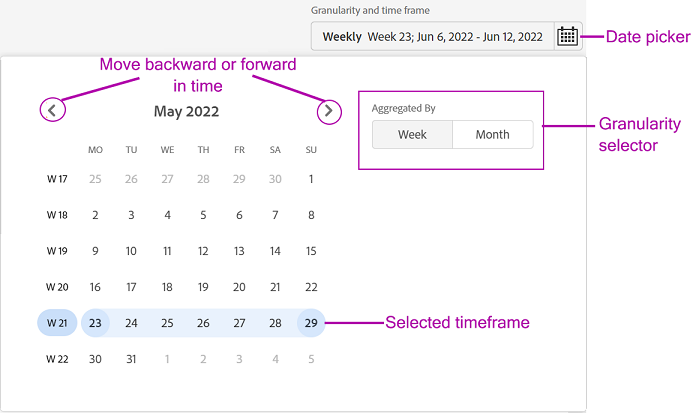

# Een segment en tijdframe definiëren {#define-segment}

Alle analyse- of weergaverapporten in [!UICONTROL Account IQ] begin met het bepalen van segment en het selecteren van tijdkader voor evaluatie. [Segment](/help/accountiq/product-concepts.md#segmet-def) verwijst naar alle abonnees of kijkers die aan uw criteria (het intekenen aan MVPD en het bekijken van specifieke kanalen) van evaluatie voldoen.

*Afbeelding: Selectie van segment en tijdframe*

Bovenaan alle pagina&#39;s met rapporten in [!UICONTROL Account IQ], is er een paneel om segment te bepalen door MVPDs, kanaalprogrammeurs, en granulariteit en tijdkader te selecteren.

## Segmentselectie {#select-segment}

### MVPD&#39;s selecteren in segment {#select-segment-mvpds}

MVPD&#39;s selecteren vanuit **[!UICONTROL MVPDs in segment]** optie:

1. Klik of tik op **[!UICONTROL MVPDs in segment]** vervolgkeuzelijst.

   >[!NOTE]
   >
   >**Alles** industrie MVPDs wordt geselecteerd door gebrek. Van hier kunt u een van de **De hoogste 10 MVPDs door score te delen**, **De hoogste 10 MVPDs door gebruik**, **Top 10 MVPD&#39;s per account**, of individuele MVPD&#39;s. Als u echter afzonderlijke MVPD&#39;s wilt selecteren, moet u de selectie opheffen **Alles**.

1. Klik of tik gewenste MVPDs.

   U kunt een MVPD uit de selectie verwijderen door het uit te schakelen.

1. Klikken of tikken **[!UICONTROL Apply selection]** zodat uw selectie van kracht wordt. Anders verliest u de gemaakte selectie.

   >[!NOTE]
   >
   >Als u de modus Isolatie selecteert, kan geen van de andere MVPD&#39;s worden geselecteerd.

### Kanalen in segment selecteren {#select-segment-channels}

Om de gewenste programmeerkanalen van te selecteren **[!UICONTROL Channels in segment]** optie:

1. Klik of tik op **[!UICONTROL Channels in segment]** vervolgkeuzelijst.

   >[!NOTE]
   >
   >**Alles** programmeerkanalen voor uw bedrijf worden geselecteerd door gebrek. Om individuele kanalen of programmeurs te selecteren moet u eerst deselecteren **Alles**.

1. Klik of tik op de gewenste kanalen of programmeurs.

   De lijstonderdelen op het hoogste niveau in het dialoogvenster **[!UICONTROL Channels in segment]** zijn [programmeur](/help/accountiq/product-concepts.md#programmer-def) bedrijven en de lijstonderdelen onder programmeernamen zijn hun [kanalen](/help/accountiq/product-concepts.md#channel-def). U kunt of individuele kanalen selecteren onder programmeurs, of programmeurs selecteren en alle activiteiten van de kanalen onder die programmeur zijn inbegrepen in rapport en grafiekresultaten.

   

   *Figuur: Programmeurs en kanalen die in kanaalselecteur worden vermeld*

   >[!IMPORTANT]
   >
   >De resultaten van het selecteren van afzonderlijke kanalen onder een programmeur zijn niet hetzelfde als die van het selecteren van de programmeur.
   >
   >
   >Wanneer u afzonderlijke kanalen selecteert, worden de activiteiten van die kanalen in bepaalde rapporten afzonderlijk uitgesplitst. Wanneer u echter de bovenliggende programmeur van al die kanalen selecteert, wordt alle activiteit van die kanalen opgenomen, maar niet afzonderlijk in rapporten onderverdeeld.

1. Klikken of tikken **[!UICONTROL Apply selection]** zodat uw selectie van kracht wordt.

>[!NOTE]
>
>U kunt niet meer dan 10 punten in de MVPD of programmeur pulldown menu&#39;s selecteren.

### Schakel MVPD&#39;s en kanalen uit {#deselect-segment-mvpds-channels}

Naast het wijzigen van de selectie in het dialoogvenster **[!UICONTROL MVPDs in segment]** en **[!UICONTROL Channels in segment]** segmentkiezers kunt u de eerder geselecteerde MVPD&#39;s en kanalen deselecteren door:

* De **[!UICONTROL Remove]** icon () op de namen van deze geselecteerde MVPD&#39;s en kanalen die onder segmentkiezer worden weergegeven.

* U kunt ook **[!UICONTROL Clear Selection]** om alle eerder geselecteerde MVPD&#39;s of kanalen te verwijderen.

*Afbeelding: Geselecteerde MVPD&#39;s en kanalen in segment- en tijdframe-deelvenster*

## Korreligheid en selectie van tijdframes {#granularity-timeframe}

Een evaluatieperiode selecteren:

1. Selecteer de **[!UICONTROL Granularity and time frame]** datumkiezer.

1. Selecteer een van beide **[!UICONTROL Week]** of **[!UICONTROL Month]** van **[!UICONTROL Aggregate By]** om granulariteit voor uw evaluatie in te stellen.

   

   *Afbeelding: Datumkiezer om granulariteit en tijdkader te selecteren*

1. Als u de granulariteit hebt geselecteerd, kunt u met de pijlen naar voren of naar achteren in de tijd gaan.

1. Geef een tijdsperiode op in het verleden (in maand of week op basis van geselecteerde granulariteit) voor evaluatie.

1. Selecteren **[!UICONTROL Apply Selection]** om ervoor te zorgen dat de selectie van kracht wordt.
