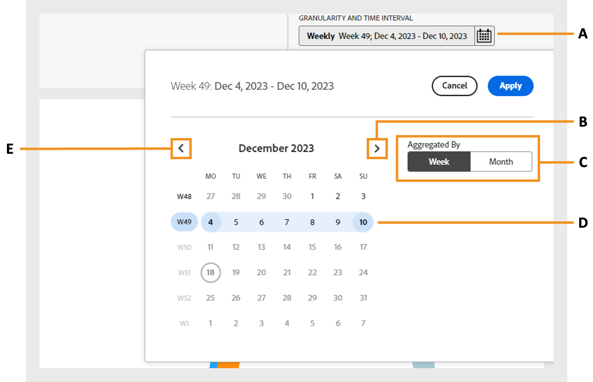

# Segmenten en tijdsinterval {#segment-timeinterval}

Wanneer u zich aanmeldt bij Account IQ, kunt u de abonnee definiëren in het segment- en tijdinterval boven het dashboard [segment](product-concepts.md#segmet-def). In dit deelvenster kunt u resultaten filteren en rapporten weergeven over het gedrag en de patronen van gebruikers die abonnementen delen. Een segment met de naam **ALLE ACCOUNTS IN UW EIGENSCHAPPEN** is momenteel standaard geselecteerd, waar u de volgende opties kunt weergeven:

{align="left"}

*Deelvenster Segment en tijdinterval met samengevouwen segmentsamenvatting*

**A.** Momenteel geselecteerde segmentnaam **B.** Segmentlijst openen **C.** Segment bewerken **D.** Nieuw segment maken **E.** Korreligheid en tijdintervalkiezer **F.** Pictogram om samenvatting van segment uit te vouwen **G.** Samengevouwen overzicht van segment **H.** Aantal rekeningen in het segment voor het geselecteerde interval

>[!NOTE]
>
> Het samengevouwen segmentoverzicht toont de [Videocategorieën](product-concepts.md#video-category-def) gebruikt in de tv-versie van Account IQ. Als u als dienst D2C het programma wordt geopend, tonen deze etiketten de specifieke videocategorieën van uw bedrijf.

Meer informatie over [maken](work-with-segments.md#create-new-segment) en [segmenten beheren](work-with-segments.md#manage-segment) van de **Segmenten** in het linkerdeelvenster.

## Segmentselectie {#segment-selection}

Ga als volgt te werk om een specifiek segment te selecteren:

1. Ga naar de **[!UICONTROL Open segment]** in het segment en het tijdinterval paneel.
1. Selecteer de **Segmentnaam** waarvoor u de rapporten voor het delen van accounts wilt weergeven.

   {align="left"}

   *Segmentnaam selecteren*

   >[!NOTE]
   >
   > De videocategorieën die in de vorige afbeelding worden weergegeven, zoals **MVPD&#39;s**, **Programmeurs**, en **Kanalen** de labels weergeven die worden gebruikt in de IQ-versie van account op tv overal. Als u als dienst D2C het programma wordt geopend, tonen deze etiketten de specifieke videocategorieën van uw bedrijf.

1. Selecteren **[!UICONTROL Open segment]**.

## Korreligheid en selectie van tijdinterval {#granularity-timeinterval}

De **Korreligheid en tijdsinterval** kunt u de data en de duur opgeven die wekelijks/maandelijks worden samengevoegd voor het observeren van gedrag voor delen van abonnees. De standaardselectie is de huidige week.

{align="left"}

*Dialoogvenster Korreligheid en tijdsinterval*

**A.** Korreligheid en tijdintervalkiezer **B.** Pijl-rechts om naar volgende maand/week te gaan **C.** Optie om granulariteit te kiezen per week/maand **D.** Momenteel geselecteerd tijdsinterval **E.** Pijl-links om naar vorige maand/week te gaan

U kunt de duur als volgt wijzigen:

1. Selecteer de **[!UICONTROL Granularity and Time Interval]** van de datumkiezer.

1. Selecteer een van beide **[!UICONTROL Week]** of **[!UICONTROL Month]** van **[!UICONTROL Aggregate By]** om granulariteit voor uw evaluatie in te stellen.

1. Als u de granulariteit hebt geselecteerd, kunt u met de pijlen naar voren of naar achteren navigeren door het tijdbereik.

1. Selecteer een specifieke evaluatieperiode.

1. Selecteren **[!UICONTROL Apply]** om ervoor te zorgen dat de selectie van kracht wordt.

Dit staat u toe om uw probleemverklaring als &quot;Abonnees van MVPD A te bepalen die kanalen X, Y, en Z tijdens de gekozen week van December keek&quot;.

## Overzicht van segment {#segment-summary}

Het overzicht van segmenten is vergelijkbaar voor D2C-services en TV overal. De videocategorieën zijn verschillend voor elke respectievelijke versie van Account IQ.

Selecteren  pictogram om de gedetailleerde samenvatting van het segment te bekijken. Het biedt ook informatie over het aantal abonneeaccounts en hun afspeelverzoeken binnen de gekozen tijdsperiode.

+++ D2C-diensten

{align="left"}

*Segmentoverzicht voor D2C-services*

>[!NOTE]
>
>De [videocategorieën](product-concepts.md#video-category-def) in de vorige afbeelding, zoals **regio** en **inhoudstypen** in segment zijn slechts voorbeelden . Wanneer u zich bij Account IQ aanmeldt, geven deze labels de specifieke videocategorieën van uw bedrijf weer.

De **Segmentoverzicht** Deze groep bevat de volgende voorwaarden die een segment definiëren:

**[Gebieden en inhoudstypen](product-concepts.md#video-category-def) in segment** raadpleeg de metagegevenslabels die zijn gekoppeld aan de videostreams die worden gecontroleerd door gedeelde accounts die worden vertegenwoordigd in rapporten voor het delen van accounts.

**[Metrisch](product-concepts.md#metric) in segment** verwijzen naar kenmerken of criteria waaraan abonnees moeten hebben voldaan om te worden geïdentificeerd in verslagen over het delen van accounts.

+++

+++ Tv overal

{align="left"}

*Segmentoverzicht voor programmeurs/MVPD&#39;s*

De **Segmentoverzicht** Deze groep bevat de volgende voorwaarden die een segment definiëren:

**[Programmeurs](product-concepts.md#programmer-def) in segment**  verwijzen naar inhoudsproviders waarvan de videostreams werden gecontroleerd door gedeelde accounts die in rapporten over het delen van accounts zijn vertegenwoordigd.

**[Kanalen](product-concepts.md#channel-def) in segment** verwijzen naar kanalen waarvan de videostromen werden gecontroleerd door gedeelde rekeningen die in rekening het delen rapporten werden vertegenwoordigd.

**[MVPD&#39;s](product-concepts.md#mvpd-def) in segment** verwijzen naar distributeurs van multivideo-programmering waaraan de abonnees zijn gekoppeld om te worden geïdentificeerd in verslagen over het delen van rekeningen.

**[Metrisch](product-concepts.md#metric) in segment** verwijzen naar kenmerken of criteria waaraan abonnees moeten hebben voldaan om te worden geïdentificeerd in verslagen over het delen van accounts.

+++
