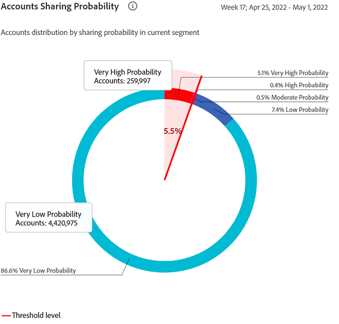
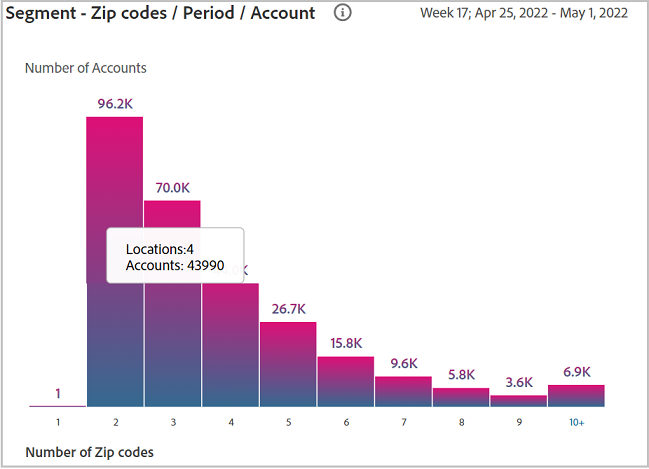

# Rapporten van gedeelde accounts {#shared-accounts-reports}

De rapporten Gedeelde Rekeningen verstrekken een andere groep grafieken en grafieken die het delen gedrag en het gebruik voor het huidige segment weerspiegelen. Bijvoorbeeld: **[!UICONTROL Over Moderate Probability]** en **[!UICONTROL Over Low Probability]** voor het huidige segment.

## Rekeningen met waarschijnlijkheid {#accounts-sharing-probability}

Deze donut- en staafdiagrammen geven de percentages (en absolute getallen) van de abonneeaccounts aan die in specifieke bereiken van gedeelde waarschijnlijkheid vallen. Deze bereiken worden als volgt gedefinieerd:

* Zeer hoog (80%-100%)
* Hoog (60%-80%)
* Matig (40%-60%)
* Laag (20%-40%)
* Zeer laag (0%-20%)

De rode lijn geeft het drempelbereik aan dat is geselecteerd in het dialoogvenster [Rekeningen boven drempel in huidig segment](#threshold-selector) en het lichtrode gebied bevat het totaal van alle accounts boven die drempel.

In het staafdiagram wordt het aantal accounts weergegeven dat in elk bereik op de y-as valt voor elk van de bereiken (getekend op de x-as).

Ook hier geeft de rode lijn de huidige drempelwaarde aan en het lichtrode gebied bevat het totaal van alle accounts boven die drempelwaarde.

>[!NOTE]
>
> De y-as van het staafdiagram is logaritmisch.

### Rekeningen boven drempel in huidig segment{#threshold-selector}

In dit deelvenster kunt u het drempelbereik voor de bovenstaande donut- en staafgrafieken selecteren. De vier opties zijn:

* Accounts **te laag** delen **waarschijnlijkheid**

* Accounts **overlaag** delen **waarschijnlijkheid**

* Accounts **overmatig** delen **waarschijnlijkheid**

* Accounts **te hoog** delen **waarschijnlijkheid**

Zodra u de drempel selecteert, toont het paneel het percentage (en het aantal) rekeningen van alle abonneerekeningen in het geselecteerde segment.

## Afspeelverzoeken uit totaal {#play-request-out-total}

Het donut diagram toont het percentage (en het aantal) spelverzoeken die door abonnees in het segment worden gemaakt laat u de spelverzoeken vergelijken die door abonnees niet in het bepaalde segment worden gemaakt.

Wanneer u de curseur over de donutgrafiek beweegt, toont het ook abonneepercentages en aantallen van diverse kanswaaiers.

<!---->

## Gemiddeld aantal apparaten per account voor segment{#avg-devices-account}

Het staafdiagram toont het gemiddelde aantal apparaten van elk type dat momenteel in gebruik door abonnees in het huidige segment en van die niet in het huidige segment is.

## Segment-zip-codes per periode per account {#zip-codes-period-account}

Deze grafiek informeert u over het aantal abonnees in het huidige segment die inhoud van verschillende plaatsen (zoals die door postcode wordt gemeten) voor het bepaalde tijdinterval verbruiken.

>[!NOTE]
>
>U kunt inzoomen op de balken die meer dan één set ZIP-codes vertegenwoordigen, weergegeven met een **+** (plus) teken (bijvoorbeeld 10+) door erop te dubbelklikken.

## Segment-geografisch bereik per periode per account {#geo-span-period-account}

In deze staafgrafiek wordt het aantal abonneeaccounts weergegeven dat inhoud gebruikt van locaties die binnen verschillende geografische bereiken in mijlen vallen. De waaier is gebaseerd op de maximumafstand tussen de plaatsen waarvan een abonnee tijdens het tijdinterval heeft gestroomd.

>[!NOTE]
>
> U kunt inzoomen op de balken die meerdere geografische afstanden vertegenwoordigen, weergegeven met een **+** (plus) teken (bijvoorbeeld 1000+) door erop te dubbelklikken.

>[!MORELIKETHIS]
>
>* Leer hoe te om rapporten voor hoogste 1000 abonnees in het geselecteerde segment uit te voeren gebruikend filters in de Rapporten van Gedeelde Rekeningen gebruikend [Bovenste 1000-accounts exporteren](/help/accountiq/export-acc-information.md) -optie.
