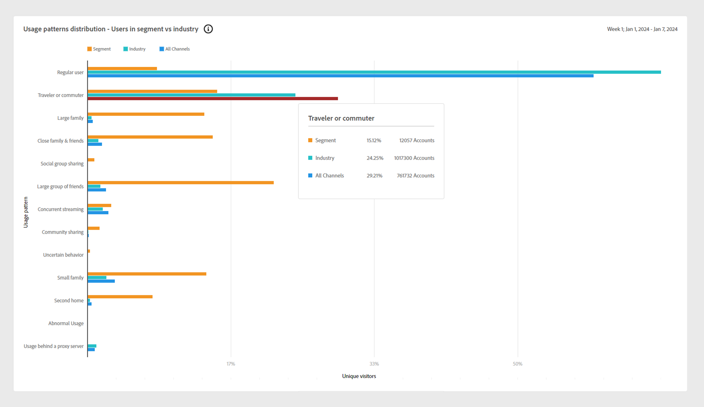
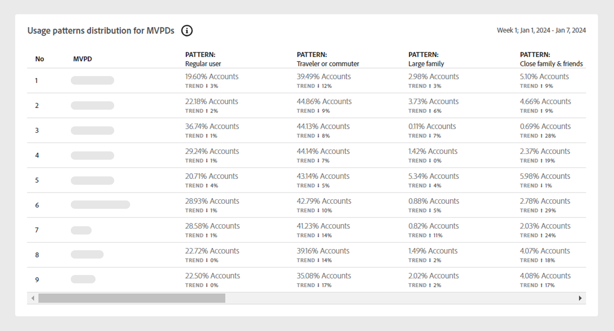

# Gebruikspatronen {#usage-patterns}

De account-IQ classificeert gebruikers van abonneeaccounts in verschillende categorieën op het gebied van hun sociale gedrag, zoals reizigers of forenzen, grote gezinnen en het delen van gemeenschappen. De **Gebruikspatronen** op de pagina worden verschillende analyses en rapporten voor deze gebruikerstypen weergegeven. Bijvoorbeeld: **Distributie van gebruikspatronen** In rapporten wordt het gebruiksgedrag voor het huidige segment vergeleken met al uw accounts.

Net als de andere pagina&#39;s in de app zijn de analyses en rapporten hier gebaseerd op het huidige segment dat is gedefinieerd in het dialoogvenster [segmentpaneel](/help/accountiq/segments-timeinterval.md).

## Distributie van gebruikspatronen {#usage-pattern-dis}

De grafiek van de clusterbar toont het aantal en de percentages abonnees voor elk sociaal gedrag, of gebruikspatroon.

+++D2C-services: distributie-gebruikers van gebruikspatronen in segment

In de onderstaande grafiek van de clusterbalk wordt de distributie van het gebruikspatroon van het huidige segment vergeleken met een segment dat al uw accounts bevat.

*Distributie-Gebruikers van gebruikspatronen in segment*

+++

+++TV overal: de distributiepatronen van het gebruik distributie-Gebruikers in segment vs Industrie

Naast het vergelijken van elk gebruikspatroon in het huidige segment met de volledige industrie, vergelijkt het hen ook met een segment dat al uw rekeningen bevat.

*Gebruikspatronen distribueren-Gebruikers in segment versus industrie*

+++

## Patroondistributie in segment gebruiken {#usage-pattern-dis-segment}

De **[!UICONTROL Usage patterns distribution in segment]** in dit deelvenster vindt u de volgende informatie voor elk gebruikerspatroon:

* Het delen van een waarschijnlijkheidsbereik waarin de individuele rekeningen vallen.
* Aantal en percentage van de rekeningen in dat patroon.
* Algemeen en percentage van het gebruik door abonnees in die categorie in termen van afspeelverzoeken.

*Distributie van gebruikspatronen in segment*

Bijvoorbeeld in de bovenstaande visualisatie:

* Een gewone gebruiker (een tot een paar mensen met een beperkt aantal apparaten op slechts één locatie) in het gedefinieerde segment heeft een kans van 5 tot 13% om een account te delen.

* 70,2% (376.615) van de totale abonnementsrekeningen (536.640) zijn gewone gebruikers.

* 44,5% (2.896.346) van de totale afspeelaanvragen (6.512.593) worden ingediend door reguliere gebruikers.

## Gebruik van patroondistributie voor videocategorieën {#usage-pattern-dis-video-categories}

+++D2C-services: distributie van gebruikspatronen voor regio&#39;s

De **[!UICONTROL Usage pattern distribution]** tabel biedt een vergelijking van gebruikspatronen voor [videocategorieën](product-concepts.md##video-category-def) in het huidige segment.

*Distributie van gebruikspatronen voor gebieden*

>[!NOTE]
>
>De videocategorie die in de vorige afbeelding wordt weergegeven, zoals **Regio&#39;s** is slechts een voorbeeld. Wanneer u zich bij Account IQ aanmeldt, geeft het label de specifieke videocategorieën van uw bedrijf weer.

+++

+++Programmer: Gebruik patroondistributie voor MVPD&#39;s

De **[!UICONTROL Usage pattern distribution]** de lijst verstrekt een vergelijking van de distributie van het gebruikspatroon voor MVPDs in het huidige segment.

*Distributie van gebruikspatronen voor programmeurs*

+++

+++MVPD: Gebruik van patroondistributie voor programmeurs

De **[!UICONTROL Usage pattern distribution]** de lijst verstrekt een vergelijking van de distributie van het gebruikspatroon voor de programmeurs of de kanalen in het huidige segment.

*Distributie van gebruikspatronen voor MVPD&#39;s*

+++
