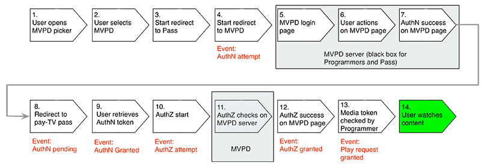

# Werken met Metriek op de server {#understanding-server-side-metrics}

>[!NOTE]
>
>De inhoud op deze pagina wordt alleen ter informatie verstrekt. Voor het gebruik van deze API is een huidige licentie van Adobe vereist. Ongeautoriseerd gebruik is niet toegestaan.

## Inleiding {#intro}

In dit document worden de afmetingen aan de serverzijde van de Adobe Pass-verificatie beschreven die door de service Entitlement Service Monitoring (ESM) worden gegenereerd. Het beschrijft niet de zelfde gebeurtenissen zoals gezien vanuit het cliënt-zijperspectief (wat Programmeurs zouden zien als zij een metingsdienst zoals Adobe Analytics op hun pagina/toepassing zouden uitvoeren).

## Overzicht van gebeurtenissen {#events_summary}

Vanuit het oogpunt van de Adobe Pass-verificatieserver worden de volgende gebeurtenissen gegenereerd:

* **Gebeurtenissen die in de Stroom van de Authentificatie** worden geproduceerd (daadwerkelijke login met MVPD)

   * Bericht van Poging AuthN - dit wordt geproduceerd wanneer de gebruiker naar de MVPD login plaats wordt verzonden.
   * Melding van AuthN in behandeling - Als de gebruiker erin slaagt zich aan te melden met hun MVPD, wordt dit geproduceerd wanneer de gebruiker is        omgeleid naar Adobe Pass Authentication.
   * Melding van AuthN verleend - Dit wordt geproduceerd wanneer de gebruiker terug op de plaats van de Programmer is, en met succes het teken van de Authentificatie van de Authentificatie van Adobe Pass heeft teruggewonnen.
* **Stroom van de Vergunning** (enkel een controle voor vergunning met een
MVPD)\
  *Vereiste:* Een geldig teken AuthN
   * Melding van AuthZ-poging
   * Kennisgeving van AuthZ verleend
* **Successful Verzoek van het Spel**\
  *Vereiste:* Geldige tokens AuthN en AuthZ
   * Melding van een controle met Adobe Pass-verificatie
   * Een spelverzoek vereist zowel een verleende authentificatie als een verleende vergunning

Het aantal unieke gebruikers wordt behandeld in detail in de [ Unieke sectie van Gebruikers ](#unique-users) hieronder. Als overzicht, aangezien de verleende authentificatie en de vergunningsreacties gewoonlijk in het voorgeheugen ondergebracht zijn, zijn de volgende formules gewoonlijk van toepassing:

* Aantal pogingen AuthN \> Aantal toegekende AuthN
* Aantal pogingen AuthZ \> Aantal toegekende AuthZ
* Aantal pogingen AuthZ \> Aantal toegekende AuthN (gewoonlijk)
* Aantal aanvragen voor succesvol afspelen \> Aantal toegekende AuthZ

### Voorbeeld {#example}

In het volgende voorbeeld worden de afmetingen aan de serverzijde gedurende een maand getoond voor
één merk:

| Metrisch | MVPD 1 | MVPD 2 | ... | MVPD n | Totaal |
| -------------------------- | ------ | ------ | - | ------ | ---------------------------------------------- |
| Succesvolle verificaties | 1125 | 2892 |   | 2203 | SUM(MVP1+...MVPD n) |
| Autorisaties geslaagd | 2527 | 5603 |   | 5904 | SUM(MVP1+...MVPD n) |
| Verzoeken voor afspelen geslaagd | 4201 | 10518 |   | 10737 | SUM(MVP1+...MVPD n) |
| Unieke gebruikers | 1375 | 2400 |   | 2890 | SUM van alle gebruikers voor alle MVPDs deduplicated\* |
| Gepoogde verificaties | 2147 | 3887 |   | 3108 | SUM(MVP1+...MVPD n) |
| Gepoogde machtigingen | 2889 | 6139 |   | 6039 | SUM(MVP1+...MVPD n) |

 

De-duplicatie zou in dit geval geen effect moeten hebben omdat verschillende MVPD-gebruikers niet dezelfde gebruikersnaam zouden moeten ontvangen. Wanneer u een bedrag voor twee verschillende merken maar hetzelfde MVPD doet, zou het deduplicatie-effect veel groter moeten zijn.

## Gebeurtenistriggers {#event_triggers}

### Nieuwe gebruiker - Volledige stroom {#new-user-full-flow}

In het volgende diagram worden de gebeurtenissen en stappen beschreven voor een gebruiker zonder verificatietoken (een nieuwe gebruiker of een gebruiker die een verificatietoken heeft verlopen):

De stroom omvat ronde-reizen aan MVPDs voor zowel Authentificatie (#5 tot \#7) als Vergunning (\#11).

Nadat de flow is voltooid, worden de verificatie- en autorisatietokens in het cachegeheugen opgeslagen op het apparaat van de gebruiker. De tijd-aan-Levende (TTL) waarden voor de tekenen van de Authentificatie zijn tussen 6 uur en 90 dagen. Een AuthN symbolische vervaldatum dwingt automatisch een AuthZ symbolische vervaldatum. De waarde van TTL voor het teken van de Toestemming is gewoonlijk 24 uren.

| Gebeurtenissen aan serverzijde geactiveerd | <ul><li>Verificatiepoging, Verificatie in behandeling, Verificatie verleend</li><li>Poging tot autorisatie, autorisatie verleend</li><li>Aanvraag voor succesvol afspelen</li></ul> |
|---|---|

### Het terugkeren van Gebruiker - AuthZ en AuthN Tokens in de cache

Voor gebruikers die geldige AuthZ en AuthN tokens caching hebben, het volgende
er treden stappen op:

Dit wordt automatisch geactiveerd wanneer `getAuthorization()` wordt aangeroepen en omvat alleen controles met Adobe Pass-verificatie. MVPD is niet betrokken bij deze stroom.

| Gebeurtenissen aan serverzijde geactiveerd | * Aanvraag voor succesvol afspelen |
|---|---|

### Gebruiker retourneren - AuthN-tokens in cache geplaatst, AuthZ-token verlopen

Voor gebruikers die nog geldige AuthN tokens hebben, gebeuren de volgende stappen:

Deze stroom omvat een ronde reis naar de MVPD.

| Gebeurtenissen aan serverzijde geactiveerd | <ul><li>Poging tot autorisatie, autorisatie OK</li><li>Aanvraag voor succesvol afspelen</li> |
|---|---|

## Verificatiegebeurtenissen {#authn_events}

### Verificatiepoging {#authentication-attempt}

Zoals geïllustreerd in het diagram hierboven, worden de authentificatiegebeurtenissen slechts teweeggebracht wanneer de gebruiker een ronde reis aan MVPD doet; de authentificatiegebeurtenissen omvatten geen symbolische authentificatie in de cache.

De gebeurtenis van de authentificatiepoging wordt teweeggebracht nadat de gebruiker op een bepaalde MVPD van de plukker heeft geklikt.

* De eerste gebeurtenis aan de MVPD-kant die hier dichtbij ligt, is het laden van de pagina
* Adobe Pass-verificatie telt niet mee voor herhaalde pogingen van de gebruiker om zich aan te melden op de MVPD-pagina (onjuist wachtwoord, probeer het opnieuw).
* meerdere pogingen worden geteld als één poging
* Sommige MVPDs voert ook Authorization in de stap van de Authentificatie uit, en de gebruiker wordt niet opnieuw gericht terug als de vergunning ontbreekt.

### Verificatie in behandeling {#authentication-pending}

Deze gebeurtenis treedt op wanneer het omleidingsproces naar Adobe Pass Authentication is gestart.

### Verificatie verleend {#authentication-granted}

De gebruiker is een bekende abonnee van MVPD, typisch met een abonnement van de Tv van het Betaal, maar soms met slechts de toegang van Internet. Een succesvolle authentificatie kan of voorkomen omdat de gebruiker uitdrukkelijk geldige geloofsbrieven met hun MVPD inging, of omdat zij eerder geldige geloofsbrieven hadden ingegaan en &quot;herinner me&quot;gecontroleerd (en de vorige zitting niet was verlopen).

MVPD verzendt daarom de Authentificatie van Adobe Pass een positieve reactie op het authentificatieverzoek en de Authentificatie van Adobe Pass leidt tot een *token AuthN*.

* De authentificatie wordt gewoonlijk in het voorgeheugen ondergebracht voor een lange periode (een maand of meer). Daarom zijn er geen verificatiegebeurtenissen meer aanwezig totdat het token vervalt en de flow opnieuw wordt gestart.
* Als u vanaf een andere site/app inkomt via Single Sign On, worden er geen verificatiegebeurtenissen gestart.

### Comcast-verificatie {#comcast-authentication}

Comcast heeft een andere AuthN-stroom dan de andere MVPD&#39;s.

De verschillen worden beschreven in de volgende functies:

* **het koekjesgedrag van de Zitting**: Dit veroorzaakt een volledige verwijdering van om het even welke authentificatietokens nadat de gebruiker browser heeft gesloten. Deze functie is alleen beschikbaar op het web. Het belangrijkste doel is ervoor te zorgen dat uw zitting Comcast niet op onveilige/gedeelde computers wordt voortgeduurd. Het effect is dat er meer verificatiepogingen/toegekende stromen zullen zijn dan voor de rest van de MVPD&#39;s.

* **AuthN per requestID**: Comcast staat niet de staat AuthN toe om van één aanvrageridentiteitskaart aan een andere worden in het voorgeheugen ondergebracht. Daarom moet elke site/app naar Comcast gaan om een verificatietoken te krijgen. Afgezien van de ervaringen van gebruikers, is het effect, zoals hierboven, dat meer authentificatiepogingen/toegekende gebeurtenissen zullen worden geproduceerd.

* **Passieve Authentificatie**: om gebruikerservaring te verbeteren maar
handhaaft nog AuthN per requestID functionaliteit, een passieve authentificatiestroom gebeurt in een verborgen iFrame. De gebruiker zal niets zien maar de gebeurtenissen zullen nog worden teweeggebracht zoals vroeger.

Als de gebruiker &quot;herinner me&quot;op de Comcast login pagina klikt, dan zullen de verdere bezoeken aan deze pagina (in een periode van twee weken) enkel een snel terugleiden zijn. Anders zullen de gebruikers eigenlijk op de pagina voor authentiek moeten verklaren.

### Verificatie is mislukt {#unsuccessful-authentication}

Een mislukte verificatie is niet per se een gebeurtenis in Adobe Pass-verificatie, maar kan worden berekend als het verschil tussen poging en succes.

In de release van mei 2013 voegt Adobe Pass Authentication foutcodes toe voor mislukte verificaties die het gevolg zijn van systeem- of netwerkfouten, waaronder DRM-fouten (tokenbinding mislukt) en LSO-fouten (geen ruimte om het token te schrijven, enz.).

### Conversiesnelheid verificatie {#authenitication-conversion-rate}

Één interessante metrisch die Programmeurs kunnen volgen is de authentificatieomzettingspercentage, dat als (de verzoeken van AuthN/toegekende AuthN)% wordt berekend.

Sommige notities over de meetgegevens:

* Aangezien het een op gebeurtenis-gebaseerde metrisch is, weerspiegelt het niet echt unieke gebruiker omrekeningskoers - als een gebruiker acht keer probeert en de negende keer slaagt - zal dit zeer slecht in de hierboven vermelde omrekeningskoers weerspiegelen.
* Bij Adobe Pass-verificatie (op de server) is er (nog) geen manier om een op unieke verificatie gebaseerde omzetting te berekenen.
* Als de site/app automatisch opnieuw AuthN-pogingen bevat, wordt de bovenstaande metrische waarde ook scheefgetrokken.

## Autorisatiegebeurtenissen {#authorization_events}

### Verificatiepoging {#authorization_attempt}

Naast het krijgen van een authentificatietoken, moeten de gebruikers ook een toestemmingstoken krijgen alvorens inhoud te spelen. Dit gebeurt gewoonlijk na authentificatie, of als het toestemmingstoken verloopt. Aangezien deze controle serverzijde (van de servers van de Authentificatie van Adobe Pass aan de servers MVPD) wordt uitgevoerd wordt de gebruiker vereist om niets te doen.

### Toelating verleend {#authorization-granted}

Een &quot;vergunning verleend&quot;signalen dat het voor authentiek verklaarde gebruikersabonnement de gevraagde programmering omvat.

Merk op dat niet alle MVPDs een afzonderlijke vergunningsstap steunt; voor sommige authentificatie wordt gelijkgesteld met vergunning. MVPD verzendt de Authentificatie van Adobe Pass een succesvolle reactie op het backchannel verzoek AuthZ, en de Authentificatie van Adobe Pass leidt tot een teken AuthZ.

* De token AuthZ wordt gedurende een periode in cache geplaatst, doorgaans 24 uur Tijdens deze periode worden er geen gebeurtenissen AuthZ geactiveerd.
* Sommige MVPDs werken met de Vergunningen van het Niveau van Activa, andere werken met de Vergunning van het Niveau van het Kanaal; - afhankelijk van welke wordt gebruikt, meer of minder gebeurtenissen AuthZ worden in brand gestoken. Zelfs voor de toestemming op kanaalniveau, is het in cache plaatsen van toepassing - dus als hetzelfde middel binnen 24 uur wordt aangevraagd, worden er geen gebeurtenissen gestart.

### Autorisatie geweigerd {#authorization-denied}

Als een autorisatie wordt geweigerd, heeft de geverifieerde gebruiker geen bevestigd abonnement op de aangevraagde programmering. De meest waarschijnlijke oorzaak is dat het kanaal geen deel uitmaakt van het abonnementspakket van de gebruiker, maar dit kan ook een weerspiegeling zijn van een gebruiker die alleen toegang tot internet heeft via het MVPD.

Voor sommige MVPD&#39;s zijn gebruikers geverifieerd, ook al hebben ze alleen een internetabonnement van de MVPD (geen abonnement op betaaltelevisie). In dit geval, alhoewel het kanaal waarvoor de gebruiker om toestemming verzoekt in het basispakket is, zal de vergunning worden ontkend.

Sommige MVPDs biedt de berichten van de douanefout voor ontkenning AuthZ aan die aanbiedingen kunnen omvatten om hun pakket te bevorderen.

### Conversiesnelheid autorisatie {#authorization-conversion-rate}

De omrekeningskoers voor verificatie kan worden berekend als (AuthZ-verzoeken / AuthZ toegekend)%.

### Aanvraag voor succesvol afspelen {#successful-play-request}

Een gebruiker die zowel geautoriseerd als geautoriseerd is, mag beveiligde inhoud weergeven.

Bij een succesvol afspeelverzoek genereert Adobe Pass Authentication een kortstondig mediatoken waarin wordt bevestigd dat de gebruiker het recht heeft de gevraagde video te bekijken. De programmeur gebruikt dit Media Token voor verdere bevestiging van de potentiële kijker. Media Tokens worden bijgehouden als afspeelverzoeken.

* De Authentificatie van Adobe Pass volgt *niet* of de videoplayback eigenlijk begon na het produceren van het Symbolische. Bijvoorbeeld, als er een geo-beperking op de inhoud is, telt de transactie nog als succesvol spelverzoek, alhoewel de stroom eigenlijk nooit begint.
* Aangezien AuthN en AuthZ tokens de reactie MVPD voor een periode in het voorgeheugen onderbrengen, is de succesvolle gebeurtenis van het spelverzoek de meest frequente gebeurtenis in de metriek.

## Unieke gebruikers {#unique-users}

### Definitie {#definition}

Bij een geslaagde verificatie wordt het bestaan van een unieke gebruiker bijgehouden op basis van de geretourneerde waarde van de MVPD-gebruikersnaam.  Deze waarde is gebaseerd op de aanmeldingsgegevens van de gebruiker, maar bevat geen identificeerbare gegevens.

Deze waarde wordt ook doorgegeven aan de site/app in de callback sendTrackingData.

Deze waarde kan blijvend over apparaten zijn (MVPD veroorzaakt de zelfde waarde voor een bepaalde gebruiker, geen kwestie waar login voorkomt) of transient (voor elke login, wordt een nieuwe waarde geproduceerd, die MVPD in zijn achtereind in kaart brengt. Doorgaans zijn de waarden die door MVPD&#39;s aan Adobe Pass-verificatie worden geleverd, blijvend in sessies en apparaten, maar zoals opgemerkt is de persistentie niet gegarandeerd en niet gevalideerd.

Deze waarde wordt gebruikt als een manier om de unieke gebruikers te berekenen. De gerapporteerde waarde (per aanvrager-id/interval/MVPD) wordt voor het opgegeven interval gededupliceerd. De som van de unieke gebruikers per dag is dus gewoonlijk anders dan de maandelijkse waarde, waarbij de maandelijkse waarde de lagere waarde heeft.

Dit nummer bevat alle gebeurtenissen vanaf Adobe Pass-verificatie, minus verificatiepogingen (zonder gebruikersnaam) maar inclusief geprobeerd (en mogelijk mislukt) autorisaties.

### Voorbeelden {#examples}

#### Dag 1 {#day1}

Gebruiker XYZ gaat naar de site om een video te bekijken.

Afgebroken gebeurtenissen:

* AuthN-poging (nog geen unieke gebruiker)
* AuthN toegekend
   * op dit punt identificeren wij uniek de gebruiker die op wat MVPD terugkeert - zodat wordt het dagelijkse unieke aantal gebruikers verhoogd met 1
   * het token AuthN wordt 30 dagen in cache geplaatst
* Poging/toegekende gebeurtenis AuthZ
   * AuthZ-token in cache geplaatst voor 1 dag
* Aanvraaggebeurtenis met succes afspelen

#### Dag 1 (later ingeschakeld) {#day1-later-on}

Gebruiker XYZ kijkt een andere video.

Afgebroken gebeurtenissen:

* Gebeurtenis voor afspeelverzoek (de rest wordt in cache opgeslagen)
* Geen toename van dagelijkse of maandelijkse uniques

#### Dag 3 {#day3}

Gebruiker XYZ kijkt een andere video.

Afgebroken gebeurtenissen:

* Poging/toegekende gebeurtenis AuthZ
   * Sinds 1 dag is het in cache plaatsen vanaf dag 1 verlopen
* Gebeurtenis voor afspeelverzoek (de rest wordt in cache opgeslagen)
* Unieke gebruikers per dag, verhoogd met één maand, zijn nog steeds 1

#### Dag 31 {#day31}

Gebruiker XYZ kijkt een andere video.

Hetzelfde als in dag 1 sinds de caching van AuthN verliep.

Als dezelfde gebruiker de autorisatie niet zou hebben doorstaan, zou het maandelijkse aantal unieke gebruikers nog steeds met 1 worden verhoogd omdat er twee gebeurtenissen zijn die de gebruikersnaam bevatten - verificatie die is verleend en autorisatiepoging.

### Single Sign-On (SSO) {#single-sign-on-sso}

In sommige gevallen kan het aantal unieke gebruikers groter zijn dan het aantal geslaagde verificaties. Dit is meestal het geval wanneer veel gebruikers via SSO van andere sites/apps binnenkomen en alleen autorisatie hoeven te krijgen op de huidige site/app.

### Unieke gebruikers op client en server vergelijken {#comparing-client-side-and-server-side-unique-users}

Als de waarde voor de gebruikers-id van `sendTrackingData()` op de client wordt gebruikt om unieke gebruikers te tellen, moeten de client-side en server-side nummers overeenkomen.

Als er grote verschillen zijn, zijn de volgende redenen doorgaans verantwoordelijk voor de
verschil:

* Videospeluniques versus alle gebeurtenissen uniques. Zoals vermeld, telt de Authentificatie van Adobe Pass unieke gebruikers voor alle gebeurtenissen behalve pogingen AuthN. Dit betekent dat als de gebruiker alleen verifieert (op de pagina) maar geen video weergeeft, een unieke toename van het aantal gebruikers nog steeds wordt geactiveerd.

* Gebruikers tellen die niet hebben geautoriseerd - Adobe Pass-verificatie telt deze gebruikers ook mee in het gerapporteerde nummer.

<!--
## Related Information {#related-information}

- [Entitlement Service Monitoring API](/help/authentication/entitlement-service-monitoring-api.md)

-->
