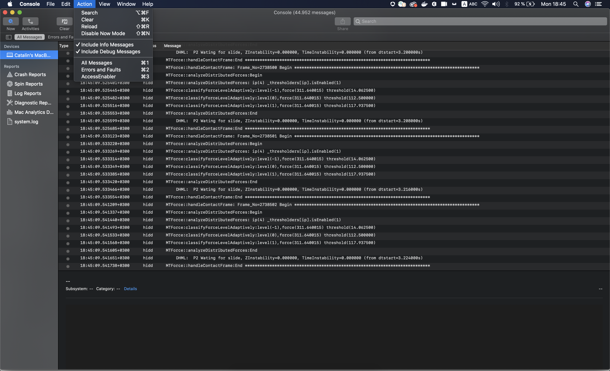

# (Verouderd) Foutopsporing in de AccessEnabler iOS/tvOS SDK met behulp van console-app-logbestanden {#debugging-the-accessenabler-iostvos-sdk-using-console-app-logs}

>[!NOTE]
>
>De inhoud op deze pagina wordt alleen ter informatie verstrekt. Voor het gebruik van deze API is een huidige licentie van Adobe vereist. Ongeautoriseerd gebruik is niet toegestaan.

>[!IMPORTANT]
>
> Zorg ervoor u over de recentste het productmededelingen van de Authentificatie van Adobe Pass en ontmantelingschronologie wordt geïnformeerd die in de [ pagina van de Mededelingen van het Product ](/help/authentication/product-announcements.md) wordt samengevoegd.

## Overzicht

Het bereik van dit document is het vastleggen en presenteren van de evolutie van het iOS/tvOS SDK-logboekmechanisme van AccessEnabler, samen met enkele nuttige details voor foutopsporing van het AccessEnabler-framework met behulp van de Console-app-logboeken.

## Status van het logboekmechanisme

Het doel van het registratiemechanisme van AccessEnabler iOS/tvOS is het uitzenden van nuttige berichten voor het oplossen van mogelijke problemen die een toepassing die het kader AccessEnabler gebruikt zou kunnen ontmoeten toe te schrijven aan het.

### AccessEnabler iOS/tvOS 3.5.0 en hoger

Vanaf de AccessEnabler iOS/tvOS 3.5.0-versie introduceert het registratiemechanisme de volgende verbeteringen als wijzigingen:

* Het kader van AccessEnabler gebruikt Apple geadviseerde [ OSLog ](https://developer.apple.com/documentation/os/oslog) implementatie.

* Het kader van AccessEnabler introduceert de capaciteit om de toepassingslogboeken van de Console te filtreren die op Subsystem worden gebaseerd: **com.adobe.pass.AccessEnabler**. Alle berichten die door de SDK worden verzonden, maken deel uit van com.adobe.pass.AccessEnabler.

* Het kader AccessEnabler introduceert de capaciteit om de toepassingslogboeken van de Console te filtreren die op om het even welk (prefix) worden gebaseerd: **[AccessEnabler]**. Alle berichten die door SDK worden uitgegeven worden vooraf bepaald met [ AccessEnabled ].

* Het kader van AccessEnabler introduceert de capaciteit om Console te filtreren app die logboeken op Categorie worden gebaseerd: **zuivert**, **fout** samen met om het even welke bovengenoemde twee criteria: Subsysteem of om het even welk (prefix).

## Foutopsporing met console-app-logboeken

Afhankelijk van de kwesties die worden onderzocht kunt u de het registreren berichten willen omvatten of uitsluiten die door het kader AccessEnabler worden uitgegeven, daarom kunt u onder sommige nuttige details vinden die u tijdens onderzoeken en wanneer het gebruiken van de toepassingslogboeken van de Console kunnen helpen.

### AccessEnabler iOS/tvOS 3.5.0 en hoger

#### Inclusief {#including}

Eerst van alles om om het even welke registrerenberichten te kunnen zien die door het kader AccessEnabler worden uitgegeven moet u **** &quot;omvatten de Berichten van Info&quot;en &quot;omvatten Debug Berichten&quot;in de sectie van de Actie van de Console selecteren app, zoals voorgesteld in het beeld hieronder.

Om de functionaliteit van AccessEnabler iOS/tvOS SDK te kunnen zuiveren en **** ziet het kader AccessEnabler registreert u:

* Onderzoek in Console app die **gebruikt Subsystem** optie die de waarde com.adobe.pass.AccessEnabler zoals in het hieronder beeld evenaart.

* Onderzoek in de app van de Console gebruikend **Om het even welke** optie die bevat
  [ AccessEnabler ] waarde zoals in het beeld hieronder.

Naast de bovengenoemde twee criteria kunt u de **optie van de Categorie** in samenhang met **ook gebruiken Subsystem** of **om het even welk (prefix)** om **te zoeken zuiveren** of **fout** niveauberichten die door AccessEnabler iOS/tvOS SDK worden uitgegeven.

#### Exclusief

Om de functionaliteit van andere componenten beter te kunnen zuiveren en **** uitsluiten de AccessEnabler kaderlogboeken u kunt:

* Onderzoek in Console app die **gebruikt Subsystem** optie die niet de waarde com.adobe.pass.AccessEnabler evenaart.
* Onderzoek in Console app die **gebruiken om het even welke** optie die niet de [ AccessEnabler ] waarde bevat.

## Melding van een probleem

Neem de volgende suggesties in overweging wanneer u een probleem meldt voor Adobe Pass-verificatie:

* Geef de reproductiestappen op.
* Geef de versie(s) van het besturingssysteem en het apparaatmodel of de apparaatmodellen op waarop het probleem zich voordoet.
* Geef de versie op van AccessEnabler iOS/tvOS SDK die dit probleem ondervindt.
* gelieve te proberen om alle het registrerenberichten vast te leggen AccessEnabler iOS/tvOS SDK gebruikend één van beide opties die in [ worden voorgesteld die ](#including) sectie omvatten.
