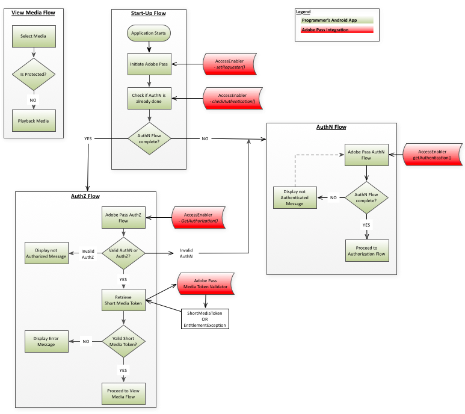

# (Verouderd) Amazon FireOS Integration Cookbook {#amazon-fireos-integration-cookbook}

>[!NOTE]
>
>De inhoud op deze pagina wordt alleen ter informatie verstrekt. Voor het gebruik van deze API is een huidige licentie van Adobe vereist. Ongeautoriseerd gebruik is niet toegestaan.

>[!IMPORTANT]
>
> Zorg ervoor u over de recentste het productmededelingen van de Authentificatie van Adobe Pass en ontmantelingschronologie wordt geïnformeerd die in de [ pagina van de Mededelingen van het Product ](/help/authentication/product-announcements.md) wordt samengevoegd.

 

## Inleiding {#intro}

In dit document worden de workflows voor machtigingen beschreven die de toepassing op hoofdniveau van een programmeur kan implementeren via de API&#39;s die worden weergegeven door de Amazon FireOS `AccessEnabler` -bibliotheek.

De Adobe Pass-verificatieoplossing voor Amazon FireOS bestaat uiteindelijk uit twee domeinen:

- Het domein UI - dit is de toepassingslaag op het hogere niveau die UI uitvoert en de diensten gebruikt die door de `AccessEnabler` bibliotheek worden verleend om toegang tot beperkte inhoud te verlenen.
- Het domein `AccessEnabler` - dit is waar de machtigingsworkflows worden geïmplementeerd in de vorm van:
   - Netwerkaanroepen naar Adobe-backendservers
   - Zakelijke en logische regels met betrekking tot de workflows voor verificatie en autorisatie
   - Beheer van diverse bronnen en verwerking van workflowstatus (zoals de tokencache)

Het doel van het `AccessEnabler` -domein is om alle complexe onderdelen van de machtigingsworkflows te verbergen en om aan de toepassing op de bovenste laag (via de `AccessEnabler` -bibliotheek) een set eenvoudige machtigingsprimitieven te bieden. Met dit proces kunt u de workflows voor machtigingen implementeren:

1. Stel de identiteit van de aanvrager in.
1. Controleer en krijg authentificatie tegen een bepaalde identiteitsleverancier.
1. Controleer en krijg vergunning voor een bepaalde bron.
1. Afmelden.

De het netwerkactiviteit van `AccessEnabler` vindt in een verschillende draad plaats zodat wordt de draad UI nooit geblokkeerd. Het communicatiekanaal in twee richtingen tussen de twee toepassingsdomeinen moet daarom een volledig asynchroon patroon volgen:

- De toepassingslaag van de UI verzendt berichten naar het `AccessEnabler` domein via de API vraag die door de `AccessEnabler` bibliotheek wordt blootgesteld.
- `AccessEnabler` antwoordt aan de laag UI door de callback methodes inbegrepen in het `AccessEnabler` protocol dat de laag UI bij de `AccessEnabler` bibliotheek registreert.

## Machtigingsstromen {#entitlement}

1. [Vereisten](#prereqs)
1. [Stroom opstarten](#startup_flow)
1. [Verificatiestroom](#authn_flow)
1. [Autorisatiestroom](#authz_flow)
1. [Media-stroom weergeven](#media_flow)
1. [Afmelden](#logout_flow)

### A. Vereisten {#prereqs}

1. Maak uw callback-functies:
   - [setRequestorComplete()`](#$setRequestorComplete)

      - Wordt geactiveerd door `setRequestor()` en retourneert een geslaagde of mislukte bewerking.     Het succes wijst erop u met machtigingsvraag kunt te werk gaan.

   - [displayProviderDialog(mvpds)](#$displayProviderDialog)

      - Wordt alleen geactiveerd door `getAuthentication()` als de gebruiker geen provider (MVPD) heeft geselecteerd en nog niet is geverifieerd. De parameter `mvpds` is een array van providers die beschikbaar zijn voor de gebruiker.

   - [setAuthenticationStatus(status, reason)`](#$setAuthNStatus)

      - Wordt telkens geactiveerd door `checkAuthentication()` . Wordt alleen geactiveerd door `getAuthentication()` als de gebruiker al is geverifieerd en een provider heeft geselecteerd.

      - De teruggekeerde status wordt voor authentiek verklaard of niet voor authentiek verklaard, beschrijft de reden een authentificatiemislukking of een logout actie.

   - [navigateToUrl(url)](#$navigateToUrl)

      - Deze methode, die is genegeerd in AmazonFireOS SDK, wordt gebruikt op Android-platforms waar deze wordt geactiveerd door `getAuthentication()` nadat de gebruiker een MVPD heeft geselecteerd.  De parameter `url` biedt de locatie van de MVPD-aanmeldingspagina.

   - [` sendTrackingData(event, data)`](#$sendTrackingData)

      - Wordt geactiveerd door `checkAuthentication(), getAuthentication(), checkAuthorization(), getAuthorization(), setSelectedProvider()` .
De parameter `event` geeft aan welke machtigingsgebeurtenis heeft plaatsgevonden. De parameter `data` is een lijst met waarden die betrekking hebben op de gebeurtenis.

   - [setToken(token, resource)`](#$setToken)

      - Wordt geactiveerd door `checkAuthorization()` en `getAuthorization()` nadat u een resource hebt bekeken.
      - De parameter `token` is het kortstondige media-token; de parameter `resource` is de inhoud die de gebruiker mag bekijken.

   - [` tokenRequestFailed(resource, code, description)`](#$tokenRequestFailed)

      - Wordt geactiveerd door `checkAuthorization()` en `getAuthorization()` nadat de autorisatie is mislukt.
      - De parameter `resource` is de inhoud die de gebruiker probeerde te bekijken. De parameter `code` is de foutcode die aangeeft welk type fout is opgetreden. De parameter `description` beschrijft de fout die aan de foutcode is gekoppeld.

   - [` selectedProvider(mvpd)`](#$selectedProvider)

      - Wordt geactiveerd door `getSelectedProvider()` .
      - De parameter `mvpd` biedt informatie over de provider die door de gebruiker is geselecteerd.

   - [` setMetadataStatus(metadata, key, arguments)`](#$setMetadataStatus)

      - geactiveerd door `getMetadata().`
      - De parameter `metadata` bevat de specifieke gegevens die u hebt aangevraagd. De parameter `key` is de sleutel die wordt gebruikt in de aanvraag `getMetadata()` en de parameter `arguments` is hetzelfde woordenboek dat is doorgegeven aan `getMetadata()` .

   - [&quot;preauthorisedResources(resources)&quot;](#$preauthResources)

      - Wordt geactiveerd door `checkPreauthorizedResources()` .
      - De parameter `authorizedResources` geeft de bronnen weer die de gebruiker mag bekijken.

### B. Startstroom {#startup_flow}

1. Start de toepassing op het hoogste niveau.
1. Adobe Pass-verificatie starten.

   1. Roep [`getInstance`](#$getInstance) aan om één instantie van de Adobe Pass-verificatie te maken `AccessEnabler` .

      - **Afhankelijkheid:** Eigen Amazon FireOS Bibliotheek van de Authentificatie van Adobe Pass (`AccessEnabler`)

   1. Vraag ` setRequestor()` om het identificeren van de Programmer te vestigen; ga in de programmeur `requestorID` en (facultatief) een serie van de eindpunten van de Authentificatie van Adobe Pass over.

      - **Afhankelijkheid:** Geldige VraagID van de Authentificatie van Adobe Pass (het Werk met uw Manager van de Rekening van de Authentificatie van Adobe Pass om dit te schikken.)

      - **Trekkers:** setRequestorComplete () callback

   Er kunnen geen aanvragen voor een machtiging worden ingevuld totdat de identiteit van de aanvrager volledig is vastgesteld. Dit betekent effectief dat terwijl setRequestor () nog loopt, alle verdere toestemmingsverzoeken (bijvoorbeeld, `checkAuthentication()`) worden geblokkeerd.

   U hebt twee implementatieopties: wanneer de informatie van de aanvrager-identificatie naar de back-endserver is verzonden, kan de UI-toepassingslaag een van de volgende twee methoden kiezen:

   1. Wacht op het teweegbrengen van `setRequestorComplete()` callback (deel van `AccessEnabler` afgevaardigde).  Deze optie biedt de meeste zekerheid dat `setRequestor()` is voltooid en wordt daarom aangeraden voor de meeste implementaties.
   1. Ga verder zonder te wachten op het activeren van de callback van `setRequestorComplete()` en geef aanvragen voor machtigingen af. Deze vraag (checkAuthentication, checkAuthorization, getAuthentication, getAuthorization, checkPreauthorisedResource, getMetadata, logout) wordt een rij gevormd door de `AccessEnabler` bibliotheek, die de daadwerkelijke netwerkvraag na `setRequestor()` zal maken. Deze optie kan af en toe worden onderbroken als bijvoorbeeld de netwerkverbinding instabiel is.

1. Vraag [ checkAuthentication () ](#$checkAuthN) om een bestaande authentificatie te controleren zonder de volledige stroom van de Authentificatie in werking te stellen.  Als deze vraag slaagt, kunt u aan de stroom van de Vergunning direct te werk gaan.  Zo niet, ga dan door naar de verificatiestroom.

- **Afhankelijkheid:** Een succesvolle vraag aan `setRequestor()` (dit gebiedsdeel is eveneens op alle verdere vraag van toepassing).

- **Trekkers:** setAuthenticationStatus () callback

### C. Verificatiestroom {#authn_flow}

1. Vraag [`getAuthentication()`](#$getAuthN) om de authentificatiestroom in werking te stellen, of bevestiging te krijgen dat de gebruiker reeds voor authentiek verklaard is.

   **Trekkers:**

   - De callback setAuthenticationStatus(), als de gebruiker al is geverifieerd.  In dit geval, ga direct aan de [ Stroom van de Vergunning ](#authz_flow) te werk.
   - De callback displayProviderDialog(), als de gebruiker nog niet is geverifieerd.

1. Geef de gebruiker de lijst met providers weer die naar `displayProviderDialog()` is verzonden.
1. Nadat de gebruiker een leverancier selecteert, zal een WebView de leverancierspagina voor gebruiker aan login openen

   >[!NOTE]
   >
   >Op dit punt, heeft de gebruiker de kans om de authentificatiestroom te annuleren. Als dit gebeurt, zal `AccessEnabler` het interne staat schoonmaken en de Stroom van de Authentificatie terugstellen.

1. Na succesvolle login door de gebruiker, zal WebView sluiten.
1. roep `getAuthenticationToken(),` aan, die de `AccessEnabler` opgeeft het verificatietoken van de backendserver op te halen.
1. [ Facultatieve ] Vraag [`checkPreauthorizedResources(resources)`](#$checkPreauth) om te controleren welke middelen de gebruiker aan mening wordt gemachtigd. De parameter `resources` is een array met beveiligde bronnen die is gekoppeld aan het verificatietoken van de gebruiker.

   **Trekkers:** `preAuthorizedResources()` callback\
   **het punt van de Uitvoering:** na de voltooide Stroom van de Authentificatie

1. Ga door naar de machtigingsstroom als de verificatie is gelukt.

### D. Vergunningsstroom {#authz_flow}

1. Roep [`getAuthorization()`](#$getAuthZ) aan om de machtigingsstroom te starten.

   Afhankelijkheid: geldige ResourceID(&#39;s) overeengekomen met de MVPD(s).

   **Nota:** ResourceIDs zou het zelfde moeten zijn als die gebruikt op andere apparaten of platforms, en zal het zelfde over MVPDs zijn.

1. Verificatie en autorisatie valideren.

   - Als de `getAuthorization()` vraag slaagt: De gebruiker heeft geldige tokens AuthN en AuthZ (de gebruiker wordt voor authentiek verklaard en gemachtigd om de gevraagde media te bekijken).
   - Als `getAuthorization()` ontbreekt: Onderzoek de geworpen uitzondering om zijn type (AuthN, AuthZ, of iets anders) te bepalen:
      - Als het een authentificatie (AuthN) fout was dan herstart de authentificatiestroom.
      - Als het een autorisatiefout (AuthZ) was, dan is de gebruiker niet geautoriseerd om de gevraagde media te bekijken en een soort foutbericht zou aan de gebruiker moeten worden getoond.
      - Als er een ander type fout is opgetreden (verbindingsfout, netwerkfout, enz.), geeft u een geschikt foutbericht weer voor de gebruiker.

1. Valideer de token voor korte media.

   Gebruik de Adobe Pass Authentication Media Token Verifier-bibliotheek om het kortstondige mediatoken te verifiëren dat door de bovenstaande `getAuthorization()` oproep wordt geretourneerd:

   - Als de validatie is gelukt: de gevraagde media afspelen voor de gebruiker.
   - Als de validatie mislukt: de AuthZ-token was ongeldig, wordt de mediaquery geweigerd en wordt een foutbericht weergegeven aan de gebruiker.

1. Ga terug naar de normale stroom van de toepassing.

### E. Mediastroom weergeven {#media_flow}

1. De gebruiker selecteert de media die u wilt weergeven.
1. Zijn de media beveiligd?  Uw toepassing controleert of het geselecteerde medium is beveiligd:
   - Als de geselecteerde media beschermd is, begint uw toepassing de [ Stroom van de Vergunning ](#authz_flow) hierboven.
   - Als het geselecteerde medium niet is beveiligd, speelt u de media voor de gebruiker af.

### F. Afmeldingsstroom {#logout_flow}

1. Roep [`logout()`](#$logout) aan om de gebruiker af te melden. In `AccessEnabler` worden alle in de cache opgeslagen waarden en tokens die de gebruiker voor de huidige MVPD heeft opgehaald, gewist voor alle aanvragers die de aanmelding delen via Single Sign On. Nadat de cache is verwijderd, roept `AccessEnabler` de server aan om de sessies aan de serverzijde op te schonen.  Merk op dat aangezien de servervraag in SAML kon resulteren die aan IdP (dit staat voor de zittingsschoonmaak op de kant IdP toe) wordt omgeleid, deze vraag moet alle omleidingen volgen. Om deze reden, zal deze vraag binnen een controle WebView worden behandeld, onzichtbaar voor de gebruiker.

   **Nota:** de logout stroom verschilt van de authentificatiestroom in die zin dat de gebruiker niet wordt vereist om met WebView op om het even welke manier in wisselwerking te staan. Aldus is het mogelijk (en geadviseerd) om de controle WebView onzichtbaar (d.w.z.: verborgen) tijdens het logout proces te maken.
