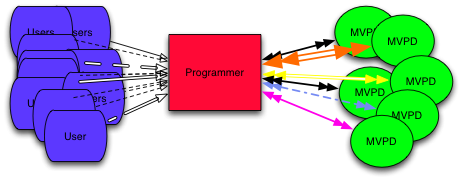

# Programmeringsintegratiegids {#programmer-integration-guide}

>[!IMPORTANT]
>
> De inhoud op deze pagina wordt alleen ter informatie verstrekt. Voor het gebruik van deze API is een huidige licentie van Adobe vereist. Ongeautoriseerd gebruik is niet toegestaan.

Deze integratiehandleiding is bedoeld voor inhoudsproviders (programmeurs) die van plan zijn te integreren met Adobe® Pass Authentication.

In het huidige digitale landschap hebben gebruikers altijd en overal toegang tot internet en kunnen ze toegang aanvragen tot uw beveiligde inhoud. Misschien kijken ze naar een eenmalig evenement of zoeken ze de rechten om een hele televisieserie te streamen die je stuurt.

Voordat u toegang tot beveiligde inhoud verleent, moet u bepalen of de viewer er recht op heeft. De belangrijkste vragen zijn:

* **heeft de kijker een actief abonnement met een Multichannel Video Programming Distributor (MVPD)?**
* **omvat dat abonnement uw programmering?**

## Adobe Pass-verificatie voor tv overal {#adobe-pass-authentication-for-tv-everywhere}

Voor programmeurs is het bepalen van de aanspraak niet altijd eenvoudig. MVPD’s zijn de bewaarnemers van de identificatiegegevens en toegangsrechten van hun klanten. Bovendien kunnen programmeurs zich op een groot aantal verschillende MVPD&#39;s abonneren, elk met unieke systemen. Deze complexiteit maakt het controleren van het recht technisch lastig en hulpbronnenintensief.

{align="center"}

*die} gebruikerstoestemming direct door programmeur wordt bepaald*

Adobe Pass-verificatie vergemakkelijkt op veilige wijze machtigingstransacties tussen programmeurs en MVPD&#39;s, waardoor het snel, gemakkelijk en veilig is om beveiligde inhoud aan in aanmerking komende viewers te leveren.

{align="center"}

*Gebruikersnaam die door de Authentificatie van Adobe Pass wordt gemedieerd*

De Authentificatie van Adobe Pass werkt als volmacht en vergemakkelijkt de machtigingsstroom tussen Programmers en MVPDs door veilige en verenigbare interfaces voor beide partijen aan te bieden.

Voor Programmeurs, verstrekt de Authentificatie van Adobe Pass APIs als deel van a **Standaard** of a **Premium** rij:

* Standaard Adobe Pass-verificatie-API&#39;s:
   * [REST API DCR](/help/authentication/integration-guide-programmers/rest-apis/rest-api-dcr/dynamic-client-registration-overview.md)
   * [REST API V2](/help/authentication/integration-guide-programmers/rest-apis/rest-api-v2/apis/rest-api-v2-apis-overview.md)

* Premium-API&#39;s voor Adobe Pass-verificatie:
   * [Tijdcontrole-API opnieuw instellen](/help/authentication/integration-guide-programmers/features-premium/temporary-access/temp-pass-feature.md#reset-tempass-api-access)
      * [Functie TempPass](/help/authentication/integration-guide-programmers/features-premium/temporary-access/temp-pass-feature.md)
   * [Verslechterings-API](/help/authentication/integration-guide-programmers/features-premium/degraded-access/degradation-feature.md#degradation-api-access)
      * [Afbraakkenmerk](/help/authentication/integration-guide-programmers/features-premium/degraded-access/degradation-feature.md)
   * [Entitlement Service Monitoring API](/help/authentication/integration-guide-programmers/features-premium/esm/entitlement-service-monitoring-api.md)

### Gevallen gebruiken {#use-cases}

In deze sectie worden de Gebruiksgevallen voor de integratie van de programmeur beschreven die door Adobe Pass-verificatie worden ondersteund:

* Programmeertoepassing (TVE) met één kanaalnetwerk

  Hierdoor kan de programmeur gebruikers toegang tot de inhoud bieden via een kanaalnetwerk voor één merk binnen een TVE-toepassing.

* Programmeertoepassing (TVE) met meerdere kanaalnetwerken

  Hierdoor kan de programmeur gebruikers toegang verschaffen tot de inhoud via meerdere kanaalnetwerken in één TVE-toepassing.

* Programmeertoepassing (TVE) voor speciale gebeurtenissen

  Hierdoor kan de programmeur gebruikers toegang geven tot de inhoud van speciale gebeurtenissen die mogelijk geen bronnen zijn die zich in de MVPD-machtigingsdatabase bevinden, zoals normale kanalen.

| **Fase** | **Prioriteit** | **Geval van het Gebruik** | **Documenten** |
|----------------------|--------------|-------------------------------------------------------------------------|----------------------------------------------------------------------------------------------------------------------------------------------------------------------------------|
| **Authentificatie** | **Hoog** | Verificatie | Voor meer details, verwijs naar de documenten die onder de [ sectie van de Fase van de Authentificatie ](#authentication-phase) worden samengevoegd. |
|                      | **Hoog** | Home-Based Authentication (HBA) | Voor meer details, verwijs naar [ op huis-Gebaseerde Authentificatie ](/help/authentication/integration-guide-programmers/features-standard/hba-access/home-based-authentication.md). |
|                      | **Hoog** | Eenmalige aanmelding (SSO) | Voor meer details, verwijs naar de documenten die onder [ worden samengevoegd Enige Sign-On (SSO) ](#sso) sectie. |
|                      | **Hoog** | MVPD selecteren | Voor meer details, verwijs naar de documenten die onder de [ sectie van de Fase van de Configuratie ](#configuration-phase) worden samengevoegd. |
|                      | **Medium** | Aanmeldingspagina van MVPD met merk | Laat MVPDs toe om login pagina&#39;s van branding te voorzien specifiek voor de programmeur of de dienstverlener, met inbegrip van steun voor standaardtaalvoorkeur. |
|                      | **Hoog** | De waarden voor tijd tot leven (TTL) per platform configureren | Voor meer details, verwijs naar de [ Gids van de Gebruiker van de Integratie van het Dashboard van TVE ](/help/authentication/user-guide-tve-dashboard/tve-dashboard-integrations.md#most-used-flows). |
| **preAuthorisation** | **Laag** | Voorvoegsel (Preflight-autorisatie) | Voor meer details, verwijs naar de documenten die onder de [ sectie van de Fase van de Voorkeur ](#preauthorization-phase) worden samengevoegd. |
|                      | **Medium** | Verbeterde foutcodes | Voor meer details, verwijs naar [ Verbeterde Codes van de Fout ](/help/authentication/integration-guide-programmers/features-standard/error-reporting/enhanced-error-codes.md). |
| **Vergunning** | **Hoog** | Toestemming | Voor meer details, verwijs naar de documenten die onder de [ sectie van de Fase van de Toestemming ](#authorization-phase) worden samengevoegd. |
|                      | **Hoog** | Verificatie via afzonderlijk kanaal | Hiermee kunnen gebruikers toegang krijgen tot inhoud van meerdere kanaalnetwerken binnen één TVE-toepassing. Programmeurs kunnen kanaalspecifieke vergunningsvraag maken om bevoegdheid te verifiëren. |
|                      | **Laag** | Autorisatie op bedrijfsniveau | Hiermee kunnen MVPD&#39;s tijdens de autorisatie gedetailleerde analyses voor afzonderlijke inhoudselementen verzamelen. |
|                      | **Medium** | Verbeterde foutcodes | Voor meer details, verwijs naar [ Verbeterde Codes van de Fout ](/help/authentication/integration-guide-programmers/features-standard/error-reporting/enhanced-error-codes.md). |
|                      | **Hoog** | Programmer Federated Player - met machtiging op paginaniveau | Voor meer details, verwijs naar de [ Tokens van Media ](/help/authentication/integration-guide-programmers/features-standard/entitlements/media-tokens.md). |
|                      | **Medium** | Programmer Federated Player - met interne Player Authorization | Voor meer details, verwijs naar de [ Tokens van Media ](/help/authentication/integration-guide-programmers/features-standard/entitlements/media-tokens.md). |
|                      | **Hoog** | Gesynchroniseerde speler - Gehost op MVPD Portal met machtiging op paginaniveau | Voor meer details, verwijs naar de [ Tokens van Media ](/help/authentication/integration-guide-programmers/features-standard/entitlements/media-tokens.md). |
|                      | **Laag** | Ouderlijke controle - Inhoudsbeoordelingen in vergunningsaanvragen | Hiermee kan de programmeur inhoudsbeoordelingen opnemen als onderdeel van het vergunningsverzoek aan de MVPD die nuttig zijn voor het verlenen van vergunningen op bedrijfsniveau. |
|                      | **Laag** | Ouderlijke controle - Inhoud filteren op basis van gebruikerskenmerken | Hiermee kan de programmeur de maximale toegestane inhoudclassificatie voor een gebruiker controleren en de beschikbare inhoud dienovereenkomstig filteren. |
| **Logout** | **Medium** | Afmelden | Voor meer details, verwijs naar de documenten die onder de [ worden samengevoegd Logout sectie van de Fase ](#logout-phase). |

## Entitlement Flow {#entitlement-flow}

De machtigingsstroom is een reeks stappen die een programmeertoepassing (TVE) moet voltooien om beveiligde inhoud te streamen. De stroom bestaat uit de volgende fasen:

* [Registratiefase](#registration-phase)
* [Configuratiefase](#configuration-phase)
* [Verificatiefase](#authentication-phase)
* [(Optioneel) Preautorisatiefase](#preauthorization-phase)
* [Autorisatiefase](#authorization-phase)
* [Afmeldingsfase](#logout-phase)

Bij het eerste bezoek van een gebruiker aan een programmeertoepassing (TVE) volgt de stroom voor machtigingen de geschetste volgorde. Bij volgende bezoeken kan de toepassing echter bepaalde stappen omzeilen op basis van de status van de registratie of verificatie en het toepasselijke weergavebeleid.

Voor een gedetailleerde verkenning van de machtigingsstroom en de bijbehorende fasen, blijft u dit document lezen en raadpleegt u de bijbehorende handleidingen voor cookies voor meer informatie:

* [REST API V2 Cookbook (client-naar-server)](/help/authentication/integration-guide-programmers/rest-apis/rest-api-v2/cookbooks/rest-api-v2-cookbook-client-server.md)
* [REST API V2 Cookbook (Server-to-Server)](/help/authentication/integration-guide-programmers/rest-apis/rest-api-v2/cookbooks/rest-api-v2-cookbook-server-server.md)

>[!NOTE]
>
> De toepassing van de programmeur (TVE) wordt gebruikt in dit document om collectief naar de types van toepassingen te verwijzen die op verschillende platforms (browsers, mobiele apparaten, TV aangesloten apparaten, enz.) worden loopt die door de Authentificatie van Adobe Pass worden gesteund.

### Registratiefase {#registration-phase}

Het doel van de Fase van de Registratie is de cliënttoepassing tegen de Authentificatie van Adobe Pass door het [ Dynamische Registratie van de Cliënt (DCR) te registreren ](/help/authentication/integration-guide-programmers/rest-apis/rest-api-dcr/dynamic-client-registration-overview.md) proces.

Het dynamische proces van de Registratie van de Cliënt (DCR) vereist de cliënttoepassing om een paar cliëntgeloofsbrieven te verkrijgen en een toegangstoken als einddoel van de Fase van de Registratie terug te winnen.

**APIs**

* [Client-referenties ophalen](/help/authentication/integration-guide-programmers/rest-apis/rest-api-dcr/apis/dynamic-client-registration-apis-retrieve-client-credentials.md)
* [Toegangstoken ophalen](/help/authentication/integration-guide-programmers/rest-apis/rest-api-dcr/apis/dynamic-client-registration-apis-retrieve-access-token.md)

**Stromen**

* [Dynamische clientregistratiestroom](/help/authentication/integration-guide-programmers/rest-apis/rest-api-dcr/flows/dynamic-client-registration-flow.md)

**FAQs**

* [ de fase FAQs van de Registratie ](/help/authentication/integration-guide-programmers/rest-apis/rest-api-v2/rest-api-v2-faqs.md#registration-phase-faqs-general).

### Configuratiefase {#configuration-phase}

Het doel van de Fase van de Configuratie is de cliënttoepassing de lijst van MVPDs te verstrekken waarmee het samen met configuratiedetails actief wordt geïntegreerd die door de Authentificatie van Adobe Pass voor elke MVPD wordt bewaard.

De configuratiefase fungeert als een noodzakelijke stap voor de verificatiefase wanneer de clienttoepassing de gebruiker moet vragen zijn of haar tv-provider te selecteren.

**APIs**

* [Win configuratie voor specifieke dienstverlener terug](/help/authentication/integration-guide-programmers/rest-apis/rest-api-v2/apis/configuration-apis/rest-api-v2-configuration-apis-retrieve-configuration-for-specific-service-provider.md)

**FAQs**

* [ de fase FAQs van de Configuratie ](/help/authentication/integration-guide-programmers/rest-apis/rest-api-v2/rest-api-v2-faqs.md#configuration-phase-faqs-general).

>[!TIP]
>
> De TVE-toepassing moet een MVPD-selectieinterface bevatten waarmee gebruikers gemakkelijk hun tv-provider kunnen identificeren en selecteren.

### Verificatiefase {#authentication-phase}

Het doel van de verificatiefase is om de clienttoepassing de mogelijkheid te bieden de identiteit van de gebruiker met de MVPD te verifiëren en om metagegevens van de gebruiker te verkrijgen.

De verificatiefase fungeert als een noodzakelijke stap voor de fase voorafgaand aan autorisatie of de machtigingsfase wanneer de clienttoepassing inhoud moet afspelen.

Met geslaagde verificatie wordt een profiel gegenereerd dat is gekoppeld aan de toepassing, het apparaat en de serviceprovider, en dat ook informatie over gebruikersmetagegevens bevat.

**Stappen op hoog niveau**

De volgende stappen schetsen de stappen op hoog niveau in het geval van een integratie van SAML:

1. **de Lading van de Toepassing van de Programmer (Website)**\
   De gebruiker navigeert aan de toepassing van de Programmer (website), die de Authentificatie van Adobe Pass [ REST API V2 ](/help/authentication/integration-guide-programmers/rest-apis/rest-api-v2/rest-api-v2-overview.md) integreert.

1. **het Beschermde Verzoek van de Inhoud**\
   Wanneer de gebruiker toegang probeert te krijgen tot beveiligde inhoud, geeft de toepassing van de programmeur een lijst van MVPD&#39;s weer waaruit de gebruiker kan kiezen.

1. **Initialisatie van het Verzoek van de Authentificatie**\
   Als MVPD is geselecteerd, wordt de gebruiker omgeleid naar een Adobe Pass-verificatieserver. Hier, wordt een gecodeerd de authentificatieverzoek van SAML voor geselecteerde MVPD geproduceerd, in het geval van een integratie SAML. Dit verzoek wordt namens de programmeur naar de MVPD verzonden. Afhankelijk van het MVPD-systeem wordt de browser van de gebruiker omgeleid naar de aanmeldingspagina van MVPD of wordt een inlogiFrame ingesloten in de toepassing van de programmeur.

1. **Login MVPD**\
   MVPD accepteert de aanvraag en presenteert zijn aanmeldingsinterface via omleiding of iFrame.

1. **Login en Bevestiging van de Gebruiker**\
   De gebruiker meldt zich aan met zijn MVPD-referenties. De MVPD valideert de abonnementsstatus van de gebruiker en stelt een eigen HTTP-sessie in.

1. **MVPD Reactie op de Authentificatie van Adobe Pass**\
   Nadat de validatie is voltooid, genereert de MVPD een (gecodeerde) SAML-reactie en stuurt deze terug naar de Adobe Pass-verificatie.

1. **de Generatie van het Profiel**\
   De Authentificatie van Adobe Pass verifieert de reactie van SAML, produceert een gebruikersprofiel dat caching wordt, en richt de gebruiker terug naar de toepassing van de Programmer (website).

**APIs**

* [Verificatiesessie maken](/help/authentication/integration-guide-programmers/rest-apis/rest-api-v2/apis/sessions-apis/rest-api-v2-sessions-apis-create-authentication-session.md)
* [Verificatiesessie hervatten](/help/authentication/integration-guide-programmers/rest-apis/rest-api-v2/apis/sessions-apis/rest-api-v2-sessions-apis-resume-authentication-session.md)
* [Verificatiesessie ophalen](/help/authentication/integration-guide-programmers/rest-apis/rest-api-v2/apis/sessions-apis/rest-api-v2-sessions-apis-retrieve-authentication-session-information-using-code.md)
* [Verificatie uitvoeren in gebruikersagent](/help/authentication/integration-guide-programmers/rest-apis/rest-api-v2/apis/sessions-apis/rest-api-v2-sessions-apis-perform-authentication-in-user-agent.md)
* [Profielen ophalen](/help/authentication/integration-guide-programmers/rest-apis/rest-api-v2/apis/profiles-apis/rest-api-v2-profiles-apis-retrieve-profiles.md)
* [Profiel ophalen voor specifieke mvpd](/help/authentication/integration-guide-programmers/rest-apis/rest-api-v2/apis/profiles-apis/rest-api-v2-profiles-apis-retrieve-profile-for-specific-mvpd.md)
* [Profiel ophalen voor specifieke code](/help/authentication/integration-guide-programmers/rest-apis/rest-api-v2/apis/profiles-apis/rest-api-v2-profiles-apis-retrieve-profile-for-specific-code.md)

**Stromen**

* [Standaardverificatiestroom uitgevoerd binnen primaire toepassing](/help/authentication/integration-guide-programmers/rest-apis/rest-api-v2/flows/basic-access-flows/rest-api-v2-basic-authentication-primary-application-flow.md)
* [Basisverificatiestroom uitgevoerd binnen secundaire toepassing](/help/authentication/integration-guide-programmers/rest-apis/rest-api-v2/flows/basic-access-flows/rest-api-v2-basic-authentication-secondary-application-flow.md)
* [Stroom van basisprofielen uitgevoerd in primaire toepassing](/help/authentication/integration-guide-programmers/rest-apis/rest-api-v2/flows/basic-access-flows/rest-api-v2-basic-profiles-primary-application-flow.md)
* [De stroom van basisprofielen die binnen secundaire toepassing wordt uitgevoerd](/help/authentication/integration-guide-programmers/rest-apis/rest-api-v2/flows/basic-access-flows/rest-api-v2-basic-profiles-secondary-application-flow.md)

**FAQs**

* [ de fase FAQs van de Authentificatie ](/help/authentication/integration-guide-programmers/rest-apis/rest-api-v2/rest-api-v2-faqs.md#authentication-phase-faqs-general).

>[!TIP]
>
> De TVE-toepassing moet de verificatiestatus van de gebruiker duidelijk weergeven, bijvoorbeeld door het MVPD-logo naast &quot;vergrendelde&quot; of &quot;niet-vergrendelde&quot; pictogrammen weer te geven om de toegankelijkheid van beveiligde inhoud aan te geven.

#### Eenmalige aanmelding (SSO) {#single-sign-on}

**APIs**

* [Vraag van partnerverificatie ophalen](/help/authentication/integration-guide-programmers/rest-apis/rest-api-v2/apis/partner-single-sign-on-apis/rest-api-v2-partner-single-sign-on-apis-retrieve-partner-authentication-request.md)
* [Profiel maken en ophalen met de verificatiereactie van de partner](/help/authentication/integration-guide-programmers/rest-apis/rest-api-v2/apis/partner-single-sign-on-apis/rest-api-v2-partner-single-sign-on-apis-retrieve-profile-using-partner-authentication-response.md)

**Stromen**

* [Enig teken-op het gebruiken van partnerstromen](/help/authentication/integration-guide-programmers/rest-apis/rest-api-v2/flows/single-sign-on-access-flows/rest-api-v2-single-sign-on-partner-flows.md)
* [Single Sign-On met gebruik van platformidentiteitsstromen](/help/authentication/integration-guide-programmers/rest-apis/rest-api-v2/flows/single-sign-on-access-flows/rest-api-v2-single-sign-on-platform-identity-flows.md)
* [Single Sign-On die de stromen van het de dienstteken gebruikt](/help/authentication/integration-guide-programmers/rest-apis/rest-api-v2/flows/single-sign-on-access-flows/rest-api-v2-single-sign-on-service-token-flows.md)

### (Optioneel) Preautorisatiefase {#preauthorization-phase}

Het doel van de fase van voorafgaande toestemming is de clienttoepassing de mogelijkheid te bieden een subset van bronnen uit de catalogus te presenteren waartoe de gebruiker toegang zou hebben.

De fase voorafgaand aan autorisatie kan de gebruikerservaring verbeteren wanneer de gebruiker de cliënttoepassing voor het eerst opent of aan een nieuwe sectie navigeert.

**APIs**

* [Toestemmingsbesluiten ophalen](/help/authentication/integration-guide-programmers/rest-apis/rest-api-v2/apis/decisions-apis/rest-api-v2-decisions-apis-retrieve-preauthorization-decisions-using-specific-mvpd.md)

**Stromen**

* [Basis preautorisatiestroom uitgevoerd binnen primaire toepassing](/help/authentication/integration-guide-programmers/rest-apis/rest-api-v2/flows/basic-access-flows/rest-api-v2-basic-preauthorization-primary-application-flow.md)

**FAQs**

* [ Veelgestelde vragen van de pre-vergunningsfase ](/help/authentication/integration-guide-programmers/rest-apis/rest-api-v2/rest-api-v2-faqs.md#preauthorization-phase-faqs-general).

>[!TIP]
>
> De TVE-toepassing moet beperkte inhoud duidelijk onderscheiden van geoorloofde inhoud door visuele indicatoren te gebruiken, zoals een &quot;vergrendeld&quot; pictogram voor beperkte inhoud en een &quot;niet-vergrendeld&quot; pictogram voor geoorloofde inhoud.

### Autorisatiefase {#authorization-phase}

Het doel van de machtigingsfase is om de clienttoepassing de mogelijkheid te bieden om bronnen af te spelen die de gebruiker vraagt nadat hij zijn rechten met de MVPD heeft gevalideerd.

Succesvolle autorisatie genereert een beslissing, die ook een media-token bevat dat voor beveiligingsdoeleinden aan de toepassing Programmer (TVE) wordt geleverd.

**Stappen op hoog niveau**

In de volgende stappen worden de stappen op hoog niveau beschreven:

1. **Verwerking van het Herkenningsteken van het Middel**\
   De beschermde inhoud wordt geïdentificeerd door a [ middelherkenningsteken ](/help/authentication/integration-guide-programmers/features-standard/entitlements/decisions.md#resource-identifier), dat een eenvoudig koord of een complexere structuur kan zijn. Deze id is vooraf gedefinieerd en overeengekomen door de programmeur en de MVPD. De toepassing van de Programmer verzendt het middelherkenningsteken naar de Authentificatie van Adobe Pass [ REST API V2 ](/help/authentication/integration-guide-programmers/rest-apis/rest-api-v2/rest-api-v2-overview.md).

1. **de Controle van de Vergunning van MVPD**\
   De server van de Authentificatie van Adobe Pass communiceert met het de vergunningseindpunt van MVPD gebruikend gestandaardiseerde protocollen.

1. **MVPD Reactie op de Authentificatie van Adobe Pass**\
   Zodra de validatie is voltooid, bevestigt de MVPD dat de gebruiker (of niet) gerechtigd is om toegang te krijgen tot de inhoud en een reactie terug te sturen naar de Adobe Pass-verificatie.

1. **Besluit en de Symbolische Generatie van Media**\
   De Authentificatie van Adobe Pass verifieert de reactie, produceert a [ besluit ](/help/authentication/integration-guide-programmers/features-standard/entitlements/decisions.md) dat in het voorgeheugen ondergebracht wordt, en keert het besluit terug dat een media teken terug naar de toepassing van de Programmer (website) bevat.

1. **de Verificatie van de Toegang van de Inhoud**\
   De toepassing van de Programmer gebruikt [ Symbolische Verifier van Media ](/help/authentication/integration-guide-programmers/features-standard/entitlements/media-tokens.md#media-token-verifier) om te bevestigen dat de correcte gebruiker tot de correcte inhoud toegang heeft. Na de validatie krijgt de gebruiker toegang om de beveiligde inhoud weer te geven.

**APIs**

* [Toestemmingsbesluiten ophalen](/help/authentication/integration-guide-programmers/rest-apis/rest-api-v2/apis/decisions-apis/rest-api-v2-decisions-apis-retrieve-authorization-decisions-using-specific-mvpd.md)

**Stromen**

* [Basisvergunningsstroom uitgevoerd binnen primaire toepassing](/help/authentication/integration-guide-programmers/rest-apis/rest-api-v2/flows/basic-access-flows/rest-api-v2-basic-authorization-primary-application-flow.md)

**FAQs**

* [ de fase FAQs van de Vergunning van de Vergunning ](/help/authentication/integration-guide-programmers/rest-apis/rest-api-v2/rest-api-v2-faqs.md#authorization-phase-faqs-general).

>[!TIP]
>
> De TVE-toepassing moet beperkte inhoud duidelijk onderscheiden van geoorloofde inhoud door visuele indicatoren te gebruiken, zoals een &quot;vergrendeld&quot; pictogram voor beperkte inhoud en een &quot;niet-vergrendeld&quot; pictogram voor geoorloofde inhoud.

### Afmeldingsfase {#logout-phase}

Het doel van de afmeldingsfase is om de clienttoepassing de mogelijkheid te bieden het geverifieerde profiel van de gebruiker binnen de Adobe Pass-verificatie op verzoek te beëindigen.

**APIs**

* [Afmelden starten voor specifieke mvpd](/help/authentication/integration-guide-programmers/rest-apis/rest-api-v2/apis/logout-apis/rest-api-v2-logout-apis-initiate-logout-for-specific-mvpd.md)

**Stromen**

* [Basisuitlogingsstroom uitgevoerd in primaire toepassing](/help/authentication/integration-guide-programmers/rest-apis/rest-api-v2/flows/basic-access-flows/rest-api-v2-basic-logout-primary-application-flow.md)

**FAQs**

* [ Logout fase FAQs ](/help/authentication/integration-guide-programmers/rest-apis/rest-api-v2/rest-api-v2-faqs.md#logout-phase-faqs-general).

#### Single Logout (SLO) {#single-logout}

**Stromen**

* [Single Logout-flow](/help/authentication/integration-guide-programmers/rest-apis/rest-api-v2/flows/single-sign-on-access-flows/rest-api-v2-single-sign-on-logout-flow.md)

## Entitlement {#understanding-entitlements}

De oplossing van de Authentificatie van Adobe Pass draait rond de verwezenlijking van recht-specifieke stukken gegevens die op de succesvolle voltooiing van authentificatie en vergunningswerkschema&#39;s worden geproduceerd. Deze rechten verlenen toegang tot beschermde inhoud, maar hebben een beperkte duur. Nadat een machtiging is verlopen, moet deze worden vernieuwd door de verificatie- of autorisatieprocessen opnieuw te starten.

Raadpleeg de volgende documenten voor meer informatie over rechten:

* **Profielen**

  Na succesvolle verificatie maakt Adobe Pass Authentication een geverifieerd profiel (&quot;long-live&quot;) dat is gekoppeld aan de aanvraag-id voor de toepassing, het apparaat en de serviceprovider (aanvrager-id).

* **[Metagegevens van de Gebruiker](/help/authentication/integration-guide-programmers/features-standard/entitlements/user-metadata.md)**

  Bij geslaagde verificatie (en in sommige gevallen ook na autorisatie) ontvangt Adobe Pass Authentication gebruikersmetagegevens van de MVPD die deze toegankelijk kunnen maken voor de toepassing die het verzoek indient.

* **[Besluiten](/help/authentication/integration-guide-programmers/features-standard/entitlements/decisions.md)**

  Na een geslaagde autorisatie maakt Adobe Pass Authentication een machtigingsbesluit (&quot;langlevende&quot;) dat verband houdt met de aanvraag, het apparaat, de dienstverlener-id (aanvrager-id) en een specifieke beschermde bron (bron-id).

* **[Tokens van Media](/help/authentication/integration-guide-programmers/features-standard/entitlements/media-tokens.md)**

  Na een geslaagde autorisatie maakt Adobe Pass Authentication een mediatoken (&quot;kortstondig&quot;) die aan een succesvol afspeelverzoek is gekoppeld en die ondersteuning biedt voor best practices van de branche voor het beperken van fraude (bijvoorbeeld &#39;streaming ripping&#39;).

De time-to-live (&quot;TTL&quot;) waarden voor profielen en besluiten worden vastgesteld op basis van overeenkomsten tussen programmeurs en betaaltelevisieproviders, die het eens zijn over een waarde die het best alle betrokkenen ten goede komt.
