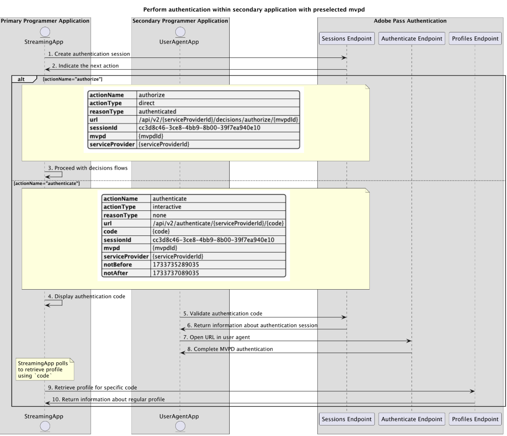

# Basisverificatiestroom uitgevoerd binnen secundaire toepassing {#basic-authentication-flow-performed-within-secondary-application}

>[!IMPORTANT]
>
> De inhoud op deze pagina wordt alleen ter informatie verstrekt. Voor het gebruik van deze API is een huidige licentie van Adobe vereist. Ongeautoriseerd gebruik is niet toegestaan.

>[!IMPORTANT]
>
> De implementatie van REST API V2 wordt begrensd door de [ Throttling mechanisme ](/help/authentication/integration-guide-programmers/throttling-mechanism.md) documentatie.

>[!MORELIKETHIS]
>
> Zorg ervoor om [ REST API V2 FAQs ](/help/authentication/integration-guide-programmers/rest-apis/rest-api-v2/rest-api-v2-faqs.md#authentication-phase-faqs-general) ook te bezoeken.

De **stroom van de Authentificatie** binnen de rechten van de Authentificatie van Adobe Pass staat de het stromen toepassing toe om te verifiëren dat een gebruiker een geldige rekening van MVPD heeft. Voor dit proces moet de gebruiker een actieve MVPD-account hebben en geldige aanmeldingsgegevens invoeren op de MVPD-aanmeldingspagina.

Verificatiestroom is vereist in de volgende gevallen:

* Wanneer de gebruiker een toepassing voor de eerste keer opent.
* Wanneer de vorige verificatie van de gebruiker is verlopen.
* Wanneer de gebruiker zich afmeldt bij de MVPD-account.
* Wanneer de gebruiker wil verifiëren met een andere MVPD.

In al deze gevallen ontvangt de toepassing die een van de eindpunten van Profielen aanroept, een lege reactie of een of meer profielen, maar voor verschillende MVPD&#39;s.

De **stroom van de Authentificatie** vereist een gebruikersagent (browser) om een reeks vraag van de toepassing aan Adobe Pass achterste, toen aan de login van MVPD pagina, en definitief terug naar de toepassing te voltooien. Deze stroom kan verscheidene omleidingen aan de systemen van MVPD omvatten en het beheren van koekjes of zittingen die voor elk domein worden opgeslagen, die kunnen zijn moeilijk te bereiken en zonder een gebruikersagent te beveiligen.

Gebaseerd op de primaire toepassingsmogelijkheden (het stromen toepassing) om gebruikersinteractie te steunen om een MVPD te selecteren en met de geselecteerde MVPD in een gebruikersagent voor authentiek te verklaren, zijn de authentificatiescenario&#39;s:

* [Verificatie uitvoeren binnen primaire toepassing](rest-api-v2-basic-authentication-primary-application-flow.md)
* [Verificatie uitvoeren binnen secundaire toepassing met vooraf geselecteerde mvpd](./rest-api-v2-basic-authentication-secondary-application-flow.md)
* [Verificatie uitvoeren binnen secundaire toepassing zonder vooraf geselecteerde mvpd](./rest-api-v2-basic-authentication-secondary-application-flow.md)

## Verificatie uitvoeren binnen secundaire toepassing met vooraf geselecteerde mvpd {#perform-authentication-within-secondary-application-with-preselected-mvpd}

### Vereisten {#prerequisites-perform-authentication-within-secondary-application-with-preselected-mvpd}

Alvorens de authentificatiestroom binnen een primaire toepassing te beginnen en het te voltooien door gebruikersinteractie binnen een secundaire toepassing, zorg ervoor de volgende eerste vereisten worden voldaan:

* De streamingtoepassing moet een MVPD selecteren.
* De streamingtoepassing moet een verificatiesessie starten om u aan te melden bij de geselecteerde MVPD.
* De secundaire toepassing moet met de geselecteerde MVPD in een gebruikersagent voor authentiek verklaren.

>[!IMPORTANT]
>
> Veronderstellingen
>
>  
> 
> * De streamingtoepassing ondersteunt gebruikersinteractie bij het selecteren van een MVPD.
> * De secundaire toepassing (gewoonlijk op een secundair apparaat) steunt gebruikersinteractie om met geselecteerde MVPD in een gebruikersagent voor authentiek te verklaren.

### Workflow {#workflow-perform-authentication-within-secondary-application-with-preselected-mvpd}

Volg de gegeven stappen om de basisauthentificatiestroom uit te voeren die binnen een secundaire toepassing met vooraf geselecteerde MVPD zoals aangetoond in het volgende diagram wordt uitgevoerd.

*voer authentificatie binnen secundaire toepassing met vooraf geselecteerde mvpd uit*

1. **creeer authentificatiesessie:** de het stromen toepassing verzamelt alle noodzakelijke gegevens om een authentificatiesessie in werking te stellen door het eindpunt van Sessies te roepen.

   >[!IMPORTANT]
   >
   > Verwijs naar [ creeer authentificatiesessie ](../../apis/sessions-apis/rest-api-v2-sessions-apis-create-authentication-session.md) API documentatie voor details op:
   > 
   > * Alle _vereiste_ parameters, als `serviceProvider`, `mvpd`, `domainName`, en `redirectUrl`
   > * Alle _vereiste_ kopballen, als `Authorization`, `AP-Device-Identifier`
   > * Alle _facultatieve_ parameters en kopballen
   >
   >  
   > 
   > De streaming toepassing moet alle vereiste parameters in één enkele vraag verstrekken wanneer het creëren van de authentificatiesessie.

1. **wijs op de volgende actie:** De het eindpuntreactie van Sessies bevat de noodzakelijke gegevens om de het stromen toepassing betreffende de volgende actie te begeleiden.

   >[!IMPORTANT]
   >
   > Verwijs naar [ creeer authentificatiesessie ](../../apis/sessions-apis/rest-api-v2-sessions-apis-create-authentication-session.md) API documentatie voor details over de informatie die in een zittingsreactie wordt verstrekt.
   > 
   >  
   > 
   > Het eindpunt van Sessies valideert de aanvraaggegevens om ervoor te zorgen dat aan de basisvoorwaarden wordt voldaan:
   >
   > * De _vereiste_ parameters en de kopballen moeten geldig zijn.
   > * De integratie tussen de opgegeven `serviceProvider` en `mvpd` moet actief zijn.
   >
   >  
   > 
   > Als de bevestiging ontbreekt, zal een foutenreactie worden geproduceerd, verstrekkend extra informatie die aan de [ Verbeterde documentatie van de Codes van de Fout ](../../../../features-standard/error-reporting/enhanced-error-codes.md) volgt.

1. **ga met besluitvormingsstromen te werk:** De reactie van het eindpunt van zittingen bevat de volgende gegevens:
   * Het attribuut `actionName` wordt ingesteld op &quot;authorize&quot;.
   * Het attribuut `actionType` wordt ingesteld op &quot;direct&quot;.

   Als de Adobe Pass-backend een geldig profiel identificeert, hoeft de streamingtoepassing niet opnieuw te worden geverifieerd met de geselecteerde MVPD, omdat er al een profiel is dat kan worden gebruikt voor volgende beslissingsstromen.

1. **de authentificatiecode van de Vertoning:** de reactie van het eindpunt van Zegelingen bevat de volgende gegevens:
   * `code` die kan worden gebruikt om de authentificatiesessie binnen een secundaire toepassing te hervatten.
   * Het kenmerk `actionName` is ingesteld op &quot;authenticate&quot;.
   * Het attribuut `actionType` wordt ingesteld op &quot;interactive&quot;.

   Als de Adobe Pass-backend geen geldig profiel herkent, wordt in de streamingtoepassing de `code` weergegeven die kan worden gebruikt om de verificatiesessie in een secundaire toepassing te hervatten.

1. **bevestigt authentificatiecode:** de secundaire toepassing bevestigt de verstrekte gebruiker `code` om ervoor te zorgen het met de authentificatie van MVPD in gebruikersagent kan te werk gaan.

   >[!IMPORTANT]
   >
   > Verwijs naar [ de informatie van de authentificatiesessie terug ](../../apis/sessions-apis/rest-api-v2-sessions-apis-retrieve-authentication-session-information-using-code.md) API documentatie voor details op:
   >
   > * Alle _vereiste_ parameters, als `serviceProvider` en `code`
   > * Alle _vereiste_ kopballen, als `Authorization`
   > * Alle _facultatieve_ parameters en kopballen

1. **de informatie van de Terugkeer over authentificatiesessie:** De reactie van het eindpunt van zittingen bevat de volgende gegevens:
   * Het kenmerk `existing` bevat de bestaande parameters die al zijn opgegeven.
   * Het attribuut `missing` bevat de ontbrekende parameters die moeten worden verstrekt om de authentificatiestroom te voltooien.

   >[!IMPORTANT]
   >
   > Verwijs naar [ verkrijg de informatie van de authentificatiesessie ](../../apis/sessions-apis/rest-api-v2-sessions-apis-retrieve-authentication-session-information-using-code.md) API documentatie voor details over de informatie die in een reactie van de zittingsbevestiging wordt verstrekt.
   >
   >  
   >
   > Het eindpunt van Sessies valideert de aanvraaggegevens om ervoor te zorgen dat aan de basisvoorwaarden wordt voldaan:
   >
   > * De _vereiste_ parameters en de kopballen moeten geldig zijn.
   >
   >  
   >
   > Als de bevestiging ontbreekt, zal een foutenreactie worden geproduceerd, verstrekkend extra informatie die aan de [ Verbeterde documentatie van de Codes van de Fout ](../../../../features-standard/error-reporting/enhanced-error-codes.md) volgt.

   >[!TIP]
   >
   > Suggestie: de secundaire toepassing kan gebruikers informeren dat de gebruikte `code` ongeldig is in het geval van een foutreactie die een ontbrekende verificatiesessie aangeeft, en hen adviseren opnieuw te proberen met een nieuwe.

1. **Open URL in gebruikersagent:** De secundaire toepassing opent een gebruikersagent om het zelf gegevens verwerkte `url` te laden, die een verzoek aan het Authenticate eindpunt doet. Deze stroom kan verschillende omleidingen bevatten, die de gebruiker uiteindelijk naar de MVPD-aanmeldingspagina leiden en geldige gegevens bieden.

   >[!IMPORTANT]
   >
   > Verwijs naar de [ authentificatie van de Voer in gebruikersagent ](../../apis/sessions-apis/rest-api-v2-sessions-apis-perform-authentication-in-user-agent.md) API documentatie voor details op uit:
   >
   > * Alle _vereiste_ parameters, als `serviceProvider` en `code`
   > * Alle _facultatieve_ parameters en kopballen

1. **Volledige authentificatie van MVPD:** als de authentificatiestroom succesvol is, slaat de gebruikersagent interactie een regelmatig profiel in Adobe Pass achterste op en bereikt verstrekte `redirectUrl`.

1. **wint profiel voor specifieke code terug:** de het stromen toepassing verzamelt alle noodzakelijke gegevens om profielinformatie terug te winnen door een verzoek naar het eindpunt van Profielen te verzenden.

   >[!IMPORTANT]
   >
   > Verwijs naar [ terugwinnen profiel voor specifieke code ](../../apis/profiles-apis/rest-api-v2-profiles-apis-retrieve-profile-for-specific-code.md) API documentatie voor details op:
   > 
   > * Alle _vereiste_ parameters, als `serviceProvider` en `code`
   > * Alle _vereiste_ kopballen, als `Authorization`, `AP-Device-Identifier`
   > * Alle _facultatieve_ parameters en kopballen

   >[!TIP]
   >
   > Suggestie: de streamingtoepassing kan een opiniepeilingsmechanisme implementeren met behulp van `code` om te controleren of het standaardprofiel is gegenereerd en opgeslagen.

1. **de informatie van de Terugkeer over regelmatig profiel:** de het eindpuntreactie van Profielen bevat informatie over het regelmatige profiel verbonden aan de ontvangen parameters en kopballen.

   >[!IMPORTANT]
   >
   > Verwijs naar [ terugwinnen profiel voor specifieke code ](../../apis/profiles-apis/rest-api-v2-profiles-apis-retrieve-profile-for-specific-code.md) API documentatie voor details op de informatie die in een profielreactie wordt verstrekt.
   > 
   >  
   > 
   > Het eindpunt van Profielen bevestigt de verzoekgegevens om ervoor te zorgen dat de basisvoorwaarden worden voldaan:
   >
   > * De _vereiste_ parameters en de kopballen moeten geldig zijn.
   >
   >  
   > 
   > Als de bevestiging ontbreekt, zal een foutenreactie worden geproduceerd, verstrekkend extra informatie die aan de [ Verbeterde documentatie van de Codes van de Fout ](../../../../features-standard/error-reporting/enhanced-error-codes.md) volgt.

## Verificatie uitvoeren binnen secundaire toepassing zonder vooraf geselecteerde mvpd {#perform-authentication-within-secondary-application-without-preselected-mvpd}

### Vereisten {#prerequisites-perform-authentication-within-secondary-application-without-preselected-mvpd}

Alvorens de authentificatiestroom binnen een primaire toepassing te beginnen en het te voltooien door gebruikersinteractie binnen een secundaire toepassing, zorg ervoor de volgende eerste vereisten worden voldaan:

* De streamingtoepassing moet een verificatiesessie starten wanneer deze zich moet aanmelden.
* De secundaire toepassing moet een MVPD selecteren.
* De secundaire toepassing moet met de geselecteerde MVPD in een gebruikersagent voor authentiek verklaren.

>[!IMPORTANT]
>
> Veronderstellingen
>
>  
> 
> * De secundaire toepassing (gewoonlijk op een secundair apparaat) steunt gebruikersinteractie om een MVPD te selecteren.
> * De secundaire toepassing (gewoonlijk op een secundair apparaat) steunt gebruikersinteractie om met geselecteerde MVPD in een gebruikersagent voor authentiek te verklaren.

### Workflow {#workflow-perform-authentication-within-secondary-application-without-preselected-mvpd}

Volg de gegeven stappen om de basisauthentificatiestroom uit te voeren die binnen een secundaire toepassing zonder vooraf geselecteerde MVPD zoals aangetoond in het volgende diagram wordt uitgevoerd.

*voer authentificatie binnen secundaire toepassing zonder vooraf geselecteerde mvpd uit*

1. **creeer authentificatiesessie:** de het stromen toepassing verzamelt enkele noodzakelijke gegevens om een authentificatiesessie in werking te stellen door het eindpunt van Zittingen te roepen.

   >[!IMPORTANT]
   >
   > Verwijs naar [ creeer authentificatiesessie ](../../apis/sessions-apis/rest-api-v2-sessions-apis-create-authentication-session.md) API documentatie voor details op:
   >
   > * Alle _vereiste_ parameters, als `serviceProvider`
   > * Alle _vereiste_ kopballen, als `Authorization`, `AP-Device-Identifier`
   > * Alle _facultatieve_ parameters en kopballen
   >
   >  
   > 
   > De streaming toepassing kan niet alle vereiste parameters in één enkele vraag verstrekken wanneer het creëren van de authentificatiesessie.

1. **wijs op de volgende actie:** De reactie van het eindpunt van zittingen bevat de noodzakelijke gegevens om de het stromen toepassing betreffende de volgende actie te begeleiden:
   * `code` die kan worden gebruikt om de authentificatiesessie binnen een secundaire toepassing te hervatten.
   * Het kenmerk `actionName` is ingesteld op &quot;resume&quot;.
   * Het attribuut `actionType` wordt ingesteld op &quot;direct&quot;.

   >[!IMPORTANT]
   >
   > Verwijs naar [ creeer authentificatiesessie ](../../apis/sessions-apis/rest-api-v2-sessions-apis-create-authentication-session.md) API documentatie voor details over de informatie die in een zittingsreactie wordt verstrekt.
   > 
   >  
   > 
   > Het eindpunt van Sessies valideert de aanvraaggegevens om ervoor te zorgen dat aan de basisvoorwaarden wordt voldaan:
   >
   > * De _vereiste_ parameters en de kopballen moeten geldig zijn.
   >
   >  
   > 
   > Als de bevestiging ontbreekt, zal een foutenreactie worden geproduceerd, verstrekkend extra informatie die aan de [ Verbeterde documentatie van de Codes van de Fout ](../../../../features-standard/error-reporting/enhanced-error-codes.md) volgt.

1. **de authentificatiecode van de Vertoning:** de het stromen toepassing toont `code` die kan worden gebruikt om de authentificatiesessie binnen een secundaire toepassing te hervatten.

1. **verstrek authentificatiesessie ontbrekende parameters:** de secundaire toepassing verzamelt alle ontbrekende gegevens die worden vereist om de authentificatiesessie te hervatten en roept het eindpunt van Sessies.

   >[!IMPORTANT]
   >
   > Verwijs naar [ hervat authentificatiesessie ](../../apis/sessions-apis/rest-api-v2-sessions-apis-resume-authentication-session.md) API documentatie voor details op:
   >
   > * Alle _vereiste_ parameters, als `serviceProvider`, `mvpd`, `domainName`, en `redirectUrl`
   > * Alle _vereiste_ kopballen, als `Authorization`, `AP-Device-Identifier`
   > * Alle _facultatieve_ parameters en kopballen

1. **wijs op de volgende actie:** De het eindpuntreactie van Sessies bevat de noodzakelijke gegevens om de het stromen toepassing betreffende de volgende actie te begeleiden.

   >[!IMPORTANT]
   >
   > Verwijs naar [ hervat authentificatiesessie ](../../apis/sessions-apis/rest-api-v2-sessions-apis-resume-authentication-session.md) API documentatie voor details over de informatie die in een zittingsreactie wordt verstrekt.
   > 
   >  
   > 
   > Het eindpunt van Sessies valideert de aanvraaggegevens om ervoor te zorgen dat aan de basisvoorwaarden wordt voldaan:
   >
   > * De _vereiste_ parameters en de kopballen moeten geldig zijn.
   > * De integratie tussen de opgegeven `serviceProvider` en `mvpd` moet actief zijn.
   >
   >  
   > 
   > Als de bevestiging ontbreekt, zal een foutenreactie worden geproduceerd, verstrekkend extra informatie die aan de [ Verbeterde documentatie van de Codes van de Fout ](../../../../features-standard/error-reporting/enhanced-error-codes.md) volgt.

   >[!TIP]
   >
   > Suggestie: de secundaire toepassing kan gebruikers informeren dat de gebruikte `code` ongeldig is in het geval van een foutreactie die een ontbrekende verificatiesessie aangeeft, en hen adviseren opnieuw te proberen met een nieuwe.

1. **wijs bestaand profiel op:** De reactie van het eindpunt van Zegelingen bevat de volgende gegevens:
   * Het attribuut `actionName` wordt ingesteld op &quot;authorize&quot;.
   * Het attribuut `actionType` wordt ingesteld op &quot;direct&quot;.

   Als de Adobe Pass-backend een geldig profiel identificeert, hoeft de streamingtoepassing niet opnieuw te worden geverifieerd met de geselecteerde MVPD, omdat er al een profiel is dat kan worden gebruikt voor volgende beslissingsstromen.

1. **Open URL in gebruikersagent:** De reactie van het eindpunt van zittingen bevat de volgende gegevens:
   * De `url` die kan worden gebruikt om de interactieve verificatie te starten op de MVPD-aanmeldingspagina.
   * Het kenmerk `actionName` is ingesteld op &quot;authenticate&quot;.
   * Het attribuut `actionType` wordt ingesteld op &quot;interactive&quot;.

   Als de Adobe Pass backend geen geldig profiel identificeert, opent de secundaire toepassing een gebruikersagent om verstrekte `url` te laden, die een verzoek aan het Authenticate eindpunt doet. Deze stroom kan verschillende omleidingen bevatten, die de gebruiker uiteindelijk naar de MVPD-aanmeldingspagina leiden en geldige gegevens bieden.

1. **Volledige authentificatie van MVPD:** als de authentificatiestroom succesvol is, slaat de gebruikersagent interactie een regelmatig profiel in de achtergrond van Adobe Pass op en bereikt verstrekte `redirectUrl`.

1. **wint profiel voor specifieke code terug:** de het stromen toepassing verzamelt alle noodzakelijke gegevens om profielinformatie terug te winnen door een verzoek naar het eindpunt van Profielen te verzenden.

   >[!IMPORTANT]
   >
   > Verwijs naar [ terugwinnen profiel voor specifieke code ](../../apis/profiles-apis/rest-api-v2-profiles-apis-retrieve-profile-for-specific-code.md) API documentatie voor details op:
   >
   > * Alle _vereiste_ parameters, als `serviceProvider` en `code`
   > * Alle _vereiste_ kopballen, als `Authorization`, `AP-Device-Identifier`
   > * Alle _facultatieve_ parameters en kopballen

   >[!TIP]
   >
   > Suggestie: de streamingtoepassing kan een opiniepeilingsmechanisme implementeren met behulp van `code` om te controleren of het standaardprofiel is gegenereerd en opgeslagen.

1. **de informatie van de Terugkeer over regelmatig profiel:** de het eindpuntreactie van Profielen bevat informatie over het regelmatige profiel verbonden aan de ontvangen parameters en kopballen.

   >[!IMPORTANT]
   >
   > Verwijs naar [ terugwinnen profiel voor specifieke code ](../../apis/profiles-apis/rest-api-v2-profiles-apis-retrieve-profile-for-specific-code.md) API documentatie voor details op de informatie die in een profielreactie wordt verstrekt.
   > 
   >  
   > 
   > Het eindpunt van Profielen bevestigt de verzoekgegevens om ervoor te zorgen dat de basisvoorwaarden worden voldaan:
   >
   > * De _vereiste_ parameters en de kopballen moeten geldig zijn.
   >
   >  
   > 
   > Als de bevestiging ontbreekt, zal een foutenreactie worden geproduceerd, verstrekkend extra informatie die aan de [ Verbeterde documentatie van de Codes van de Fout ](../../../../features-standard/error-reporting/enhanced-error-codes.md) volgt.
