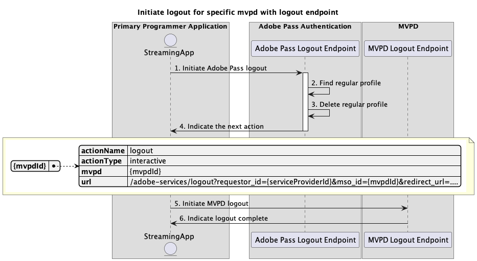

# Basisuitlogingsstroom uitgevoerd in primaire toepassing {#basic-logout-flow-performed-within-primary-application}

>[!IMPORTANT]
>
> De inhoud op deze pagina wordt alleen ter informatie verstrekt. Voor het gebruik van deze API is een huidige licentie van Adobe vereist. Ongeautoriseerd gebruik is niet toegestaan.

>[!IMPORTANT]
>
> De implementatie van REST API V2 wordt begrensd door de [ Throttling mechanisme ](/help/authentication/integration-guide-programmers/throttling-mechanism.md) documentatie.

De **Logout stroom** binnen de rechten van de Authentificatie van Adobe Pass staat de het stromen toepassing toe om twee belangrijkste stappen uit te voeren:

* Verwijder de gewone profielen die op de Adobe Pass-achtergrond zijn opgeslagen.
* Gebruik een gebruikersagent (browser) om aan het MVPD logout eindpunt te navigeren, die een schoonmaakbeurt op de achtergrond MVPD teweegbrengt.

De basis logout stroom staat u toe om voor de volgende scenario&#39;s te vragen:

* [Afmelden voor specifieke mvpd starten met eindpunt voor afmelden](#initiate-logout-for-specific-mvpd-with-logout-endpoint)
* [Afmelden starten voor specifieke mvpd zonder afmeldingseindpunt](#initiate-logout-for-specific-mvpd-without-logout-endpoint)

## Afmelden voor specifieke mvpd starten met afmeldingseindpunt {#initiate-logout-for-specific-mvpd-with-logout-endpoint}

### Vereisten {#prerequisites-initiate-logout-for-specific-mvpd-with-logout-endpoint}

Alvorens logout voor een specifiek MVPD met een logout eindpunt in werking te stellen, zorg ervoor de volgende eerste voorwaarden worden voldaan aan:

* De streaming toepassing moet een geldig regelmatig profiel hebben dat met succes voor MVPD gebruikend één van de basisauthentificatiestromen is gecreeerd:
   * [Verificatie uitvoeren binnen primaire toepassing](rest-api-v2-basic-authentication-primary-application-flow.md)
   * [Verificatie uitvoeren binnen secundaire toepassing met vooraf geselecteerde mvpd](rest-api-v2-basic-authentication-secondary-application-flow.md)
   * [Verificatie uitvoeren binnen secundaire toepassing zonder vooraf geselecteerde mvpd](rest-api-v2-basic-authentication-secondary-application-flow.md)
* De streamingtoepassing moet de logout-flow starten wanneer deze zich moet afmelden bij de MVPD.

>[!IMPORTANT]
>
> Veronderstellingen
>
>  
> 
> * MVPD steunt de logout stroom en heeft een logout eindpunt.

### Workflow {#workflow-initiate-logout-for-specific-mvpd-with-logout-endpoint}

Volg de gegeven stappen om de basislogout stroom voor een specifieke MVPD met een logout eindpunt uit te voeren dat binnen een primaire toepassing zoals aangetoond in het volgende diagram wordt uitgevoerd.

 in werking

*stelt logout voor specifiek mvpd met logout eindpunt* in werking

1. **stelt Adobe Pass logout in werking:** de het stromen toepassing verzamelt alle noodzakelijke gegevens om de logout stroom in werking te stellen door het de Logout van Adobe Pass eindpunt te roepen.

   >[!IMPORTANT]
   >
   > Verwijs naar [ Logout van het Begin voor specifieke mvpd ](../../apis/logout-apis/rest-api-v2-logout-apis-initiate-logout-for-specific-mvpd.md) API documentatie voor details op:
   >
   > * Alle _vereiste_ parameters, als `serviceProvider`, `mvpd`, en `redirectUrl`
   > * Alle _vereiste_ kopballen, als `Authorization`, `AP-Device-Identifier`
   > * Alle _facultatieve_ parameters en kopballen

1. **vind regelmatig profiel:** de server van Adobe Pass identificeert een geldig profiel dat op de ontvangen parameters en kopballen wordt gebaseerd.

1. **Schrap regelmatig profiel:** de server van Adobe Pass schrapt het geïdentificeerde regelmatige profiel van de achtergrond van Adobe Pass.

1. **wijs op de volgende actie:** De het eindpuntreactie van het Logout van Adobe Pass bevat de noodzakelijke gegevens om de het stromen toepassing betreffende de volgende actie te begeleiden:
   * Het attribuut `url` is aanwezig aangezien MVPD de logout stroom steunt.
   * Het attribuut `actionName` wordt ingesteld op &quot;logout&quot;.
   * Het attribuut `actionType` wordt ingesteld op &quot;interactive&quot;.

   >[!IMPORTANT]
   >
   > Verwijs naar [ Logout van het Begin voor specifieke mvpd ](../../apis/logout-apis/rest-api-v2-logout-apis-initiate-logout-for-specific-mvpd.md) API documentatie voor details op de informatie die in een logout reactie wordt verstrekt.
   > 
   >  
   > 
   > Het Adobe Pass Logout eindpunt valideert de verzoekgegevens om ervoor te zorgen dat de basisvoorwaarden worden voldaan:
   >
   > * De _vereiste_ parameters en de kopballen moeten geldig zijn.
   > * De integratie tussen de opgegeven `serviceProvider` en `mvpd` moet actief zijn.
   >
   >  
   > 
   > Als de bevestiging ontbreekt, zal een foutenreactie worden geproduceerd, verstrekkend extra informatie die aan de [ Verbeterde documentatie van de Codes van de Fout ](../../../../features-standard/error-reporting/enhanced-error-codes.md) volgt.

1. **initieert MVPD logout:** De het stromen toepassing leest `url` en gebruikt een gebruikersagent om de logout stroom met MVPD in werking te stellen. De stroom kan verscheidene omleidingen aan systemen omvatten MVPD. Toch is het resultaat dat de MVPD zijn interne schoonmaak uitvoert en de definitieve logout bevestiging terug naar de Adobe Pass backend verzendt.

1. **wijs logout volledig op:** de het stromen toepassing kan op de gebruikersagent wachten om verstrekte `redirectUrl` te bereiken en kan het als signaal gebruiken om naar keuze een specifiek bericht op het gebruikersinterface te tonen.

## Afmelden starten voor specifieke mvpd zonder afmeldingseindpunt {#initiate-logout-for-specific-mvpd-without-logout-endpoint}

### Vereisten {#prerequisites-initiate-logout-for-specific-mvpd-without-logout-endpoint}

Alvorens logout voor een specifiek MVPD zonder een logout eindpunt in werking te stellen, zorg ervoor de volgende eerste voorwaarden worden voldaan aan:

* De streaming toepassing moet een geldig regelmatig profiel hebben dat met succes voor MVPD gebruikend één van de basisauthentificatiestromen is gecreeerd:
   * [Verificatie uitvoeren binnen primaire toepassing](rest-api-v2-basic-authentication-primary-application-flow.md)
   * [Verificatie uitvoeren binnen secundaire toepassing met vooraf geselecteerde mvpd](rest-api-v2-basic-authentication-secondary-application-flow.md)
   * [Verificatie uitvoeren binnen secundaire toepassing zonder vooraf geselecteerde mvpd](rest-api-v2-basic-authentication-secondary-application-flow.md)
* De streamingtoepassing moet de logout-flow starten wanneer deze zich moet afmelden bij de MVPD.

>[!IMPORTANT]
>
> Veronderstellingen
>
>  
> 
> * MVPD steunt niet de logout stroom en heeft geen logout eindpunt.

### Workflow {#workflow-initiate-logout-for-specific-mvpd-without-logout-endpoint}

Volg de gegeven stappen om de basislogout stroom voor een specifieke MVPD zonder een logout uit eindpunt uit te voeren dat binnen een primaire toepassing zoals aangetoond in het volgende diagram wordt uitgevoerd.

*initieert logout voor specifiek mvpd zonder logout eindpunt*

1. **stelt Adobe Pass logout in werking:** de het stromen toepassing verzamelt alle noodzakelijke gegevens om de logout stroom in werking te stellen door het de Logout van Adobe Pass eindpunt te roepen.

   >[!IMPORTANT]
   >
   > Verwijs naar [ Logout van het Begin voor specifieke mvpd ](../../apis/logout-apis/rest-api-v2-logout-apis-initiate-logout-for-specific-mvpd.md) API documentatie voor details op:
   >
   > * Alle _vereiste_ parameters, als `serviceProvider`, `mvpd`, en `redirectUrl`
   > * Alle _vereiste_ kopballen, als `Authorization`, `AP-Device-Identifier`
   > * Alle _facultatieve_ parameters en kopballen

1. **vind regelmatig profiel:** de server van Adobe Pass identificeert een geldig profiel dat op de ontvangen parameters en kopballen wordt gebaseerd.

1. **Schrap regelmatig profiel:** de server van Adobe Pass schrapt het geïdentificeerde regelmatige profiel.

1. **wijs op de volgende actie:** De het eindpuntreactie van het Logout van Adobe Pass bevat de noodzakelijke gegevens om de het stromen toepassing betreffende de volgende actie te begeleiden:
   * Het attribuut `url` ontbreekt aangezien MVPD niet de logout stroom steunt.
   * Het kenmerk `actionName` wordt ingesteld op &quot;complete&quot;.
   * Het attribuut `actionType` wordt ingesteld op &quot;none&quot;.

   >[!IMPORTANT]
   >
   > Verwijs naar [ Logout van het Begin voor specifieke mvpd ](../../apis/logout-apis/rest-api-v2-logout-apis-initiate-logout-for-specific-mvpd.md) API documentatie voor details op de informatie die in een logout reactie wordt verstrekt.
   > 
   >  
   > 
   > Het Adobe Pass Logout eindpunt valideert de verzoekgegevens om ervoor te zorgen dat de basisvoorwaarden worden voldaan:
   >
   > * De _vereiste_ parameters en de kopballen moeten geldig zijn.
   > * De integratie tussen de opgegeven `serviceProvider` en `mvpd` moet actief zijn.
   >
   >  
   > 
   > Als de bevestiging ontbreekt, zal een foutenreactie worden geproduceerd, verstrekkend extra informatie die aan de [ Verbeterde documentatie van de Codes van de Fout ](../../../../features-standard/error-reporting/enhanced-error-codes.md) volgt.

1. **wijs logout volledig op:** de het stromen toepassing verwerkt de reactie en kan het naar keuze gebruiken om een specifiek bericht op het gebruikersinterface te tonen.
