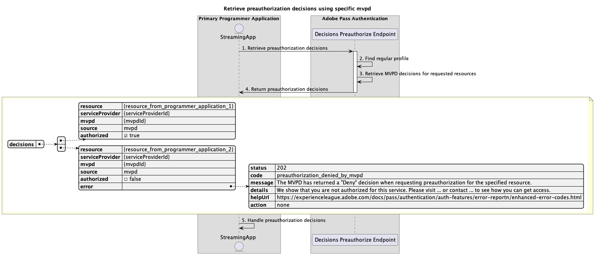

# Basis preautorisatiestroom uitgevoerd binnen primaire toepassing {#basic-preauthorization-flow-performed-within-primary-application}

>[!IMPORTANT]
>
> De inhoud op deze pagina wordt alleen ter informatie verstrekt. Voor het gebruik van deze API is een huidige licentie van Adobe vereist. Ongeautoriseerd gebruik is niet toegestaan.

>[!IMPORTANT]
>
> De implementatie van REST API V2 wordt begrensd door de [&#x200B; Throttling mechanisme &#x200B;](/help/authentication/integration-guide-programmers/throttling-mechanism.md) documentatie.

De **stroom van de Toestemming van de Toestemming van de Authentificatie van Adobe Pass** staat de het stromen toepassing toe om te bepalen of een MVPD de toegang van de gebruiker tot een lijst van middelen kan toestaan of ontkennen. Deze verificatie zorgt ervoor dat de toepassing de gebruiker nauwkeurige informatie kan geven over de inhoud die hij of zij kan bekijken.

## Besluiten vóór toelating met specifieke mvpd ophalen {#retrieve-preauthorization-decisions-using-specific-mvpd}

### Vereisten {#prerequisites-retrieve-preauthorization-decisions-using-specific-mvpd}

Voordat u beslissingen vóór toelating ophaalt met een specifieke MVPD, moet u controleren of aan de volgende voorwaarden is voldaan:

* De streamingtoepassing moet een geldig regelmatig profiel hebben dat met succes is gemaakt voor de MVPD en dat een van de basisverificatiestromen gebruikt:
   * [Verificatie uitvoeren binnen primaire toepassing](rest-api-v2-basic-authentication-primary-application-flow.md)
   * [Verificatie uitvoeren binnen secundaire toepassing met vooraf geselecteerde mvpd](rest-api-v2-basic-authentication-secondary-application-flow.md)
   * [Verificatie uitvoeren binnen secundaire toepassing zonder vooraf geselecteerde mvpd](rest-api-v2-basic-authentication-secondary-application-flow.md)
* De streamingtoepassing wil beslissingen vóór autorisatie ophalen om een lijst met bronnen weer te geven, samen met de bijbehorende status.

### Workflow {#workflow-retrieve-preauthorization-decisions-using-specific-mvpd}

Volg de gegeven stappen om de basispreautorisatiestroom uit te voeren gebruikend een specifieke MVPD die binnen een primaire toepassing zoals aangetoond in het volgende diagram wordt uitgevoerd.

*wint pre-vergunningsbesluiten terug gebruikend specifieke mvpd*

1. **wint pre-vergunningsbesluiten terug:** De het stromen toepassing verzamelt alle noodzakelijke gegevens om pre-vergunningsbesluiten voor een lijst van middelen te verkrijgen door de Besluiten te roepen preauthorize eindpunt.

   >[!IMPORTANT]
   >
   > Verwijs naar [&#x200B; terugwinnen pre-vergunningsbesluiten gebruikend specifieke mvpd &#x200B;](../../apis/decisions-apis/rest-api-v2-decisions-apis-retrieve-preauthorization-decisions-using-specific-mvpd.md) API documentatie voor details op:
   >
   > * Alle _vereiste_ parameters, als `serviceProvider`, `mvpd`, en `resources`
   > * Alle _vereiste_ kopballen, als `Authorization` en `AP-Device-Identifier`
   > * Alle _facultatieve_ parameters en kopballen

1. **vind regelmatig profiel:** de server van Adobe Pass identificeert een geldig profiel dat op de ontvangen parameters en kopballen wordt gebaseerd.

1. **wint de besluiten van MVPD voor gevraagde middelen terug:** de server van Adobe Pass roept het eindpunt van de toestemming van MVPD om een `Permit` of `Deny` besluit voor elk middel te verkrijgen dat van de het stromen toepassing wordt ontvangen.

1. **de besluiten van de Terugkeer voorafgaand aan autorisatie:** De Besluiten pre-autoriseren eindpuntreactie bevat a `Permit` of `Deny` besluit voor elk middel:
   * Een `Permit` -beslissing betekent dat de bron kan worden afgespeeld. De reactie omvat geen media teken, aangezien de pre-vergunningsstroom niet moet worden gebruikt om middelen te spelen.
   * Een `Deny` -beslissing betekent dat de bron niet kan worden afgespeeld. De reactie omvat een foutenlading die aan de [&#x200B; Verbeterde documentatie van de Codes van de Fout &#x200B;](../../../../features-standard/error-reporting/enhanced-error-codes.md) volgt.

   >[!IMPORTANT]
   >
   > Verwijs naar [&#x200B; terugwinnen pre-vergunningsbesluiten gebruikend specifieke mvpd &#x200B;](../../apis/decisions-apis/rest-api-v2-decisions-apis-retrieve-preauthorization-decisions-using-specific-mvpd.md) API documentatie voor details over de informatie die in een besluitreactie wordt verstrekt.
   > 
   >  
   > 
   > Het eindpunt van Besluiten pre-autoriseert bevestigt de verzoekgegevens om ervoor te zorgen dat de basisvoorwaarden worden voldaan:
   >
   > * De _vereiste_ parameters en de kopballen moeten geldig zijn.
   > * De integratie tussen de opgegeven `serviceProvider` en `mvpd` moet actief zijn.
   >
   >  
   > 
   > Als de bevestiging ontbreekt, zal een foutenreactie worden geproduceerd, verstrekkend extra informatie die aan de [&#x200B; Verbeterde documentatie van de Codes van de Fout &#x200B;](../../../../features-standard/error-reporting/enhanced-error-codes.md) volgt.

1. **de besluiten van de Behandeling prepermission:** De het stromen toepassing verwerkt de reactie en kan het gebruiken naar keuze om de aangewezen status voor elk middel op het gebruikersinterface te tonen.
