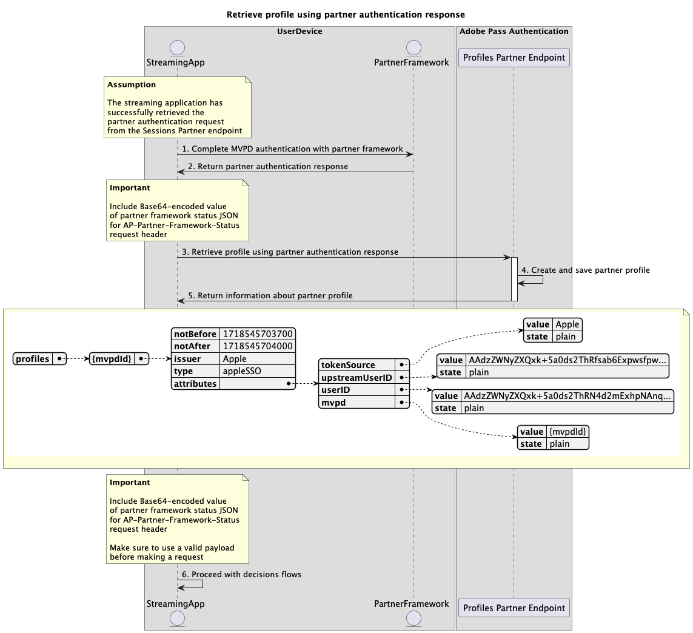

# Enig teken-op het gebruiken van partnerstromen {#single-sign-on-partner-flows}

>[!IMPORTANT]
>
> De inhoud op deze pagina wordt alleen ter informatie verstrekt. Voor het gebruik van deze API is een huidige licentie van Adobe vereist. Ongeautoriseerd gebruik is niet toegestaan.

>[!IMPORTANT]
>
> De implementatie van REST API V2 wordt begrensd door de [ Throttling mechanisme ](/help/authentication/integration-guide-programmers/throttling-mechanism.md) documentatie.

De methode van de Partner laat veelvoudige toepassingen toe om een de statuslading van het partnerkader te gebruiken om enige sign-on (SSO) op het apparatenniveau te bereiken wanneer het gebruiken van de diensten van Adobe Pass.

De toepassingen zijn verantwoordelijk voor het terugwinnen van de de statuslading van het partnerkader gebruikend partnerspecifieke kaders of bibliotheken buiten de systemen van Adobe Pass.

De toepassingen zijn verantwoordelijk voor het opnemen van deze statuslading van het partnerframework als onderdeel van de header `AP-Partner-Framework-Status` voor alle aanvragen die deze opgeven.

Voor meer details over `AP-Partner-Framework-Status` kopbal, verwijs naar [ AP-partner-kader-status ](../../appendix/headers/rest-api-v2-appendix-headers-ap-partner-framework-status.md) documentatie.

De Adobe Pass Authentication REST API V2 biedt ondersteuning voor Single Sign-On (SSO) voor eindgebruikers van clienttoepassingen die op iOS, iPadOS of tvOS worden uitgevoerd.

Voor meer details over enig teken-binnen (SSO) voor het platform van Apple, verwijs naar [ Apple SSO Cookbook (REST API V2) ](/help/authentication/integration-guide-programmers/features-standard/sso-access/partner-sso/apple-sso/apple-sso-cookbook-rest-api-v2.md) documentatie.

## Vraag van partnerverificatie ophalen {#retrieve-partner-authentication-request}

### Vereisten {#prerequisites-retrieve-partner-authentication-request}

Alvorens het verzoek van de partnerauthentificatie terug te winnen, zorg ervoor de volgende eerste vereisten worden voldaan aan:

* Het partnerkader moet een MVPD selecteren.
* De het stromen toepassing moet de de statusinformatie van het partnerkader van het partnerkader verkrijgen en het tot de server van Adobe Pass overgaan.
* De het stromen toepassing moet het verzoek van de partnerauthentificatie van de server van Adobe Pass verkrijgen en het tot het partnerkader overgaan.

>[!IMPORTANT]
>
> Veronderstellingen
> 
>  
> 
> * Het partnerkader steunt gebruikersinteractie om een MVPD te selecteren.
> * Het partnerkader steunt gebruikersinteractie om met geselecteerde MVPD voor authentiek te verklaren.
> * Het partnerkader verstrekt gebruikerstoestemming en leveranciersinformatie.

### Workflow {#workflow-retrieve-partner-authentication-request}

Voer de bepaalde stappen uit om het verzoek van de partnerauthentificatie zoals aangetoond in het volgende diagram terug te winnen.

 terug

*wint verzoek van de partnerauthentificatie* terug

1. **wint de status van het partnerkader terug:** de het stromen toepassing roept het partnerkader, buiten de systemen van Adobe Pass, om gebruikerstoestemming en leveranciersinformatie te verkrijgen.

1. **de statusinformatie van het partnerkader van de Terugkeer:** De het stromen toepassing bevestigt de reactiegegevens om ervoor te zorgen dat de basisvoorwaarden worden voldaan aan:
   * De toegangsstatus van de gebruikerstoestemming wordt verleend.
   * De toewijzingsaanduiding van de gebruikersprovider is aanwezig en geldig.
   * De vervaldatum (indien beschikbaar) van het gebruikersprovider-profiel is geldig.

1. **wint het verzoek van de partnerauthentificatie terug:** de het stromen toepassing verzamelt alle noodzakelijke gegevens om een authentificatiesessie in werking te stellen door het eindpunt van de Partner van Sessies te roepen.

   >[!IMPORTANT]
   >
   > Verwijs naar [ ophalen de verzoek van de partnerauthentificatie ](../../apis/partner-single-sign-on-apis/rest-api-v2-partner-single-sign-on-apis-retrieve-partner-authentication-request.md) API documentatie voor details op:
   >
   > * Alle _vereiste_ parameters, als `serviceProvider` en `partner`
   > * Alle _vereiste_ kopballen zoals `Authorization`, `AP-Device-Identifier`, `Content-Type`, `X-Device-Info`, en `AP-Partner-Framework-Status`
   > * Alle _facultatieve_ kopballen en parameters
   >
   >  
   >
   > De het stromen toepassing moet ervoor zorgen het een geldige waarde voor de status van het partnerkader alvorens een verzoek omvat.
   >
   >  
   > 
   > Voor meer details over `AP-Partner-Framework-Status` kopbal, verwijs naar [ AP-partner-kader-status ](../../appendix/headers/rest-api-v2-appendix-headers-ap-partner-framework-status.md) documentatie.

1. **wijs op de volgende actie:** De het eindpuntreactie van de Partner van Sessies bevat de noodzakelijke gegevens om de het stromen toepassing betreffende de volgende actie te begeleiden.

   >[!IMPORTANT]
   >
   > Verwijs naar [ ophalen de verzoek van de partnerauthentificatie ](../../apis/partner-single-sign-on-apis/rest-api-v2-partner-single-sign-on-apis-retrieve-partner-authentication-request.md) API documentatie voor details over de informatie die in een zittingsreactie wordt verstrekt.
   > 
   >  
   > 
   > Het eindpunt van de Partner van Sessies bevestigt de verzoekgegevens om ervoor te zorgen dat aan basisvoorwaarden wordt voldaan:
   >
   > * De _vereiste_ parameters en de kopballen moeten geldig zijn.
   > * De integratie tussen de opgegeven `serviceProvider` en `mvpd` moet actief zijn.
   >
   >  
   > 
   > Als de basisbevestiging ontbreekt, zal een foutenreactie worden geproduceerd, verstrekkend extra informatie die aan de [ Verbeterde documentatie van de Codes van de Fout ](../../../../features-standard/error-reporting/enhanced-error-codes.md) volgt.
   >
   >  
   >
   > Het eindpunt van de Partner van Sessies bevestigt de verzoekgegevens om ervoor te zorgen dat de partner enige sign-on voorwaarden wordt voldaan aan:
   >
   >  * De partner enige sign-on configuratie in de server van Adobe Pass moet geldig en toegelaten zijn.
   >  * De de statuslading van het partnerkader die via [ wordt ontvangen AP-partner-kader-status ](../../appendix/headers/rest-api-v2-appendix-headers-ap-partner-framework-status.md) kopbal moet geldig zijn.
   >
   >  
   >
   > Als de partner enige sign-on bevestiging ontbreekt, zal de reactie aan de basisauthentificatiestroom in gebreke blijven.

1. **ga met de stroom van de profielherwinning verder gebruikend de reactie van de partnerauthentificatie:** De het eindpuntreactie van de Partner van Sessies bevat de volgende gegevens:
   * Het attribuut `actionName` wordt ingesteld op &quot;partner_profile&quot;.
   * Het attribuut `actionType` wordt ingesteld op &quot;direct&quot;.
   * Het attribuut `authenticationRequest - type` omvat het veiligheidsprotocol dat door het partnerkader voor MVPD login wordt gebruikt (momenteel geplaatst aan SAML slechts).
   * Het attribuut `authenticationRequest - request` omvat het SAML- verzoek dat tot het partnerkader wordt overgegaan.
   * Het attribuut `authenticationRequest - attributesNames` omvat de attributen SAML die tot het partnerkader worden overgegaan.

   Als de Adobe Pass backend geen geldig profiel identificeert en de partner enige sign-on bevestiging overgaat, ontvangt de het stromen toepassing een reactie met acties en gegevens om tot het partnerkader over te gaan om de authentificatiestroom met MVPD te beginnen.

   Voor meer details over de stroom van de profielterugwinning die een reactie van de partnerauthentificatie gebruiken, verwijs naar [ profiel terugwinnen gebruikend de sectie van de de authentificatiereactie van de partner ](#retrieve-profile-using-partner-authentication-response).

1. **ga met basisauthentificatiestroom te werk:** De het eindpuntreactie van de Partner van Sessies bevat de volgende gegevens:
   * Het kenmerk `actionName` wordt ingesteld op &quot;authenticate&quot; of &quot;resume&quot;.
   * Het attribuut `actionType` wordt ingesteld op &quot;interactive&quot; of &quot;direct&quot;.

   Als de Adobe Pass backend geen geldig profiel identificeert en de partner enige sign-on bevestiging ontbreekt, valt de server van Adobe Pass terug naar de basisauthentificatiestroom.

   Raadpleeg de volgende documenten voor meer informatie over de basisverificatiestroom:
   * [Verificatie uitvoeren binnen primaire toepassing](../basic-access-flows/rest-api-v2-basic-authentication-primary-application-flow.md)
   * [Verificatie uitvoeren binnen secundaire toepassing met vooraf geselecteerde mvpd](../basic-access-flows/rest-api-v2-basic-authentication-secondary-application-flow.md)
   * [Verificatie uitvoeren binnen secundaire toepassing zonder vooraf geselecteerde mvpd](../basic-access-flows/rest-api-v2-basic-authentication-secondary-application-flow.md)

1. **ga met besluitvormingsstromen te werk:** De het eindpuntreactie van de Partner van Sessies bevat de volgende gegevens:
   * Het attribuut `actionName` wordt ingesteld op &quot;authorize&quot;.
   * Het attribuut `actionType` wordt ingesteld op &quot;direct&quot;.

   Als de Adobe Pass-backend een geldig profiel identificeert, hoeft de streamingtoepassing niet opnieuw te worden geverifieerd met de geselecteerde MVPD, omdat er al een profiel is dat kan worden gebruikt voor volgende beslissingsstromen.

   >[!IMPORTANT]
   >
   > De het stromen toepassing moet ervoor zorgen het een geldige waarde voor de status van het partnerkader alvorens een verzoek omvat.
   >
   >  
   > 
   > Voor meer details over `AP-Partner-Framework-Status` kopbal, verwijs naar [ AP-partner-kader-status ](../../appendix/headers/rest-api-v2-appendix-headers-ap-partner-framework-status.md) documentatie.

## Profiel ophalen met verificatierespons van partner {#retrieve-profile-using-partner-authentication-response}

### Vereisten {#prerequisites-retrieve-profile-using-partner-authentication-response}

Alvorens het profiel terug te winnen gebruikend een reactie van de partnerauthentificatie, zorg ervoor de volgende eerste vereisten worden voldaan:

* Het partnerkader moet authentificatie met geselecteerde MVPD uitvoeren.
* De het stromen toepassing moet de reactie van de partnerauthentificatie samen met de statusinformatie van het partnerkader van het partnerkader verkrijgen en het tot de server van Adobe Pass overgaan.

>[!IMPORTANT]
>
> Veronderstelling
>
> * Het partnerkader steunt gebruikersinteractie om een MVPD te selecteren.
> * Het partnerkader steunt gebruikersinteractie om met geselecteerde MVPD voor authentiek te verklaren.
> * Het partnerkader verstrekt gebruikerstoestemming en leveranciersinformatie.

### Workflow {#workflow-retrieve-profile-using-partner-authentication-response}

Voer de bepaalde stappen uit om de stroom van de profielherwinning uit te voeren gebruikend een reactie van de partnerauthentificatie zoals aangetoond in het volgende diagram.

*wint voor authentiek verklaard profiel terug gebruikend de reactie van de partnerauthentificatie*

1. **Volledige authentificatie MVPD met partnerkader:** als de authentificatiestroom succesvol is, veroorzaakt de interactie van het partnerkader met MVPD een reactie van de partnerauthentificatie (reactie van SAML) die samen met de de statusinformatie van het partnerkader is teruggekeerd.

1. **de reactie van de partnerauthentificatie van de Terugkeer:** De het stromen toepassing bevestigt de reactiegegevens om ervoor te zorgen dat de basisvoorwaarden worden voldaan aan:
   * De toegangsstatus van de gebruikerstoestemming wordt verleend.
   * De toewijzingsaanduiding van de gebruikersprovider is aanwezig en geldig.
   * De vervaldatum (indien beschikbaar) van het gebruikersprovider-profiel is geldig.

1. **wint profiel terug gebruikend de reactie van de partnerauthentificatie:** de het stromen toepassing verzamelt alle noodzakelijke gegevens om een profiel tot stand te brengen en terug te winnen door het eindpunt van de Partner van Profielen te roepen.

   >[!IMPORTANT]
   >
   > Verwijs naar [ terug wint profiel gebruikend de reactie van de partnerauthentificatie ](../../apis/partner-single-sign-on-apis/rest-api-v2-partner-single-sign-on-apis-retrieve-profile-using-partner-authentication-response.md) API documentatie voor details op:
   >
   > * Alle _vereiste_ parameters, als `serviceProvider`, `partner`, en `SAMLResponse`
   > * Alle _vereiste_ kopballen, als `Authorization`, `AP-Device-Identifier`, `Content-Type`, `X-Device-Info`, en `AP-Partner-Framework-Status`
   > * Alle _facultatieve_ kopballen en parameters
   >
   >  
   > 
   > De het stromen toepassing moet ervoor zorgen het een geldige waarde voor de status van het partnerkader alvorens een verzoek omvat.
   >
   >  
   > 
   > Voor meer details over `AP-Partner-Framework-Status` kopbal, verwijs naar [ AP-partner-kader-status ](../../appendix/headers/rest-api-v2-appendix-headers-ap-partner-framework-status.md) documentatie.

1. **creeer en bewaar partnerprofiel:** de server van Adobe Pass leidt en bewaart een partnerprofiel na het verzekeren dat aan alle voorwaarden wordt voldaan.

1. **de informatie van de Terugkeer over partnerprofiel:** de het eindpuntreactie van Profielen bevat informatie over het partnerprofiel, met inbegrip van de attributen `type` die aan &quot;appleSSO&quot;worden geplaatst.

   >[!IMPORTANT]
   >
   > Verwijs naar [ terugwinnen profiel gebruikend de reactie van de partnerauthentificatie ](../../apis/partner-single-sign-on-apis/rest-api-v2-partner-single-sign-on-apis-retrieve-profile-using-partner-authentication-response.md) API documentatie voor details op de informatie die in een profielreactie wordt verstrekt.
   > 
   >  
   > 
   > Het eindpunt van de Partner van Profielen bevestigt de verzoekgegevens om ervoor te zorgen dat de basisvoorwaarden worden voldaan aan:
   >
   > * De _vereiste_ parameters en de kopballen moeten geldig zijn.
   > * De integratie tussen de opgegeven `serviceProvider` en `mvpd` moet actief zijn.
   >
   >  
   > 
   > Als de bevestiging ontbreekt, zal een foutenreactie worden geproduceerd, verstrekkend extra informatie die aan de [ Verbeterde documentatie van de Codes van de Fout ](../../../../features-standard/error-reporting/enhanced-error-codes.md) volgt.
   >
   >  
   >
   > Het eindpunt van de Partner van Profielen bevestigt de verzoekgegevens om ervoor te zorgen dat de partner enige sign-on voorwaarden wordt voldaan aan:
   >
   >  * De partner enige sign-on configuratie in de server van Adobe Pass moet geldig en toegelaten zijn.
   >  * De de statuslading van het partnerkader die via [ wordt ontvangen AP-partner-kader-status ](../../appendix/headers/rest-api-v2-appendix-headers-ap-partner-framework-status.md) kopbal moet geldig zijn.
   >
   >  
   >
   > Als de partner enige sign-on bevestiging ontbreekt, zal de reactie aan de basisstroom van de profielherwinning in gebreke blijven.

1. **ga met besluitvormingsstromen te werk:** De het stromen toepassing kan met verdere besluitvormingsstromen verdergaan.

   >[!IMPORTANT]
   >
   > De het stromen toepassing moet ervoor zorgen het een geldige waarde voor de status van het partnerkader alvorens een verzoek omvat.
   >
   >  
   > 
   > Voor meer details over `AP-Partner-Framework-Status` kopbal, verwijs naar [ AP-partner-kader-status ](../../appendix/headers/rest-api-v2-appendix-headers-ap-partner-framework-status.md) documentatie.
