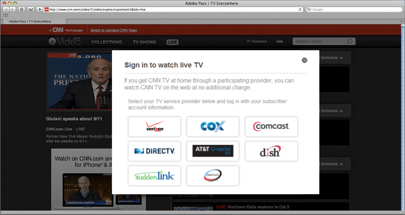

# Informatie over Adobe Pass-verificatie en tv overal {#about-auth-tve}

>[!NOTE]
>
>De inhoud op deze pagina wordt alleen ter informatie verstrekt. Voor het gebruik van deze API is een huidige licentie van Adobe vereist. Ongeautoriseerd gebruik is niet toegestaan.

## Over tv overal {#about-tve}

De televisiekijkers van vandaag kunnen op elk moment of elke plaats online gaan, en zij verwachten dat hun vermogen om toegang te krijgen tot betaaltelevisie-inhoud er met hen is. Bovendien bekijken de doelgroepen inhoud met behulp van een steeds groter aantal apparaten die geschikt zijn voor internet, zoals:

* Laptops
* Tablets
* Smartphones
* Websites
* Federale apps
* Gameconsoles
* Bovenste vakken instellen
* Slimme tv&#39;s

Tv Overal is de branchebeweging die het vermogen van betaaltelevisie-abonnees ondersteunt om toegang te krijgen tot dezelfde inhoud die zij al betalen, op meerdere apparaten, zowel in als uit hun huizen. Terwijl het grootste deel van de televisie het bekijken nog op conventionele, lineaire TV voorkomt, is de groei in consumptie in tijd verschoven inhoud, online video, en alternatieve schermen. Als gevolg hiervan bevindt de markt voor videodistributie zich momenteel in een toestand van verstoring en is TV Overal opgedoken als de oplossing die de belangen van programmeurs, betaaltelevisieproviders en betaaltelevisieabonnees op elkaar afstemt.

Het technische doel van TV overal is om klanten van betaaltelevisie toegang te geven tot inhoud waarop zij zich al abonneren op al hun apparaten en platforms.

De bedrijfsdoelstellingen van TV overal zijn:

* **Behoud bestaande klantenverhoudingen en laat nieuwe degenen** toe
* Laat programmeurs en eigenaars van inhoud het breedst mogelijke publiek bereiken en leg meer waarde vast van premiuminhoud
* Brandmerken uitbreiden via directe online interactie met viewers

## Tv-uitdagingen overal {#tve-challenges}

Samen met de mogelijkheden van tv komen overal uitdagingen. De kern hiervan is het recht. Voordat een viewer toegang krijgt tot abonnementsinhoud, moet iemand bepalen of hij of zij recht heeft op die toegang.

Heeft de gebruiker een abonnement bij een Pay TV-provider? Zo ja, bevat dat abonnement de gevraagde inhoud? Entitlement is vooral moeilijk voor programmeurs en inhoudseigenaars om direct te bepalen, omdat het de exploitanten van de Tv van het Betaal zijn die de identificerende gegevens voor hun klanten, evenals de toegangsvoorrechten van hun klanten hebben.

Afgezien van het recht op toegang zijn er tal van gerelateerde technische en integratieproblemen, waaronder:

* Een uitgebreide multiapparatenstrategie ontwikkelen en toepassen
* Coördinatie van de vele relaties tussen programmeurs en betaaltelevisiezenders
* Voorkomen van frauduleuze toegang of misbruik van de voorwaarden van de dienst
* Een consistente en frustrerende verificatieervaring voor gebruikers op verschillende websites en toepassingen
* Behoud van een snelle marktperiode om de deal met partners bij te houden
* Kosten beheren die samenhangen met meerdere integraties

Deze uitdagingen maken het uitvoeren en onderhouden van complexe, directe integraties tussen programmeurs en de authentificatiesystemen van veelvoudige leveranciers van de TV van het Betaal zeer middelintensief, die tijd en technische verfijning vereisen.

De oplossing? **de Authentificatie van de Voldoende Authentificatie van 0} Adobe®.**

## Inleiding tot Adobe Pass-verificatie {#authentication-intro}

Met Adobe Pass Authentication hoeven programmeurs en betaaltelevisieproviders alleen maar eenvoudig te integreren, met behulp van Adobe Pass Authentication-API&#39;s, om toegang te krijgen tot het hele ecosysteem, waaronder:

* Programmeurs zoals Turner Broadcasting (TBS, TNT, CNN), Fox Broadcast Networks en Hulu

* Alle toonaangevende betaaltelevisieproviders in de VS, die meer dan 90% van alle betaaltelevisiehuishoudens in de VS uitmaken

Daarnaast biedt Adobe Pass-verificatie het framework dat gebruikersverificatie en -autorisatie eenvoudig en veilig maakt.

*Figuur 1: Slechts enkele programmeurs en betalen TV leveranciers die door de Authentificatie van Adobe Pass verbinden...*

Adobe Pass bemiddelt op veilige wijze machtigingstransacties tussen programmeurs en Pay TV-providers, waardoor de viewer gemakkelijker toegang heeft tot abonnementsinhoud. Of met andere woorden...

**de Authentificatie van Adobe Pass maakt het voor de juiste klanten gemakkelijk en snel om tot de juiste inhoud toegang te hebben.**

**voor wie de Authentificatie van Adobe Pass is?**

* **Programmeurs** die met de leveranciers van de Tv van de Betaal gemakkelijk willen integreren (die ook als &quot;MVPDs&quot;of &quot;Multichannel Video Programmerende Verdelers&quot;worden bekend), die het breedste publiek, voor optimale opbrengst bereiken. Met Adobe Pass-verificatie kunnen programmeurs viewers verifiëren voor alle belangrijke providers, onafhankelijk van het clientplatform.

* **betalen TV leveranciers/MVPDs** die pijnloze connectiviteit met veelvoudige Programmers en hogere klantentevredenheid zoeken door toegang tot abonnementsinhoud online te vergemakkelijken.

* **de klanten van de Tv van de Betaal** die gemakkelijke toegang tot inhoud willen die zij reeds aan, waar zij, zonder extra kosten intekenen. Single Sign-On biedt een beveiligde viewerverificatie voor het web of voor verschillende mobiele apps, zonder dat clientdownloads of herhaalde logins en een goede gebruikerservaring nodig zijn.

Voor **Programmeurs**, verstrekt de Authentificatie van Adobe Pass:

* Eenvoudige integratie en onmiddellijke connectiviteit met de beste Pay-tv-providers, zonder de pijn van meerdere, directe integratie
* Optimalisering van zowel abonnements- (licenties) als reclame-inkomsten door ondersteuning van een zo breed mogelijk publiek voor inhoud
* Beveiligde verificatie, met toegang tot premiuminhoud die alleen wordt verleend aan geautoriseerde gebruikers/apparaten
* Een open en flexibel framework dat zowel speler als DRM-platform agnost is. Het kan worden afgespeeld op een groot aantal platforms, zoals iOS, Android, Windows 8, spelconsoles, set-top boxes en nog veel meer.
* Compatibiliteit met alle DRM-technologie, zoals Adobe Flash Access® of Play Ready®.
* Ondersteuning voor Single Sign-On (SSO) verificatie en autorisatie, zodat abonnees zich niet opnieuw hoeven aan te melden na hun eerste verificatie op hun eigen systeem.

Voor **betalen TV leveranciers/MVPDs**, verstrekt de Authentificatie van Adobe Pass:

* Eenvoudige integratie met eigenaars van inhoud, waardoor u direct connectiviteit kunt bieden met meerdere programmeurs via één integratie
* Verbeterde betrokkenheid van klanten door ondersteuning van een vloeiende merkboodschap als ze inhoud bekijken op meerdere platforms en apparaten
* Beveiligde verificatie die ervoor zorgt dat alleen geautoriseerde gebruikers/apparaten toegang krijgen tot premiuminhoud en (optioneel) beperkt het aantal apparaten en gelijktijdige streams dat per huishoudelijke account kan worden aangesloten.

Voor **de klanten van TV van de Betaling**, verstrekt de Authentificatie van Adobe Pass:

* **TV overal!**

De rest van dit artikel biedt een technische inleiding op Adobe Pass Authentication.  Hoewel veel van de volgende zaken zich richten op de integratie van Programmer, is er zowel algemene als specifieke informatie die van toepassing is op de leveranciers van betaaltelevisie. In dit document wordt ook de beveiliging en integriteit benadrukt van de manier waarop Adobe Pass Authentication functioneert als een oplossing voor tv overal. Voor verdere details voorbij dit document, contacteer uw vertegenwoordiger van de Adobe of vul het Verzoek om de vorm van de Informatie [ hier ](https://www.adobe.com/) in.

## Bouwstenen voor architectuur {#arch-building-blocks}

<!-- BROKEN LINK
 
-->

In het volgende gedeelte worden de centrale machtigingstransacties van authenticatie en autorisatie besproken. Verificatie is het proces waarbij met een Pay TV provider wordt bevestigd dat een bepaalde gebruiker een bekende klant is. Autorisatie is het proces waarbij een betaaltelevisieprovider bevestigt dat een geverifieerde gebruiker een geldig abonnement heeft op een bepaalde resource.
Adobe Pass-verificatie bestaat uit de volgende basiscomponenten:

* Client-component (een van de volgende):

   * Toegangsbeheer - een platformspecifieke bibliotheek; verstrekt makkelijk te gebruiken APIs en codesteekproeven voor het uitvoeren van de machtigingsstromen
   * De API zonder client - RESTful-webservices; biedt eindpunten voor machtigingsstromen voor platforms zonder rendermogelijkheden voor webpagina&#39;s (zoals spelconsoles, set-top boxes, enz.)

* Op Adobe gehoste back-endservers
* De token-verificator voor media
* Een veilige, centrale Medium van Exchange (tokens)

Op basisniveau, bestaat de Authentificatie van Adobe Pass uit drie componenten (Toegelaten, Adobe-ontvangen backendservers, en de Symbolische Verificateur van Media) en een centraal punt van uitwisseling (tokens).

### Clientcomponenten {#client-components}

* Toegangsfunctie
* Clientloze API

#### Toegangsfunctie {#access-enabler}

Op volledig gesteunde platforms (met inbegrip van het Web, iOS, Android, Vensters 8), communiceren de Programmers met de Authentificatie van Adobe Pass via de de cliëntcomponent van Enabler van de Toegang. Deze component vergemakkelijkt alle authentificatie en vergunningsinteractie met de klant.  De looppas van Inschakelen van de Toegang plaatselijk op hun systeem. Wanneer een gebruiker tot een plaats van de Programmer of een toepassing toegang heeft en om inhoud verzoekt, wordt de Adobe-ontvangen/handhaven component van de Inschakelen van de Toegang stil geladen in de achtergrond.

De Toegangsmanager behandelt de daadwerkelijke machtigingswerkschema&#39;s, terwijl de programmeur verantwoordelijkheid voor de hoger-vlakke Web-pagina of spelertoepassing handhaaft die het gebruikersinterface uitvoert en met Toegangsmanager in wisselwerking staat. Deze interacties zijn via een asynchroon systeem van functies en callbacks, dat door Toegangsbeheer API wordt bepaald.

Dit zijn de basismachtigingsstromen, die gemakkelijk kunnen worden uitgevoerd gebruikend Toegangsbeheer API:

* De identiteit van de aanvrager (programmeur) instellen
* Gebruikersverificatie controleren/verkrijgen via een bepaalde Pay TV-operator (de &quot;Identity Provider&quot;)
* Gebruikersverificatie voor een bepaalde bron controleren/verkrijgen
* De gebruiker afmelden

Toegangsbeheer verleent ook de volgende diensten:

* Het bevestigt vragen van de Programmer, met inbegrip van de registratiestatus van specifieke cliënten, hun domeinen, en hun middelen/kanalen.
* Het levert de gegevens die de lijst maken van Pay TV-operatoren waaruit de gebruiker zijn provider selecteert. Deze lijst wordt ook gevalideerd en gedefinieerd als toepasselijk voor de programmeur van waaruit de aanvraag afkomstig is.
* Het initieert betaaltelevisie exploitant-specifieke authentificatie en vergunningswerkschema&#39;s.
* Het plaatst de succesvolle vergunningsreacties per middel/kanaal van de Programmer in het voorgeheugen om onnodig verzoekverkeer te minimaliseren.
* Deze kan worden geconfigureerd voor vooraf gedefinieerde workflows die specifiek zijn voor elke Pay TV-operator, zoals expliciete apparaatregistratie.

Afhankelijk van uw website of spelertoepassing, kan Toegangsbeheer de volgende vormen nemen:

* Een SWF-bestand dat de Flash Player-runtime kan uitvoeren
* Een JS-bestand dat rechtstreeks door de browser wordt uitgevoerd
* Een native toegangsfunctie voor ondersteunde platforms (waaronder iOS, Android en Windows 8)

#### Clientloze API {#clientless-api}

De benadering van de Clientless API is voor &quot;slimme apparaten&quot; (spelconsoles, set-top boxes, en slimme TVs) die Webbrowsers (vereist voor authentificatie met MVPDs) niet steunen.  In de clientless aanpak communiceren slimme apparaten rechtstreeks met Adobe Pass-verificatie via RESTful-API&#39;s voor webservices voor alles, behalve verificatie, die wordt uitgevoerd op een tweede scherm (browser)-app. Met andere woorden, de client-side bibliotheek van Access Enabler wordt niet gebruikt. In plaats daarvan gebruiken ontwikkelaars van slimme-apparaattoepassingen rechtstreeks de API&#39;s voor Adobe Pass Authentication-webservices om de machtigingsstromen te implementeren.

### Op Adobe gehoste back-endservers {#adobe-backend-servers}

De Adobe Pass Authentication-backendservers, gehost door Adobe:

* Geef de verificatie- en autorisatieworkflows door aan de betaaltelevisieproviders die server-naar-server communicatie tussen Adobe Pass Authentication en de operator vereisen.
* Handhaaf de configuratie voor de plaatsen en de toepassingen van de Programmer.
* Gastheer de downloadbare de componentendossiers van Enabler van de Toegang.
* Geef de RESTful-eindpunten voor de webservice op voor de integratie van Clientless API.
* Genereer (en sla in sommige gevallen) verificatie- en verificatietokens op.

### Tokens en de Verificator van de Token van Media {#tokens-media-token-verifier}

De Adobe Pass-verificatiemachtigingsoplossing richt zich op het genereren van specifieke gegevens die worden verkregen wanneer de workflows voor verificatie en autorisatie met succes zijn voltooid. Deze gegevens worden tokens genoemd. Zij hebben een beperkte levensduur en worden veilig opgeslagen, of in platform-afhankelijke plaatsen op de cliënt, of op de servers van de Adobe in het geval van de Clientless API oplossing. Na afloop moeten tokens opnieuw worden uitgegeven door de workflows voor verificatie en/of autorisatie opnieuw te starten.

Er zijn drie soorten tokens die de Authentificatie van Adobe Pass tijdens de authentificatie/de vergunningswerkschema&#39;s kwesties. Twee zijn &quot;van lange duur,&quot;die continuïteit in de kijkervaring van de gebruiker verstrekken. Het derde, een kortstondige token, biedt ondersteuning voor de beste praktijken van de industrie om fraude tegen te gaan (waarbij onder fraude ook misbruik valt, zoals bijvoorbeeld het rippen van streams). De time-to-live-waarden (&quot;TTL&quot;) worden vastgesteld op basis van overeenkomsten tussen programmeurs en betaaltelevisieproviders, die het eens zijn over een waarde die het best alle betrokkenen ten goede komt.

#### (Lange tijd) verificatietoken {#long-lived-auth-token}

Verificatie is geslaagd wanneer een klant Adobe Pass-verificatie gebruikt om zich met succes aan te melden bij zijn betaaltelevisie. De Authentificatie van Adobe Pass produceert dan een teken van de authentificatie van lange duur (AuthN) verbonden aan het het vragen apparaat en (afhankelijk van de leverancier van de Tv van de Betaling) een globally uniek herkenningsteken (&quot;GUID&quot;) dat anoniem de gebruiker identificeert.

* Bij Adobe Pass-verificatie wordt het AuthN-token veilig opgeslagen op een locatie waar het beschikbaar is voor alle toepassingen die Adobe Pass-verificatie gebruiken. Voor de integratie van Toegangsbeheer worden tokens veilig opgeslagen aan de clientzijde.  De Authentificatie van Adobe Pass gebruikt het teken AuthN om verdere vergunningsvragen namens de gebruiker te maken.
* Op een bepaald moment wordt slechts één AuthN-token opgeslagen. Wanneer een nieuw token AuthN wordt uitgegeven en er al een oud token bestaat, overschrijft het nieuwe token de bestaande opgeslagen waarde.

#### (Long-Lived) Authorization Token {#long-lived-authriz-token}

Na een geslaagde autorisatie maakt Adobe Pass Authentication een token voor een langdurige autorisatie (&quot;AuthZ&quot;). Dit token is niet overdraagbaar omdat het is gekoppeld aan het apparaat dat het verzoek indient en een specifieke beveiligde bron (bijvoorbeeld een kanaal, serie of aflevering).

* De Authentificatie van Adobe Pass slaat het teken AuthZ, samen met andere toestemmingstokens voor andere middelen veilig op.  Nogmaals, zoals met de tokens AuthN, op platforms die de Toegankelijkheid gebruiken wordt het teken plaatselijk opgeslagen op de cliënt; op platforms die Clientless API gebruiken, worden de tokens opgeslagen op de servers van de Authentificatie van Adobe Pass.
* De tijd-aan-levende (TTL) van het lang-levende teken AuthZ wordt typisch bepaald in de waaier van dagen tot weken, afhankelijk van de specifieke overeenkomst tussen de leverancier van de Betaaltelevisie en de Programmer.
* Op elk moment wordt slechts één AuthZ-token per resource opgeslagen. Er kunnen meerdere machtigingstokens worden opgeslagen, zolang deze aan verschillende bronnen zijn gekoppeld. Wanneer een nieuw toestemmingstoken wordt uitgegeven en oud reeds voor het zelfde middel bestaat, beschrijft het nieuwe teken de bestaande caching waarde.
* De Authentificatie van Adobe Pass gebruikt het lange-levende teken AuthZ om de kortstondige media tokens tot stand te brengen die voor daadwerkelijke het bekijken toegang worden gebruikt.

#### Token voor korte media {#short-lived-media-token}

Zodra de Authentificatie van Adobe Pass het teken AuthZ produceert, gebruikt het dat teken om een enig-gebruik, kortlevend media teken te produceren dat door Adobe wordt ondertekend en wordt gecodeerd om het knoeien tijdens uitwisseling te vermijden:

* TTL van het kortstondige teken (gebrek: 5 mins) wordt geplaatst om voor kloksynchronisatie kwesties tussen de server toe te staan die het teken produceert en de server die het teken bevestigt.
* Het token met een korte levensduur wordt blootgesteld aan de insluitingssite voordat toegang wordt verleend tot de beveiligde bron. Daarom moet de programmeur het token valideren met de Media Token Verifier for Access Enabler integrations, of de Token Verifier Service in het geval van Clientless API-integratie.

#### Verificator mediatokens {#media-token-verifier}

Programmeurs zijn verantwoordelijk voor de integratie van de Media Token Verifier Library in hun bestaande toepassingsserver, zodat de Verifier de definitieve gebruikersbevestigingen kan uitvoeren alvorens een videostroom eigenlijk wordt begonnen. In de bibliotheek Media Token Verifier wordt het volgende gedefinieerd:

* Een API voor tokenverificatie die informatie ophaalt uit het token, zoals of het geldig is, de tijd dat het token werd uitgegeven en andere relevante gegevens
* De openbare sleutel van de Adobe die wordt gebruikt om te verifiëren dat het token inderdaad afkomstig is van Adobe
* Een voorbeeldimplementatie die toont hoe te om de Verifier API te gebruiken en hoe te om de Adobe openbare sleutel in de bibliotheek te gebruiken om zijn oorsprong te verifiëren

*Figuur 2: De architectuur op hoog niveau van het ecosysteem van de Authentificatie van Adobe Pass in een integratie van Toegangsmogelijkheden*

## Integreren met Adobe Pass-verificatie {#integrate-auth}

Of u nu een Pay TV-provider of een programmeur bent, het integratieproces met Adobe Pass-verificatie vereist enige actieve deelname. Elk van deze processen wordt hieronder beschreven.

### Het proces voor de levering van betaaltelevisie

De primaire verantwoordelijkheid van de betaaltelevisieprovider met Adobe Pass-verificatie is om te controleren of een gebruiker die het verzoek indient inderdaad een bekende abonnee is die recht heeft op toegang tot de inhoud van de programmeur. Bij hoog
Voor het Adobe Pass-verificatieproces voor integratie met een nieuwe Pay TV-provider zijn de volgende stappen vereist:

1. De provider ondertekent de Adobe Pass Authentication Non-Disclosure Agreement (NDA).
1. De dienstverlener verstrekt Adobe met specificaties voor zijn authentificatie en vergunningssysteem. Voor de eenvoudigste integratie, wordt geadviseerd dat de exploitanten van betaaltelevisie een op SAML-Gebaseerde identiteitsleverancier (IdP) voor authentificatie en de capaciteit hebben om via het SOAP toegangsprotocol voor vergunning te communiceren.
1. De leverancier vestigt connectiviteit tussen hun servers en de servers van de Authentificatie van Adobe Pass. Dit omvat het leveren van eindpunten, en het vermelden van IPs.
1. Pre-Qualification Release en QE.
1. Productieversie en QE.

Hoewel Adobe Pass-verificatie bestaande integratie voor programmeurs kan vervangen, is dit doorgaans niet vereist voor betaaltelevisieproviders. Adobe werkt samen met het technische team van de leverancier om de Authentificatie van Adobe Pass te vormen om aan de behoeften van om het even welke bestaande integratie te voldoen. De integratie is gratis voor betaaltelevisieproviders, waarbij wordt uitgegaan van een &quot;standaard&quot; integratie en minimale supportvereisten (documentatie en standaard e-mailondersteuning). Als een leverancier aanzienlijke ondersteuning of een geescaleerde tijdlijn nodig heeft, kan een supportvergoeding in rekening worden gebracht of kan de provider willen samenwerken met een derde die vertrouwd is met onze oplossing, zoals Synacor.

Adobe Pass Authentication biedt ook ondersteuning voor de efficiënte afhandeling van zakelijke logica van Pay TV-providers, zoals hieronder wordt beschreven:

* Voor bedrijfslogica die op zichzelf staat en door de exploitant kan worden toegepast wanneer een vergunningsaanvraag wordt ontvangen, verstrekt de Adobe de nodige gegevens die nodig zijn om de handhaving van de bedrijfslogica te ondersteunen wanneer de exploitant een vergunningsverzoek ontvangt. Deze gegevens kunnen, maar zijn niet beperkt tot, de unieke apparaat-id voor de gebruiker die het verzoek indient en het IP-adres van het apparaat bevatten.
* Voor bedrijfslogica die gebruikersinterventie en/of specifieke behandeling door de oplossing van de Adobe vereist, kan de Adobe sommige douaneeigenschappen voor elke leverancier van betaaltelevisie handhaven. Deze operatorspecifieke configuraties/beleid omvatten het inschakelen van vooraf gedefinieerde workflows die op specifieke punten van de workflow op hoofdniveau kunnen worden uitgeschakeld. Neem voor meer informatie over ondersteuning van aangepaste eigenschappen contact op met uw Adobe.

Adobe biedt ook fraudebeperkende diensten. Neem voor meer informatie contact op met uw Adobe.

### Het programmeerproces {#programmer-process}

Om Adobe Pass-verificatie met succes te kunnen integreren, moeten programmeurs hun mediaspeler-toepassing of webpagina zo instellen dat ze met Adobe Pass-verificatie kunnen werken bij de verwerking van de kernmachtigingsprocessen: verificatie, verificatie en afmelden.

Voordat wordt begonnen met integratie met Adobe Pass Authentication, moeten programmeurs beschikken over:

* Een bestaand online videoplatform, inclusief een mediaspeler, als onderdeel van een website of als zelfstandige toepassing
* Een inhoudsbeheersysteem
* Een leveringsmechanisme, dat al dan niet een netwerk van de inhoudslevering van derde kan omvatten (CDN)

Programmeurs moeten sommige integratietaken uitvoeren als onderdeel van het aanbieden van tv-services overal met Adobe Pass-verificatie. Deze taken omvatten:

* De Adobe Pass Authentication&#39;s Access Enabler-bibliotheek integreren in uw webpagina of mediaspeler of integratie implementeren met behulp van de Clientless-aanpak voor &#39;intelligente apparaten&#39; die niet geschikt zijn voor het web
* De server-zijwerkzaamheden om de het symbolische verificatorcomponent van de Authentificatie van Adobe Pass in uw videohet stromen werkschema te integreren
* Een gebruikersinterface maken voor de toegangsworkflow naar uw website of app (sommige elementen hiervan, zoals het daadwerkelijke aanmeldingsproces, worden geleverd door de Pay TV-operator en sommige elementen zijn optioneel beschikbaar als onderdeel van Adobe Pass-verificatie)

In dit document wordt een overzicht gegeven van het programmeerproces en de Adobe geeft aanvullende aanwijzingen bij het formeel starten van de integratie.

#### Instellen aanvrager (programmeur) {#requester-prog-setup}

##### Registreren bij Adobe {#registering}

Als eerste stap, moeten de programmeurs bij Adobe of een Adobe-geautoriseerde partner registreren en de domeinen specificeren die zij met de Authentificatie van Adobe Pass willen gebruiken. De programmeurs ontvangen dan een unieke aanvrageridentiteitskaart, die aan de Authentificatie van Adobe Pass voor elke zitting wordt geleverd waarin de programmeur met Toegangsactivering in wisselwerking staat.

##### Opstelling voor de Eerste Integratie van Toegankelijkheid {#access-enabler-int-setup}

Voordat klanten toegang tot inhoud aanvragen, moeten programmeurs de Adobe Pass Authentication-clientcomponent - de Access Enabler - integreren in hun bestaande mediaspeler-app of webpagina. Er zijn verschillende opties om dit te doen:

* U kunt de versie van de Flash, AccessEnabler.swf, in een op Flash gebaseerde videospeler op een Web-pagina, of direct in HTML insluiten. U kunt met de SWF in ActionScript of JavaScript communiceren. De basis-API is ActionScript, maar er is een volledige JavaScript-wrapper-bibliotheek beschikbaar.
* Voor apparaten zonder Flash kunt u het volgende doen:
   * Gebruik de HTML5/JavaScript-versie, AccessEnabler.js, en communiceer ermee via de JavaScript API, of
   * Een native bibliotheek van Access Enabler gebruiken, zoals voor iOS, Android of Windows 8

##### Installatie van initiële API-integratie zonder client {#clientless-api-int-setup}

Voordat klanten toegang tot inhoud aanvragen, moeten programmeurs de RESTful-webserviceaanroepen implementeren met behulp van de client-API in hun mediaspeler-app en een &quot;second-screen&quot;-toepassing instellen om de aanmelding van de gebruiker bij hun Pay TV-provider via internet af te handelen.

#### Verificatie en autorisatie afhandelen {#auth-authr-handling}

Wanneer een klant voor het eerst een beschermde bron bij een programmeur aanvraagt, stelt de programmeur de klant een lijst voor met Pay TV-providers waaruit hij of zij kan kiezen. Wanneer de leverancier wordt geselecteerd, wordt de gebruiker opnieuw gericht aan die exploitant voor aanvankelijke gebruikersauthentificatie. Zodra de verificatie is gelukt, communiceert Adobe Pass Authentication met de geselecteerde Pay TV provider om toegang tot de opgegeven resource te verlenen. Hierna volgen nadere gegevens over deze processen.

*Figuur 3: De leverancier-selectie UI van het voorbeeld*

>[!NOTE]
>
>* Verificatie vindt plaats als SAML-uitwisseling tussen Adobe Pass-verificatie als de Serviceverlener (of &quot;SP&quot;) en een Pay TV-provider als Identiteitsprovider (of &quot;IdP&quot;).
>* Bij autorisatie wordt gebruikgemaakt van een webservice (server-naar-server) die via een back-kanaal wordt uitgewisseld tussen Adobe Pass Authentication (de SP) en een Pay TV provider (de IDP).

##### De Communicatie van de programmeur die de Toegang toelaat

Het communicatiekanaal in twee richtingen tussen de Access Enabler en de webpagina of speler-app van de programmeur verloopt volgens een volledig asynchroon patroon. De programmeur verzendt berichten naar Enabler van de Toegang door de methodes die door Toegangsbeheer API worden blootgesteld. Toegangsactivering antwoordt via callbacks die met de bibliotheek van Inschakelen van de Toegang worden geregistreerd.

* Om het even welk verzoek om vergunning verzoekt eerst automatisch authentificatie, als een authentificatietoken niet op het lokale systeem wordt gevonden. Wanneer de authentificatie slaagt, wordt het token van de klant lokaal opgeslagen, zodat zij zich niet opnieuw hoeven aan te melden voor een bepaalde periode. Als zij met succes door de de machtigingsoplossing van de Authentificatie van Adobe Pass in een andere context (b.v., door de website van de leverancier van de Tv van het Betalen of een verschillende Programmer) zijn geverifieerd, heeft Toegangstoegelaten toegang tot het lokale teken en vereist geen extra authentificatie om worden uitgevoerd.
* Wanneer een klant om een specifieke bron vraagt, vraagt de programmeur om toestemming van de leverancier van de Tv van het Betalen via Toegangsbeheer. Nadat de verificatie is geverifieerd (of is gestart), neemt de Access Enabler contact op met de Pay TV provider (via Adobe Pass-verificatie) om te bepalen of de klant het recht heeft de resource te bekijken. Adobe Pass Authentication handelt de communicatie met de Pay TV provider af om autorisatie te verkrijgen. De programmeur moet het verzoek slechts naar Toegangsmanager verzenden en de reactie (succes of mislukking van vergunning) behandelen. Als de vergunning slaagt, wordt een toestemmingstoken opgeslagen op het cliëntsysteem, en callback ontvangt een kort-levend media teken.

##### Programmeringscommunicatie met de API zonder client {#progr-comm-clientless-api}

Communicatie tussen de toepassing van de programmeur en de Authentificatie van Adobe Pass is via RESTful Webdiensten.  Er zijn beveiligingsprotocollen voor alle API-aanroepen naar de eindpunten van de Adobe Pass-verificatie.  De beveiligingsvereisten worden beschreven in de documentatie van de client-API.

##### Voorbeeld van workflow met SSO-gebaseerde verificatie in SAML-webbrowser {#sample-wf}

1. De viewer navigeert naar een site (dummy1.com) en probeert toegang te krijgen tot inhoud met rechten.
1. De videopagina/de speler laadt Toegangsmanager van adobe.com en, wanneer ertoe aangezet door gebruikersactie, vraagt om toestemming voor de gevraagde inhoud.
1. Access Enabler voert de aanvraag en de aanvraag uit en valideert deze.
1. Toegangsbeheer controleert op een geldig toestemmingstoken in lokale opslag. Als een geldige vergunning wordt gevonden, dan produceert Enabler van de Toegang een kort-levend media teken (zie stap 14).
1. Als geen geldige vergunning voor de gevraagde bron wordt gevonden maar een geldig authentificatietoken bestaat, dan stelt Toegangsbeheer een vergunningsverzoek met de leverancier van de Tv van de Betaal in werking die de gebruiker tegen voor authentiek verklaard is. De server van de Adobe voorziet de vergunningsverzoek/reactieuitwisseling met de leverancier van de Tv van het Betaal.
1. Als er geen geldig verificatietoken wordt gevonden, vraagt Access Enabler de gebruiker om hun Pay TV-provider. (Het selecteren van een leverancier die de op SSO-Gebaseerde authentificatie van de Webbrowser van SAML steunt brengt een op SAML-Gebaseerde authentificatiewerkschema teweeg. Voor niet-SAML leveranciers, behandelt de Adobe een gelijkaardige douanewerkschema.)
1. De Toegangsmanager navigeert browser aan de dienst van SAML SP van de Adobe (Service Provider), die het overgaat alle aangewezen parameters.
1. SAML SP haalt aangewezen SAML IdP (Identiteitsleverancier) bij de leverancier van de Tv van de Betaal van de gebruiker aan, gebruikend het browser profiel van het Web van SAML zoals vermeld in de meta-gegevens IdP. Op deze manier navigeert de gebruiker naar de site van de IDP (Pay TV provider) waar de gebruiker zich verifieert.
1. Na succesvolle authentificatie, wordt de gebruiker opnieuw gericht terug naar SAML SP van de Adobe, die het een authentificatie GUID in de reactie van SAML overgaat.
1. SAML SP van de Adobe leidt tot een zitting aan de serverzijde waar de authentificatie GUID wordt opgeslagen en leidt de gebruiker terug naar de originele pagina van de Programmer opnieuw. (De serversessie wordt verwijderd bij het ophalen van de functie Toegangsbeheer van het token autoN.)
1. Toegangsactivering wint de authentificatie GUID van de server van de Adobe terug om in het teken met een apparatenidentiteitskaart te omvatten die door de Authentificatie van Adobe Pass wordt gehandhaafd. Wanneer Flash DRM op het apparaat is, wordt dit gedaan door Flash Access APIs (de component van DRM van de Flash Player) die band van GUID aan apparatenidentiteitskaart toelaten en een authentificatietoken terugkeren. Anders gebeurt dit via JS API&#39;s via HTTPS met behulp van op HTML5 gebaseerde opslag of via specifieke native componenten.
1. Het verificatietoken wordt gebruikt door Access Enabler om autorisatieaanvragen in te dienen bij de Pay TV provider. Op Flash Access-toegelaten apparaten, worden de verzoeken altijd gemaakt door Flash Access APIs zodat het resulterende toestemmingstoken aan het apparaat wordt gebonden. Op apparaten zonder Flash Access wordt HTTPS gebruikt voor veilige communicatie van client naar server.
1. Na succesvolle vergunning, leidt de Authentificatie van Adobe Pass tot een teken van de vergunning voor lange tijd (&quot;authZ&quot;) en gaat het tot Toegangsmanager over, die het op het lokale systeem opslaat.
1. Toegangsbeheer gebruikt het authZ teken om media tokens van korte duur tot stand te brengen die voor daadwerkelijke het bekijken toegang worden gebruikt. Voor veiligheid, moeten deze kortstondige tekenen door een andere component van de Authentificatie van Adobe Pass, de Symbolische Verificateur van Media worden bevestigd.

*Figuur 4: Het werkschema van Toegankelijkheid van de Authentificatie en van de vergunning*

##### Een machtigingsgebruikersinterface bieden {#entitlement-ui}

Programmeurs moeten hun eigen gebruikersinterface maken voor de toegangsworkflow naar hun website of app. Sommige elementen, zoals het daadwerkelijke aanmeldingsproces, worden geleverd door de Pay TV provider en sommige elementen zijn optioneel beschikbaar als onderdeel van de Adobe Pass Authentication. De programmeur doet minstens het volgende:

* **voert een interface van de leveranciersselectie** uit die een nieuwe gebruiker toestaat om hun leverancier van de Tv van het Betaal en login voor het eerst te identificeren. Voor ontwikkeling, verstrekt Toegangstoelage een basisgebruikersinterface die de klant een keus van de leveranciers van de Tv van de Betaal geeft en het login proces in werking stelt. Voor een productiemilieu, moeten de programmeurs hun eigen leveranciersdialoog uitvoeren. Sommige Pay TV-providers leiden zich voor de aanmelding om naar hun eigen site en andere vereisen dat hun aanmeldingspagina&#39;s binnen een iframe worden weergegeven. De programmeurs moeten callback uitvoeren die tot dit iframe leidt, voor het geval de klant één van die leveranciers kiest.
* **identificeert beschermde middelen.** Beveiligde bronnen zijn bronnen die toegangsrechten vereisen. Bij het aanbieden van deze middelen, zou de interface van de Programmer op de behoefte aan vergunning voorafgaand aan het bekijken moeten wijzen. Met vergunningssucces, zou de interface moeten tonen dat het middel nu wordt toegelaten.
* **creeert en handhaaft een lijst van de leveranciers van Tv van de Betaal** om gebruikerstoegang tot slechts die leveranciers te controleren die u specificeert.
* **toont dat een gebruiker voor authentiek wordt verklaard.** De programmeur moet de verificatiestatus van de klant aangeven als onderdeel van een methode waarmee de beveiligde bronnen kunnen worden geïdentificeerd. De programmeurs kunnen de Toegangsmanager vragen om te bepalen of een klant reeds voor authentiek is verklaard.

#### Ondersteuning voor Single Logout {#single-logout-support}

In de meeste gevallen is de programmeur verantwoordelijk voor het afhandelen van gebruikersaanmeldingen via een eenvoudige API-aanroep. Met de aanroep logout() wordt de Adobe Pass-verificatie opgedragen de huidige gebruiker af te melden door:

* Alle AuthN- en AuthZ-tokens verwijderen
* Alle verificatie- en autorisatiegegevens voor die gebruiker wissen
* Het in werking stellen van een leverancier-specifieke werkschema van de Betaaltelevisie voor het ontruimen van de de authentificatiesessie van de gebruiker met de leverancier (bijvoorbeeld, als de authentificatie gebruikend het protocol van het Verzoek van de Authentificatie van SAML werd gedaan, dan kan logout worden gedaan gebruikend het Enige Logout van SAML protocol.)

Als de gebruiker de computer zo lang inactief laat dat de tokens verlopen, kan hij of zij nog steeds terugkeren naar zijn of haar sessie en met succes de afmelding starten. Met Adobe Pass-verificatie wordt gegarandeerd dat alle tokens worden verwijderd en wordt de Pay TV-provider op de hoogte gesteld van het verwijderen van de sessie.

Wanneer de aanmelding wordt gestart vanaf een site die niet is geïntegreerd met Adobe Pass-verificatie, kan de Pay TV-provider de service Single Logout voor Adobe Pass-verificatie aanroepen via een omleiding van de browser.

## Buiten de elementaire machtigingsstromen - extra functies {#beyond-basics}

De basismachtigingsstromen zijn opstarten, Authentificatie, Toestemming, en Logout.  Naarmate de Adobe Pass-verificatie rijpt en zich ontwikkelt, zijn en worden een aantal extra functies toegevoegd aan de basisflows.  Deze omvatten:

* **Metagegevens van de Gebruiker** - Afhankelijk van overeenkomsten tussen MVPDs en Programmers, kan MVPDs meta-gegevens zoals Zipcode, maximumclassificatie, kanaalidentiteitskaart, en meer veilig ruilen. Metagegevens maken verschillende gebruiksgevallen mogelijk, zoals ouderlijk toezicht, regionale stilleggingsperioden voor sportevenementen, enz.
* **Tijdelijke Vrije Toegang** - laat Programmeurs tijdelijke vrije toegang tot hun beschermde inhoud (bijvoorbeeld, korte steekproeven van dagelijkse programmering, of vrije presentatie van een grote gebeurtenis) aanbieden.
* **Volmacht MVPD** - een MVPD kan zijn eigen integratie met de Authentificatie van Adobe Pass beheren, en ook het machtigingsproces namens een groep van bijbehorende &quot;ProxiedMVPDs&quot;beheren.

## Beveiliging {#security}

Deze sectie benadrukt de veiligheid en de integriteit van de infrastructuur van de Authentificatie van Adobe Pass.

### Tokenbeveiliging {#token-security}

Een van de belangrijkste doelen van Adobe Pass Authentication is ervoor te zorgen dat het systeem bestand is tegen aanvallen van een schurkengebruiker of aggregator van inhoud op de gegevens van de inhoudsrechten. Daarom wordt de gegevenstoegang op verschillende niveaus in de werkstroom beveiligd, waarbij het beschermen van het genereren en gebruiken van de gegevens van het toestemmingstoken van het hoogste belang is. De architectuur van de Authentificatie van Adobe Pass wordt ontworpen om symbolische inhoud veilig te handhaven en dat het teken op het apparaat blijft waaraan het werd uitgegeven.

* **langlevende AuthN en AuthZ symbolische veiligheid** - Alle langlevende tekenen worden digitaal ondertekend door de server van de Authentificatie van Adobe Pass. De digitale handtekening verschilt echter van platform tot platform, omdat deze een apparaat-id gebruikt die verschilt in de manier waarop deze wordt gegenereerd, beveiligd en gevalideerd. In alle gevallen zorgt een clientvalidatie ervoor dat de digitale handtekening intact is en dat de integriteit van het token behouden blijft. De Toegangsfunctie slaat veilig de gevalideerde tokens op locaties die specifiek zijn voor de omgeving waarin deze worden uitgevoerd. Als de validatie van de apparaat-id mislukt, wordt de verificatiesessie ongeldig, worden tokens opnieuw ingesteld en wordt de gebruiker gevraagd zich opnieuw aan te melden.
* **Kortlevende het symbolische veiligheid van Media** - De kortlevende media tokens, die in de definitieve stap voorafgaand aan inhoudstoegang worden geproduceerd, worden ondertekend door Adobe en gecodeerd om het knoeien tijdens uitwisseling te vermijden. Voor kortstondige mediatokens is ook een extra validatiestap vereist door een extra Adobe Pass-verificatiecomponent, de Media Token Verifier. De TTL van het kort-levende teken wordt geplaatst aan een gebrek van 5 minuten en kan worden gemaakt korter, indien gewenst. Het token voor kortstondige media wordt nooit in de cache geplaatst; telkens wanneer een autorisatie-API wordt aangeroepen, wordt een nieuw token opgehaald van de server.

### Platformspecifieke apparaatbeveiliging {#platform-sp-security}

De veiligheidsmaatregelen die door de Authentificatie van Adobe Pass worden gebruikt variëren door platform, maar allen zijn robuust en state-of-the-art.

* **Flash-toegelaten apparaten** - wanneer Flash Player 10.1+ of AIR 2.5+ op het apparaat is, gebruikt de Authentificatie van Adobe Pass de functionaliteit van Flash Player DRM voor bescherming, die ook als Flash Access wordt bekend. Flash biedt een extra beschermingsniveau. De sterke zekerheid van apparaatbinding voor tokens op basis van Flash betekent dat in de meeste gevallen de tijd tot leven langer kan zijn, de gebruiker zich niet zo vaak hoeft aan te melden en de gebruikerservaring over het algemeen vloeiender is.
* **In-browser ervaringen op HTML5-Geschikt apparaten** - op apparaten niet-Flash die HTML browser5 vermogen omvatten, heeft de Authentificatie van Adobe Pass een alternatief middel van beperkte bescherming voor op browser-gebaseerde integratie. Omdat de apparaatbinding voor HTML5 echter niet zo sterk is, is de time-to-live (TTL) voor tokens op HTML5-platforms doorgaans korter.
* **Native app steun voor in en uit-van-huis apparaten** - de Adobe biedt inheemse SDKs per OS (iOS, Android, Vensters 8, enz.) aan die verbeterde veiligheid over de oplossing van HTML5 verstrekken. Deze SDK&#39;s gebruiken native API&#39;s om een apparaat-id op te halen en veilig door te geven aan de Adobe Pass-verificatieserver.
* **Clientless** - de Authentificatie van Adobe Pass gebruikt het HTTPS protocol voor veilige mededeling. Bovendien moeten alle vraag van een slim apparaat digitaal worden ondertekend.

## Veelgestelde vragen {#faqs}

**Wat is TV overal?**
Met de branchebeweging, die bekend staat als TV Anywhere, kunnen betaaltelevisieklanten toegang krijgen tot de premiuminhoud waarop ze zich al abonneren op een groot aantal apparaten met internetverbinding, zoals pc&#39;s, tablets, smartphones, spelconsoles, set-top boxes en &#39;Smart&#39; tv&#39;s. De uitdaging van dit initiatief is om het authentificatieproces zo eenvoudig en pijnloos mogelijk te maken, die klanten toestaan om tot hun abonnementsinhoud zonder belemmerende barrières en veelvoudige logins regelmatig toegang te hebben.

**wat is de Authentificatie van Adobe Pass, en hoe houdt het met TV overal verband?**
Met Adobe Pass-verificatie kunt u overal op tv kijken, van concept tot realiteit, door het recht van een gebruiker op inhoud op een eenvoudige en veilige manier te controleren. Adobe Pass Authentication is een gehoste service die snelle back-end integratie mogelijk maakt op basis van de bedrijfsregels die zowel door programmeurs als door betaaltelevisieproviders worden vereist. Dit betekent een snelle marktintroductie voor alle partijen, een veiliger omgeving om fraude te voorkomen en een superieure klantervaring, met meer tv-inhoud die beschikbaar is voor meer mensen op meer platforms.

**Hoe wordt de Authentificatie van Adobe Pass aangeboden/geleverd?**
Adobe Pass-verificatie wordt aangeboden via het SaaS-model (Software as a Service). Op deze manier kan er veiliger communicatie plaatsvinden tussen eindgebruikers, programmeurs en betaaltelevisieproviders om het recht op inhoud te valideren. De kerncomponenten van de service zijn onder andere de client-side Access Enabler (of de client-less API voor sommige apparaten) en de gehoste Adobe Pass-verificatieserver. Toegangsbeheer is een klein bestand dat in de webpagina of spelertoepassing van een programmeur wordt geladen. Het communiceert met de Server van de Authentificatie van Adobe Pass, die op zijn beurt verbindingen hebben die in de authentificatiesystemen van diverse leveranciers van de Tv van het Betaal worden ingebouwd. De Authentificatie van Adobe Pass biedt ook een Clientless API benadering van integratie voor sommige &quot;slimme apparaten&quot;die niet Web-geschikt zijn (Slimme TVs, Reeks-top Boxes, de Consoles van het Spel, enz.). De Clientless-benadering biedt RESTful-webservices waarmee ontwikkelaars de Adobe Pass-verificatiemachtigingsstromen op deze apparaten kunnen implementeren.

**hoe verschilt de Authentificatie van Adobe Pass van andere TV overal oplossingen?**
Adobe Pass-verificatie biedt duidelijke voordelen ten opzichte van alternatieve tv-oplossingen overal. De directe integratie met individuele leveranciers verstrekt niet de flexibiliteit van één enkele, blijvende login (SSO) aangezien de gebruikers van plaats aan plaats over Internet reizen. Adobe Pass Authentication heeft ook een opmerkelijke marktpenetratie. Zodra een programmeur zich integreert met Adobe Pass Authentication, zijn ze direct verbonden met betaaltelevisieoperatoren die meer dan 90% van de huishoudens in de Verenigde Staten bedienen. Bovendien maakt Adobe Pass Authentication gebruik van unieke beveiligingsfuncties die in de Flash-runtime zijn ingebouwd (indien beschikbaar) om fraude te helpen beperken, terwijl ze ook SDK&#39;s biedt zodat programmeurs overal dezelfde tv-functionaliteit kunnen hebben die is ingebouwd in native apps voor mobiele apparaten of apparaten thuis waar Flash niet beschikbaar is. Tot slot, terwijl de Authentificatie van Adobe Pass als standalone dienst beschikbaar is, bieden wij ook de optie om strak met andere producten en de diensten van de Adobe (met inbegrip van Adobe Pass en Adobe Analytics) met betrekking tot levering, bescherming, en monetisatie van TV overal inhoud te hebben.

**Hoe veilig is de Authentificatie van Adobe Pass?**
De belangrijkste prioriteit van de Adobe Pass-verificatiearchitectuur is ervoor te zorgen dat alleen geautoriseerde viewers worden geverifieerd en toegang krijgen tot premiuminhoud. Adobe Pass Authentication bindt nauw toegang tot het weergaveapparaat en kan helpen streams, sessies en/of apparaten voor een bepaald huishouden te beperken.

**wordt Flash Player vereist?**
Flash Player 11.x of later van de Adobe wordt vereist voor de strengste apparatenbindende veiligheid. Adobe Pass Authentication for TV Anywhere is echter een speler en platform agnostic, waarbij alle toepassingen die u afspeelt, worden geïntegreerd, inclusief Silverlight en HTML5. Daarnaast biedt Adobe Pass-verificatie native ondersteuning voor apparaten zoals iOS, Android en Xbox, waarbij Flash Player niet beschikbaar is.  Tot slot biedt Adobe Pass-verificatie een gebruiksvriendelijke benadering voor apparaten die geen webpagina kunnen weergeven (spelconsoles, slimme tv&#39;s, Set-top boxes).

**Welke apparaten steunt de Authentificatie van Adobe Pass?**
Adobe Pass-verificatie wordt door vrijwel elk apparaat ondersteund met de HTML5-webkit voor weergave in de browser. Bovendien blijft Adobe Pass Authentication native software development kits (SDK&#39;s) ontwikkelen voor verschillende apparaatspecifieke platforms, zoals iOS, Android™ en Windows 8. Adobe Pass-verificatie biedt gedeeltelijk ondersteuning voor bepaalde apparaten die niet geschikt zijn voor het web (Smart TV&#39;s, Set-top boxes, spelconsoles, enz.) via de RESTful-API&#39;s voor webservices.

**steunt de Authentificatie van Adobe Pass de opkomende normen voor TV overal?**
De Authentificatie van Adobe Pass is volgzaam met **CableLabs OLCA (Online Toegang van de Inhoud)** [ specificatie ](https://www.cablelabs.com/specifications), die technische vereisten en architectuur voor de levering van video aan een klant van de Tv van de Betaal van online bronnen verstrekt. Adobe nam in juni 2011 deel aan het gezamenlijke CableLabs-interoptestproject en stemde in met het testproces voor een Service Provider-implementatie. Adobe Pass-verificatie wordt geverifieerd (compleet en getest) aan de hand van de OLCA-specificaties voor verificatie. De vergunningscomponent wordt voltooid, maar de testende controle wacht op de versie van het CableLabs testmilieu (ETA Nov 2011).

De Adobe is ook een actief lid van **OATC (het Open Technische Consortium van de Authentificatie)** en neemt aan verscheidene van de specificatie-opstellende projecten van subcomités als deel van dat lichaam deel.

**hoe behandelt de Authentificatie van Adobe Pass gefedereerd identiteitsbeheer/enig teken-op (SSO)?**
Met Adobe Pass-verificatie kunt u klanten Single Sign-On (SSO)-verificatie en -autorisatie bieden via back-channel communicatie (server-naar-server) tussen Adobe Pass-verificatie en deelnemende Pay TV-operatoren. Bij Adobe Pass-verificatie is het dus niet nodig dat abonnees zich opnieuw aanmelden na hun eerste verificatie, zolang die verificatie door de Pay TV-operator is toegestaan. Doorgaans wordt deze limiet ingesteld op 30 dagen. Om dit te bereiken, verstrekt de Authentificatie van Adobe Pass een gemeenschappelijk domein voor authentificatietokens voor onze klanten. Deze gegevens over de verificatiestatus zijn beschikbaar voor alle deelnemende sites die zijn geïntegreerd met een bepaalde Pay TV-operator.

Momenteel gebruiken de meeste Adobe Pass Authentication-integraties met Pay TV-operatoren het SAML-protocol, een van de primaire verificatienormen. De Authentificatie van Adobe Pass doet dienst als volmachtsdienstverlener in de architectuur van SAML en handhaaft de authentificatiereactie van SAML als veilig teken in het gemeenschappelijke domein van de Adobe. Adobe Pass-verificatie is compatibel met SAML 2.0.

Terwijl de Authentificatie van Adobe Pass typisch met de oplossingen van SAML SSO op dit punt wordt gebruikt, onttrekt de architectuur van de Authentificatie van Adobe Pass om het even welke protocolspecificaties van de integratie van de Programmer. Daarom kan de steun voor nieuwe protocollen-zoals die op OAuth 2.0 of douane protocollen-worden gebaseerd in tijd worden toegevoegd.

**Hoeveel kost de Authentificatie van Adobe Pass voor TV overal voor eind - gebruikers?**
Er zijn geen extra kosten voor eindgebruikers voor het gebruik van Adobe Pass-verificatie.

>[!NOTE]
>
>**Volgende stappen:** voor meer informatie, contacteer uw vertegenwoordiger van de Adobe of vul het Verzoek om de vorm van Informatie [ hier ](https://www.adobe.com/cfusion/mmform/index.cfm?name=adobepass_rfi) in.
>
