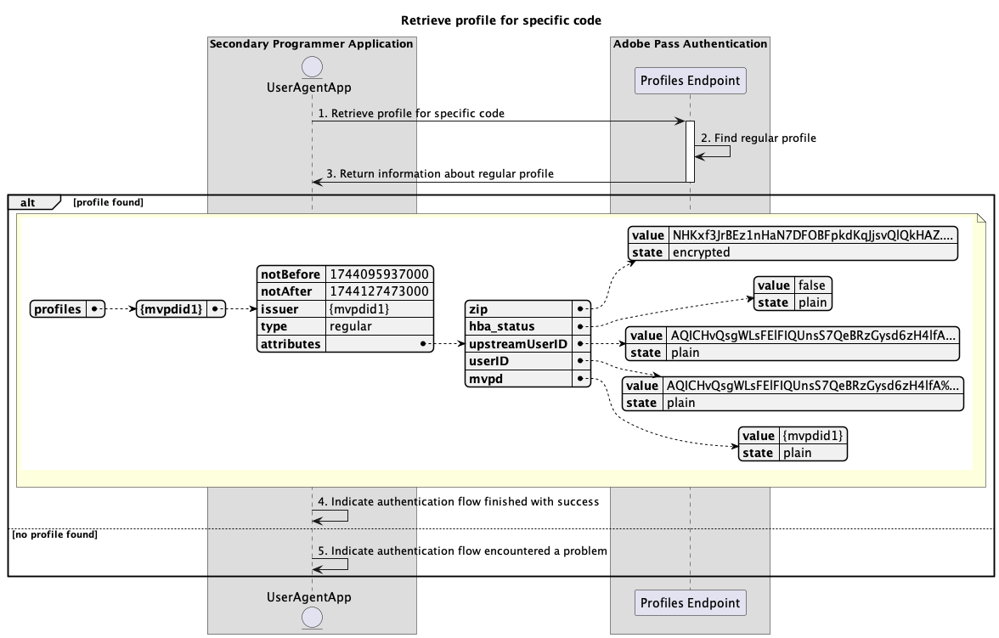

# De stroom van basisprofielen die binnen secundaire toepassing wordt uitgevoerd {#basic-profiles-flow-secondary-application}

>[!IMPORTANT]
>
> De inhoud op deze pagina wordt alleen ter informatie verstrekt. Voor het gebruik van deze API is een huidige licentie van Adobe vereist. Ongeautoriseerd gebruik is niet toegestaan.

>[!IMPORTANT]
>
> De implementatie van REST API V2 wordt begrensd door de [ Throttling mechanisme ](/help/authentication/throttling-mechanism.md) documentatie.

De **stroom van Profielen** binnen de rechten van de Authentificatie van Adobe Pass staat de secundaire toepassing toe om tot informatie over actieve gebruikerslogins toegang te hebben.

De basis profielstroom staat u toe om voor de volgende scenario&#39;s te vragen:

* [Profiel ophalen voor specifieke code](#retrieve-profile-for-specific-code)

## Profiel ophalen voor specifieke code {#retrieve-profile-for-specific-code}

### Vereisten {#prerequisites-retrieve-profile-for-specific-code}

Voordat u het profiel voor een specifieke verificatiecode ophaalt, moet u controleren of aan de volgende voorwaarden is voldaan:

* De secundaire toepassing, die een `code` heeft die wordt gebruikt om de interactieve authentificatie met MVPD uit te voeren, wil het profiel voor een specifieke authentificatiecode terugwinnen.

### Workflow {#workflow-retrieve-profile-for-specific-code}

Volg de gegeven stappen om de basisstroom van de profielherwinning voor een specifieke authentificatiecode uit te voeren die binnen een secundaire toepassing zoals aangetoond in het volgende diagram wordt uitgevoerd.

 terug

*wint profiel voor specifieke code* terug

1. **wint profiel voor specifieke code terug:** de secundaire toepassing verzamelt alle noodzakelijke gegevens om profielinformatie voor die specifieke authentificatiecode terug te winnen door een verzoek naar het eindpunt van Profielen te verzenden.

   >[!IMPORTANT]
   >
   > Verwijs naar [ terugwinnen profiel voor specifieke code ](../../apis/profiles-apis/rest-api-v2-profiles-apis-retrieve-profile-for-specific-code.md) API documentatie voor details op:
   >
   > * Alle _vereiste_ parameters, als `serviceProvider`, en `code`
   > * Alle _vereiste_ kopballen, als `Authorization`
   > * Alle _facultatieve_ parameters en kopballen

1. **vind regelmatig profiel:** de server van Adobe Pass identificeert een geldig profiel dat op de ontvangen parameters en kopballen wordt gebaseerd.

1. **de informatie van de Terugkeer over regelmatig profiel:** de het eindpuntreactie van Profielen bevat informatie over het gevonden profiel verbonden aan de ontvangen parameters en kopballen.

   >[!IMPORTANT]
   >
   > Verwijs naar [ terugwinnen profiel voor specifieke code ](../../apis/profiles-apis/rest-api-v2-profiles-apis-retrieve-profile-for-specific-code.md) API documentatie voor details op de informatie die in een profielreactie wordt verstrekt.
   > 
   >  
   > 
   > Het eindpunt van Profielen bevestigt de verzoekgegevens om ervoor te zorgen dat de basisvoorwaarden worden voldaan:
   >
   > * De _vereiste_ parameters en de kopballen moeten geldig zijn.
   >
   >  
   > 
   > Als de bevestiging ontbreekt, zal een foutenreactie worden geproduceerd, verstrekkend extra informatie die aan de [ Verbeterde documentatie van de Codes van de Fout ](../../../enhanced-error-codes.md) volgt.

1. **wijst op authentificatiestroom gebeëindigd met succes:** als de het eindpuntreactie van Profielen een profiel bevat, verwerkt de secundaire toepassing de reactie en kan het gebruiken om naar keuze een specifiek bericht op het gebruikersinterface te tonen.

1. **wijs op authentificatiestroom ondervond een probleem:** als de het eindpuntreactie van Profielen geen profiel bevat, verwerkt de secundaire toepassing de reactie en kan het gebruiken om naar keuze een specifiek bericht op het gebruikersinterface te tonen.
