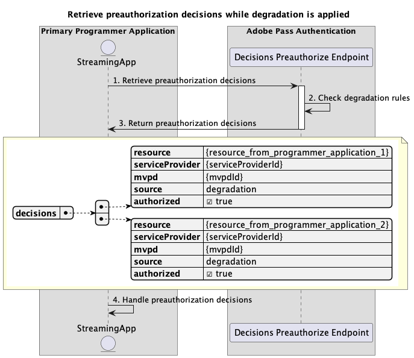

# Verminderde toegangsstromen {#degraded-access-flows}

>[!IMPORTANT]
>
> De inhoud op deze pagina wordt alleen ter informatie verstrekt. Voor het gebruik van deze API is een huidige licentie van Adobe vereist. Ongeautoriseerd gebruik is niet toegestaan.

>[!IMPORTANT]
>
> De implementatie van REST API V2 wordt begrensd door de [ Throttling mechanisme ](/help/authentication/throttling-mechanism.md) documentatie.

Degradatie zorgt ervoor dat bepaalde eindpunten voor MVPD-verificatie en -autorisatie tijdelijk worden overgeslagen. Meestal initieert de programmeur deze actie, maar ongeacht wie een degradatiegebeurtenis teweegbrengt, hangt de actie van vroegere regelingen af die met betrokken MVPDs worden gemaakt.

Voor meer details over de eigenschap van de Afbraak, verwijs naar de [ documentatie van de Afbraak ](../../../degradation-api-overview.md).

De degraded toegangsstromen staan u toe om voor de volgende scenario&#39;s te vragen:

* [Verificatie uitvoeren terwijl degradatie wordt toegepast](#perform-authentication-while-degradation-is-applied)
* [Autorisatiebesluiten ophalen terwijl degradatie wordt toegepast](#retrieve-authorization-decisions-while-degradation-is-applied)
* [Voorafgaande beslissingen ophalen terwijl de afbraak wordt toegepast](#retrieve-preauthorization-decisions-while-degradation-is-applied)
* [Profiel ophalen terwijl degradatie wordt toegepast](#retrieve-profile-while-degradation-is-applied)

## Verificatie uitvoeren terwijl degradatie wordt toegepast {#perform-authentication-while-degradation-is-applied}

### Vereisten {#prerequisites-perform-authentication-while-degradation-is-applied}

Voordat u de verificatiestroom uitvoert terwijl de degradatie wordt toegepast, moet u controleren of aan de volgende voorwaarden is voldaan:

* De streamingtoepassing moet een verificatiesessie starten wanneer deze zich moet aanmelden bij de MVPD.

>[!IMPORTANT]
> 
> Veronderstellingen
> 
>  
> 
> * De streamingtoepassing heeft geen geldig profiel voor die specifieke MVPD die in Adobe Pass-back-end is opgeslagen.
> * Er is een AuthNAll degradatieregel toegepast op de integratie tussen verstrekte `serviceProvider` en `mvpd`.

### Workflow {#workflow-perform-authentication-while-degradation-is-applied}

Volg de gegeven stappen om de authentificatiestroom uit te voeren terwijl de degradatie zoals aangetoond in het volgende diagram wordt toegepast.

*voer authentificatie uit terwijl de degradatie wordt toegepast*

1. **creeer authentificatiesessie:** de het stromen toepassing verzamelt alle noodzakelijke gegevens om een authentificatiesessie in werking te stellen door het eindpunt van Sessies te roepen.

   >[!IMPORTANT]
   >
   > Verwijs naar [ creeer authentificatiesessie ](../../apis/sessions-apis/rest-api-v2-sessions-apis-create-authentication-session.md) API documentatie voor details op:
   > 
   > * Alle _vereiste_ parameters, als `serviceProvider`, `mvpd`, `domainName`, en `redirectUrl`
   > * Alle _vereiste_ kopballen, als `Authorization` en `AP-Device-Identifier`
   > * Alle _facultatieve_ parameters en kopballen

1. **de degradatieregels van de Controle:** de server van Adobe Pass verifieert als er een AuthNAll degradatieregel is die op de integratie tussen verstrekte `serviceProvider` en `mvpd` wordt toegepast.

1. **wijs op de volgende actie:** De reactie van het eindpunt van zittingen bevat de noodzakelijke gegevens om de het stromen toepassing betreffende de volgende actie te begeleiden:
   * Het attribuut `actionName` wordt ingesteld op &quot;authorize&quot;.
   * Het attribuut `actionType` wordt ingesteld op &quot;direct&quot;.

   >[!IMPORTANT]
   >
   > Verwijs naar [ creeer authentificatiesessie ](../../apis/sessions-apis/rest-api-v2-sessions-apis-create-authentication-session.md) API documentatie voor details over de informatie die in een zittingsreactie wordt verstrekt.
   > 
   >  
   > 
   > Het eindpunt van Sessies valideert de aanvraaggegevens om ervoor te zorgen dat aan de basisvoorwaarden wordt voldaan:
   >
   > * De _vereiste_ parameters en de kopballen moeten geldig zijn.
   > * De integratie tussen de opgegeven `serviceProvider` en `mvpd` moet actief zijn.
   >
   >  
   > 
   > Als de basisbevestiging ontbreekt, zal een foutenreactie worden geproduceerd, verstrekkend extra informatie die aan de [ Verbeterde documentatie van de Codes van de Fout ](../../../enhanced-error-codes.md) volgt.
   >
   >  
   > 
   > Het eindpunt van Sessies gebruikt de verzoekgegevens om te controleren of aan degraded toegangsvoorwaarden wordt voldaan:
   >
   > * Voor de integratie tussen de opgegeven `serviceProvider` en `mvpd` moet een AuthNAll-afbraakregel worden toegepast.
   >
   >  
   > 
   > Als de degraded toegangsbevestiging ontbreekt, zal de reactie aan de basisauthentificatiestroom in gebreke blijven.

1. **ga met besluitvormingsstromen te werk:** De het stromen toepassing kan met verdere besluitvormingsstromen verdergaan.

## Autorisatiebesluiten ophalen terwijl degradatie wordt toegepast {#retrieve-authorization-decisions-while-degradation-is-applied}

### Vereisten {#prerequisites-retrieve-authorization-decisions-while-degradation-is-applied}

Zorg ervoor dat aan de volgende voorwaarden is voldaan voordat u autorisatiebeslissingen ophaalt terwijl de afbraak wordt toegepast:

* De streamingtoepassing moet een autorisatiebesluit ophalen voordat een door de gebruiker geselecteerde bron wordt afgespeeld.

>[!IMPORTANT]
>
> Veronderstellingen
> 
>  
> 
> * De streamingtoepassing heeft geen geldig profiel voor die specifieke MVPD.
> * Er is een AuthZAll- of AuthNAll-afbraakregel toegepast op de integratie tussen de opgegeven `serviceProvider` en `mvpd` .

### Workflow {#workflow-retrieve-authorization-decisions-while-degradation-is-applied}

Volg de gegeven stappen om de vergunningsstroom uit te voeren terwijl de degradatie wordt toegepast zoals aangetoond in het volgende diagram.

*wint vergunningsbesluiten terug terwijl de degradatie wordt toegepast*

1. **wint vergunningsbesluit terug:** De het stromen toepassing verzamelt alle noodzakelijke gegevens om een vergunningsbesluit voor een specifiek middel te verkrijgen door Besluiten te roepen machtigt eindpunt.

   >[!IMPORTANT]
   > 
   > Verwijs naar [ terugwinnen vergunningsbesluiten gebruikend specifieke mvpd ](../../apis/decisions-apis/rest-api-v2-decisions-apis-retrieve-authorization-decisions-using-specific-mvpd.md) API documentatie voor details op:
   >
   > * Alle _vereiste_ parameters, als `serviceProvider`, `mvpd`, en `resources`
   > * Alle _vereiste_ kopballen, als `Authorization` en `AP-Device-Identifier`
   > * Alle _facultatieve_ parameters en kopballen

1. **de degradatieregels van de Controle:** de server van Adobe Pass verifieert als er een AuthZAll of AuthNAll degradatieregel is die op de integratie tussen verstrekte `serviceProvider` en `mvpd` wordt toegepast.

1. **Terugkeer `Permit` besluit met media teken:** de Besluiten staan eindpuntreactie toe bevat een `Permit` besluit en een media teken.

   >[!IMPORTANT]
   >
   > Verwijs naar [ terugwinnen vergunningsbesluiten gebruikend specifieke mvpd ](../../apis/decisions-apis/rest-api-v2-decisions-apis-retrieve-authorization-decisions-using-specific-mvpd.md) API documentatie voor details over de informatie die in een besluitreactie wordt verstrekt.
   >
   >  
   > 
   > De Besluiten machtigen eindpunt bevestigt de verzoekgegevens om ervoor te zorgen dat de basisvoorwaarden worden voldaan:
   >
   > * De _vereiste_ parameters en de kopballen moeten geldig zijn.
   > * De integratie tussen de opgegeven `serviceProvider` en `mvpd` moet actief zijn.
   >
   >  
   > 
   > Als de basisbevestiging ontbreekt, zal een foutenreactie worden geproduceerd, verstrekkend extra informatie die aan de [ Verbeterde documentatie van de Codes van de Fout ](../../../enhanced-error-codes.md) volgt.
   >
   >  
   >
   > De Besluiten machtigen eindpunt gebruikt de verzoekgegevens om te controleren of de degraded toegangsvoorwaarden worden vervuld:
   >
   > * Voor de integratie tussen de opgegeven `serviceProvider` en `mvpd` moet een afbraakregel van AuthZAll of AuthNAll worden toegepast.
   >
   >  
   > 
   > Als de degraded toegangsbevestiging ontbreekt, zal de reactie aan de basisvergunningsstroom in gebreke blijven.

1. **stroom van het Begin met media teken:** de het stromen toepassing gebruikt het media teken om de inhoud te spelen.

## Voorafgaande beslissingen ophalen terwijl de afbraak wordt toegepast {#retrieve-preauthorization-decisions-while-degradation-is-applied}

### Vereisten {#prerequisites-retrieve-preauthorization-decisions-while-degradation-is-applied}

Voordat u beslissingen vóór de toelating ophaalt terwijl de afbraak wordt toegepast, moet u ervoor zorgen dat aan de volgende voorwaarden wordt voldaan:

* De streamingtoepassing wil beslissingen vóór autorisatie ophalen om een lijst met bronnen weer te geven, samen met de bijbehorende status.

>[!IMPORTANT]
>
> Veronderstellingen
>
>  
> 
> * De streamingtoepassing heeft geen geldig profiel voor die specifieke MVPD.
> * Er is een AuthZAll- of AuthNAll-afbraakregel toegepast op de integratie tussen de opgegeven `serviceProvider` en `mvpd` .

### Workflow {#workflow-retrieve-preauthorization-decisions-while-degradation-is-applied}

Volg de gegeven stappen om de stroom van de voorafgaande toestemming uit te voeren terwijl de degradatie wordt toegepast zoals aangetoond in het volgende diagram.

*wint pre-vergunningsbesluiten terug terwijl de degradatie wordt toegepast*

1. **wint pre-vergunningsbesluiten terug:** De het stromen toepassing verzamelt alle noodzakelijke gegevens om pre-vergunningsbesluiten voor een lijst van middelen te verkrijgen door de Besluiten te roepen preauthorize eindpunt.

   >[!IMPORTANT]
   >
   > Verwijs naar [ terugwinnen pre-vergunningsbesluiten gebruikend specifieke mvpd ](../../apis/decisions-apis/rest-api-v2-decisions-apis-retrieve-preauthorization-decisions-using-specific-mvpd.md) API documentatie voor details op:
   >
   > * Alle _vereiste_ parameters, als `serviceProvider`, `mvpd`, en `resources`
   > * Alle _vereiste_ kopballen, als `Authorization` en `AP-Device-Identifier`
   > * Alle _facultatieve_ parameters en kopballen

1. **de degradatieregels van de Controle:** de server van Adobe Pass verifieert als er een AuthZAll of AuthNAll degradatieregel is die op de integratie tussen verstrekte `serviceProvider` en `mvpd` wordt toegepast.

1. **de besluiten van de Terugkeer voorafgaand aan goedkeuring:** De Besluiten pre-autoriseren eindpuntreactie bevat a `Permit` besluit voor elk middel.

   >[!IMPORTANT]
   >
   > Verwijs naar [ terugwinnen pre-vergunningsbesluiten gebruikend specifieke mvpd ](../../apis/decisions-apis/rest-api-v2-decisions-apis-retrieve-preauthorization-decisions-using-specific-mvpd.md) API documentatie voor details over de informatie die in een besluitreactie wordt verstrekt.
   >
   >  
   >
   > Het eindpunt van Besluiten pre-autoriseert bevestigt de verzoekgegevens om ervoor te zorgen dat de basisvoorwaarden worden voldaan:
   >
   > * De _vereiste_ parameters en de kopballen moeten geldig zijn.
   > * De integratie tussen de opgegeven `serviceProvider` en `mvpd` moet actief zijn.
   >
   >  
   > 
   > Als de basisbevestiging ontbreekt, zal een foutenreactie worden geproduceerd, verstrekkend extra informatie die aan de [ Verbeterde documentatie van de Codes van de Fout ](../../../enhanced-error-codes.md) volgt.
   >
   >  
   >
   > Het eindpunt van Besluiten pre-machtigt gebruikt de verzoekgegevens om te controleren of de degraded toegangsvoorwaarden worden voldaan aan:
   >
   > * Voor de integratie tussen de opgegeven `serviceProvider` en `mvpd` moet een afbraakregel van AuthZAll of AuthNAll worden toegepast.
   >
   >  
   > 
   > Als de degraded toegangsbevestiging ontbreekt, zal de reactie aan de basisstroom in gebreke blijven voorafgaand aan goedkeuring.

1. **de besluiten van de Behandeling prepermission:** De het stromen toepassing verwerkt de reactie en kan het gebruiken naar keuze om de aangewezen status voor elk middel op het gebruikersinterface te tonen.

## Profiel ophalen terwijl degradatie wordt toegepast {#retrieve-profile-while-degradation-is-applied}

>[!IMPORTANT]
>
> De het eindpuntvraag van Profielen is facultatief terwijl de degradatie wordt toegepast.
>
>  
> 
> De het eindpuntreactie van Sessies instrueert de toepassing om met besluitvormingsstromen te werk te gaan terwijl de degradatie wordt toegepast. Voor meer details, verwijs naar [ authentificatie uitvoeren terwijl de degradatie wordt toegepast ](#perform-authentication-while-degradation-is-applied) sectie.

### Vereisten {#prerequisites-retrieve-profile-while-degradation-is-applied}

Alvorens het profiel voor een specifieke MVPD terug te winnen terwijl de degradatie wordt toegepast, zorg ervoor de volgende voorwaarden worden voldaan aan:

* De streamingtoepassing, die een geselecteerde of in cache geplaatste `mvpd` id heeft, wil het profiel voor een specifieke MVPD ophalen.

>[!IMPORTANT]
>
> Veronderstellingen
>
>  
> 
> * De streamingtoepassing heeft geen geldig profiel voor die specifieke MVPD.
> * Er is een AuthNAll degradatieregel toegepast op de integratie tussen verstrekte `serviceProvider` en `mvpd`.

### Workflow {#workflow-retrieve-profile-while-degradation-is-applied}

Volg de gegeven stappen om de stroom van de profielherwinning voor een specifieke MVPD uit te voeren terwijl de degradatie zoals aangetoond in het volgende diagram wordt toegepast.

*wint profiel terug terwijl de degradatie wordt toegepast*

1. **wint profiel voor specifieke mvpd terug:** de het stromen toepassing verzamelt alle noodzakelijke gegevens om profielinformatie voor dat specifieke MVPD terug te winnen door een verzoek naar het eindpunt van Profielen te verzenden.

   >[!IMPORTANT]
   >
   > Verwijs naar [ terugwinnen profiel voor specifieke mvpd ](../../apis/profiles-apis/rest-api-v2-profiles-apis-retrieve-profile-for-specific-mvpd.md) API documentatie voor details op:
   >
   > * Alle _vereiste_ parameters, als `serviceProvider`, en `mvpd`
   > * Alle _vereiste_ kopballen, als `Authorization` en `AP-Device-Identifier`
   > * Alle _facultatieve_ parameters en kopballen

1. **de degradatieregels van de Controle:** de server van Adobe Pass verifieert als er een AuthNAll degradatieregel is die op de integratie tussen verstrekte `serviceProvider` en `mvpd` wordt toegepast.

1. **de informatie van de Terugkeer over gedegradeerd profiel:** de het eindpuntreactie van Profielen bevat informatie over het gedegradeerde profiel, met inbegrip van de attributen `type` die aan &quot;degraded&quot;worden geplaatst.

   >[!IMPORTANT]
   >
   > Verwijs naar [ terugwinnen profiel voor specifieke mvpd ](../../apis/profiles-apis/rest-api-v2-profiles-apis-retrieve-profile-for-specific-mvpd.md) API documentatie voor details op de informatie die in een profielreactie wordt verstrekt.
   >
   >  
   >
   > Het eindpunt van Profielen bevestigt de verzoekgegevens om ervoor te zorgen dat de basisvoorwaarden worden voldaan:
   >
   > * De _vereiste_ parameters en de kopballen moeten geldig zijn.
   > * De integratie tussen de opgegeven `serviceProvider` en `mvpd` moet actief zijn.
   >
   >  
   > 
   > Als de basisbevestiging ontbreekt, zal een foutenreactie worden geproduceerd, verstrekkend extra informatie die aan de [ Verbeterde documentatie van de Codes van de Fout ](../../../enhanced-error-codes.md) volgt.
   >
   >  
   > 
   > Het eindpunt van Profielen gebruikt de verzoekgegevens om te controleren of de degraded toegangsvoorwaarden worden vervuld:
   >
   > * Voor de integratie tussen de opgegeven `serviceProvider` en `mvpd` moet een AuthNAll-afbraakregel worden toegepast.
   >
   >  
   > 
   > Als de degraded toegangsbevestiging ontbreekt, zal de reactie aan de basisstroom van de profielterugwinning in gebreke blijven.

1. **ga met besluitstromen te werk:** als de het eindpuntreactie van Profielen een profiel bevat, gebruikt de het stromen toepassing de gedegradeerde profielinformatie om met verdere besluitvormingsstromen verder te gaan.

1. **wijs op nieuwe basisauthentificatiestroom:** als de het eindpuntreactie van Profielen geen profiel bevat, wijst de het stromen toepassing op de gebruiker om een nieuwe basisauthentificatiestroom in werking te stellen.

>[!NOTE]
>
> De stappen voor de stroom van de profielterugwinning voor een specifieke authentificatiecode zijn het zelfde als hierboven, behalve dat wordt gebruikt het eindpunt in [ wordt beschreven terugwinnen profiel voor specifieke code ](../../apis/profiles-apis/rest-api-v2-profiles-apis-retrieve-profile-for-specific-code.md) documentatie die.
