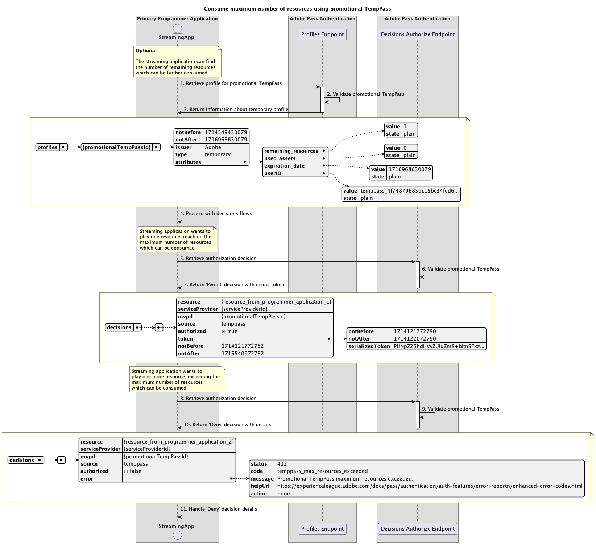

# Tijdelijke toegangsstromen {#temporary-access-flows}

>[!IMPORTANT]
>
> De inhoud op deze pagina wordt alleen ter informatie verstrekt. Voor het gebruik van deze API is een huidige licentie van Adobe vereist. Ongeautoriseerd gebruik is niet toegestaan.

>[!IMPORTANT]
>
> De implementatie van REST API V2 wordt begrensd door de [ Throttling mechanisme ](/help/authentication/throttling-mechanism.md) documentatie.

Met TempPass kunnen programmeurs tijdelijke toegang geven tot hun beveiligde inhoud zonder dat gebruikers wordt gevraagd om te verifiëren met een geldig MVPD-account.

Voor meer details over eigenschap TempPass, verwijs naar [ TempPass ](../../../temp-pass.md) documentatie.

Met tijdelijke toegangsstromen kunt u zoeken naar de volgende scenario&#39;s:

* [Autorisatiebesluiten ophalen met basis TempPass](#retrieve-authorization-decisions-using-basic-temppass)
* [Autorisatiebesluiten ophalen met gebruik van promotionele TempPass](#retrieve-authorization-decisions-using-promotional-temppass)
* [Maximumaantal bronnen gebruiken met promotionele TempPass](#consume-maximum-number-of-resources-using-promotional-temppass)
* [Autorisatiebesluiten ophalen wanneer basis- of promotionele TempPass verloopt](#retrieve-authorization-decisions-when-basic-or-promotional-temppass-expires)
* [Profiel ophalen voor standaard TempPass](#retrieve-profile-for-basic-temppass)
* [Profiel ophalen voor promotionele TempPass](#retrieve-profile-for-promotional-temppass)

## Autorisatiebesluiten ophalen met basis TempPass {#retrieve-authorization-decisions-using-basic-temppass}

### Vereisten {#prerequisites-retrieve-authorization-decisions-using-basic-temppass}

Voordat u autorisatiebeslissingen ophaalt met behulp van basis TempPass, moet u controleren of aan de volgende voorwaarden is voldaan:

* De streamingtoepassing wil tijdelijk toegang tot afspeelinhoud bieden zonder de gebruiker te vragen om te verifiëren.
* De streamingtoepassing moet een autorisatiebesluit ophalen voordat een door de gebruiker geselecteerde bron wordt afgespeeld.

>[!IMPORTANT]
>
> Veronderstellingen
> 
>  
> 
> * Er moet een geldige configuratie-instelling zijn voor de standaard TempPass die wordt toegepast op de integratie tussen de opgegeven `serviceProvider` en `mvpd` .
> * De tijd-aan-Levende (TTL) die voor basisTempPass wordt gevormd is niet verlopen.

### Workflow {#workflow-retrieve-authorization-decisions-using-basic-temppass}

Volg de gegeven stappen om de vergunningsstroom uit te voeren gebruikend basis TempPass zoals aangetoond in het volgende diagram.

*wint vergunningsbesluiten terug gebruikend basis TempPass*

1. **wint vergunningsbesluit terug:** De het stromen toepassing verzamelt alle noodzakelijke gegevens om een vergunningsbesluit voor een specifiek middel te verkrijgen door Besluiten te roepen machtigt eindpunt.

   >[!IMPORTANT]
   >
   > Verwijs naar [ terugwinnen vergunningsbesluiten gebruikend specifieke mvpd ](../../apis/decisions-apis/rest-api-v2-decisions-apis-retrieve-authorization-decisions-using-specific-mvpd.md) API documentatie voor details op:
   > 
   > * Alle _vereiste_ parameters, als `serviceProvider`, `mvpd`, en `resources`
   > * Alle _vereiste_ kopballen, als `Authorization` en `AP-Device-Identifier`
   > * Alle _facultatieve_ parameters en kopballen

1. **bevestigt basis TempPass:** de server van Adobe Pass verifieert als er een geldige configuratieconfiguratie van basisTempPass die op de integratie tussen verstrekt `serviceProvider` en `mvpd` wordt toegepast is.

1. **Terugkeer `Permit` besluit met media teken:** de Besluiten staan eindpuntreactie toe bevat een `Permit` besluit en een media teken.

   >[!IMPORTANT]
   >
   > Verwijs naar [ terugwinnen vergunningsbesluiten gebruikend specifieke mvpd ](../../apis/decisions-apis/rest-api-v2-decisions-apis-retrieve-authorization-decisions-using-specific-mvpd.md) API documentatie voor details over de informatie die in een besluitreactie wordt verstrekt.
   >
   >  
   > 
   > De Besluiten machtigen eindpunt bevestigt de verzoekgegevens om ervoor te zorgen dat de basisvoorwaarden worden voldaan:
   >
   > * De _vereiste_ parameters en de kopballen moeten geldig zijn.
   > * De integratie tussen de opgegeven `serviceProvider` en `mvpd` moet actief zijn.
   >
   >  
   > 
   > Als de basisbevestiging ontbreekt, zal een foutenreactie worden geproduceerd, verstrekkend extra informatie die aan de [ Verbeterde documentatie van de Codes van de Fout ](../../../enhanced-error-codes.md) volgt.
   >
   >  
   > 
   > De Besluiten machtigen eindpunt gebruikt de verzoekgegevens om te controleren of de tijdelijke toegangsvoorwaarden worden voldaan:
   >
   > * De tijd-aan-Levende (TTL) die voor basisTempPass wordt gevormd moet niet zijn verlopen.
   >
   >  
   > 
   > Als de tijdelijke toegangsbevestiging ontbreekt, zal een foutenreactie worden geproduceerd, die extra informatie verstrekt die aan de [ Verbeterde documentatie van de Codes van de Fout ](../../../enhanced-error-codes.md) volgt.

1. **stroom van het Begin met media teken:** de het stromen toepassing gebruikt het media teken om de inhoud te spelen.

## Autorisatiebesluiten ophalen met gebruik van promotionele TempPass {#retrieve-authorization-decisions-using-promotional-temppass}

### Vereisten {#prerequisites-retrieve-authorization-decisions-using-promotional-temppass}

Voordat u autorisatiebesluiten ophaalt met gebruik van promotionele TempPass, moet u controleren of aan de volgende voorwaarden is voldaan:

* De streamingtoepassing wil tijdelijk toegang bieden om een maximaal aantal bronnen af te spelen zonder de gebruiker te vragen om te verifiëren.
* De streamingtoepassing moet unieke informatie bevatten over de identiteit van de gebruiker wanneer een machtigingsbesluit wordt opgehaald.
* De streamingtoepassing moet een autorisatiebesluit ophalen voordat een door de gebruiker geselecteerde bron wordt afgespeeld.

>[!IMPORTANT]
>
> Veronderstellingen
>
>  
> 
> * Er moet een geldige configuratie-instelling zijn voor de promotionele TempPass die wordt toegepast op de integratie tussen de opgegeven `serviceProvider` en `mvpd` .
> * De tijd-aan-Levende (TTL) die voor promotionele TempPass wordt gevormd is niet verlopen.
> * Het maximumaantal middelen dat voor promotionele TempPass wordt gevormd is niet verbruikt.

### Workflow {#workflow-retrieve-authorization-decisions-using-promotional-temppass}

Volg de gegeven stappen om de vergunningsstroom uit te voeren gebruikend promotionele TempPass zoals aangetoond in het volgende diagram.

*wint vergunningsbesluiten terug gebruikend promotional TempPass*

1. **wint vergunningsbesluit terug:** De het stromen toepassing verzamelt alle noodzakelijke gegevens om een vergunningsbesluit voor een specifiek middel te verkrijgen door Besluiten te roepen machtigt eindpunt.

   >[!IMPORTANT]
   >
   > Verwijs naar [ terugwinnen vergunningsbesluiten gebruikend specifieke mvpd ](../../apis/decisions-apis/rest-api-v2-decisions-apis-retrieve-authorization-decisions-using-specific-mvpd.md) API documentatie voor details op:
   >
   > * Alle _vereiste_ parameters, als `serviceProvider`, `mvpd`, en `resources`
   > * Alle _vereiste_ kopballen, als `Authorization` en `AP-Device-Identifier`
   > * Alle _facultatieve_ parameters en kopballen
   >
   >  
   >
   > Het eindpunt van Besluiten autoriseren vereist de aanwezigheid van `AP-TempPass-Identity` header wanneer het gebruiken van promotionele TempPass. De koptekst bevat unieke informatie over de identiteit van de gebruiker die de inhoud benadert.
   > 
   >  
   > 
   > Voor meer details over `AP-TempPass-Identity` kopbal, verwijs naar [ AP-TempPass-Identity ](../../appendix/headers/rest-api-v2-appendix-headers-ap-temppass-identity.md) documentatie.

1. **bevestigt promotionele TempPass:** de server van Adobe Pass verifieert als er een geldige configuratieconfiguratie van promotionele TempPass die op de integratie tussen verstrekte `serviceProvider` en `mvpd` wordt toegepast is.

1. **Terugkeer `Permit` besluit met media teken:** de Besluiten staan eindpuntreactie toe bevat een `Permit` besluit en een media teken.

   >[!IMPORTANT]
   >
   > Verwijs naar [ terugwinnen vergunningsbesluiten gebruikend specifieke mvpd ](../../apis/decisions-apis/rest-api-v2-decisions-apis-retrieve-authorization-decisions-using-specific-mvpd.md) API documentatie voor details over de informatie die in een besluitreactie wordt verstrekt.
   > 
   >  
   > 
   > De Besluiten machtigen eindpunt bevestigt de verzoekgegevens om ervoor te zorgen dat de basisvoorwaarden worden voldaan:
   >
   > * De _vereiste_ parameters en de kopballen moeten geldig zijn.
   > * De integratie tussen de opgegeven `serviceProvider` en `mvpd` moet actief zijn.
   >
   >  
   > 
   > Als de basisbevestiging ontbreekt, zal een foutenreactie worden geproduceerd, verstrekkend extra informatie die aan de [ Verbeterde documentatie van de Codes van de Fout ](../../../enhanced-error-codes.md) volgt.
   >
   >  
   > 
   > De Besluiten machtigen eindpunt gebruikt de verzoekgegevens om te controleren of de tijdelijke toegangsvoorwaarden worden voldaan:
   >
   > * De tijd-aan-Levende (TTL) die voor promotionele TempPass wordt gevormd moet niet verlopen.
   > * Het maximumaantal middelen dat voor promotionele TempPass wordt gevormd moet niet worden verbruikt.
   >
   >  
   > 
   > Als de tijdelijke toegangsbevestiging ontbreekt, zal een foutenreactie worden geproduceerd, die extra informatie verstrekt die aan de [ Verbeterde documentatie van de Codes van de Fout ](../../../enhanced-error-codes.md) volgt.

1. **stroom van het Begin met media teken:** de het stromen toepassing gebruikt het media teken om de inhoud te spelen.

## Maximumaantal bronnen gebruiken met promotionele TempPass {#consume-maximum-number-of-resources-using-promotional-temppass}

### Vereisten {#prerequisites-consume-maximum-number-of-resources-using-promotional-temppass}

Voordat u een maximaal aantal bronnen gebruikt met behulp van promotionele TempPass, moet u ervoor zorgen dat aan de volgende voorwaarden wordt voldaan:

* De streamingtoepassing wil tijdelijk toegang bieden om een maximaal aantal bronnen af te spelen zonder de gebruiker te vragen om te verifiëren.
* De streamingtoepassing moet unieke informatie bevatten over de identiteit van de gebruiker wanneer een machtigingsbesluit wordt opgehaald.
* De streamingtoepassing moet een autorisatiebesluit ophalen voordat een door de gebruiker geselecteerde bron wordt afgespeeld.

>[!IMPORTANT]
>
> Veronderstellingen
>
>  
> 
> * Er moet een geldige configuratie-instelling zijn voor de promotionele TempPass die wordt toegepast op de integratie tussen de opgegeven `serviceProvider` en `mvpd` .
> * De tijd-aan-Levende (TTL) die voor promotionele TempPass wordt gevormd is niet verlopen.
> * Het maximumaantal middelen dat voor promotionele TempPass wordt gevormd is 1.

### Workflow {#workflow-consume-maximum-number-of-resources-using-promotional-temppass}

Volg de gegeven stappen om de vergunningsstroom uit te voeren wanneer het verbruiken van een maximumaantal middelen gebruikend promotionele TempPass zoals aangetoond in het volgende diagram.

*verbruikt maximum aantal middelen gebruikend promotionele TempPass*

1. **wint profiel voor promotionele TempPass terug:** de het stromen toepassing verzamelt alle noodzakelijke gegevens om profielinformatie voor promotionele TempPass terug te winnen door een verzoek naar het eindpunt van Profielen te verzenden.

   >[!IMPORTANT]
   >
   > Verwijs naar [ terugwinnen profiel voor specifieke mvpd ](../../apis/profiles-apis/rest-api-v2-profiles-apis-retrieve-profile-for-specific-mvpd.md) API documentatie voor details op:
   >
   > * Alle _vereiste_ parameters, als `serviceProvider`, en `mvpd`
   > * Alle _vereiste_ kopballen, als `Authorization` en `AP-Device-Identifier`
   > * Alle _facultatieve_ parameters en kopballen
   >
   >  
   > 
   > De het eindpuntvraag van Profielen is facultatief en kan worden gebruikt om te bepalen hoeveel middelen nog kunnen worden gespeeld gebruikend promotionele TempPass.

1. **bevestigt promotionele TempPass:** de server van Adobe Pass verifieert als er een geldige configuratieconfiguratie van promotionele TempPass die op de integratie tussen verstrekte `serviceProvider` en `mvpd` wordt toegepast is.

1. **de informatie van de Terugkeer over tijdelijk profiel:** de het eindpuntreactie van Profielen bevat informatie over het tijdelijke profiel, met inbegrip van de attributen `type` die aan &quot;tijdelijk&quot;worden geplaatst.

   >[!IMPORTANT]
   >
   > Verwijs naar [ terugwinnen profiel voor specifieke mvpd ](../../apis/profiles-apis/rest-api-v2-profiles-apis-retrieve-profile-for-specific-mvpd.md) API documentatie voor details op de informatie die in een profielreactie wordt verstrekt.
   > 
   >  
   > 
   > Het eindpunt van Profielen bevestigt de verzoekgegevens om ervoor te zorgen dat de basisvoorwaarden worden voldaan:
   >
   > * De _vereiste_ parameters en de kopballen moeten geldig zijn.
   > * De integratie tussen de opgegeven `serviceProvider` en `mvpd` moet actief zijn.
   > 
   >  
   >
   > Als de basisbevestiging ontbreekt, zal een foutenreactie worden geproduceerd, verstrekkend extra informatie die aan de [ Verbeterde documentatie van de Codes van de Fout ](../../../enhanced-error-codes.md) volgt.
   >
   >  
   > 
   > Het eindpunt van Profielen gebruikt de verzoekgegevens om te controleren als de tijdelijke toegangsvoorwaarden worden voldaan:
   >
   > * De tijd-aan-Levende (TTL) die voor promotionele TempPass wordt gevormd moet niet verlopen.
   > * Het maximumaantal middelen dat voor promotionele TempPass wordt gevormd moet niet worden verbruikt.
   >
   >  
   > 
   > Als de tijdelijke toegangsbevestiging ontbreekt, zal een foutenreactie worden geproduceerd, die extra informatie verstrekt die aan de [ Verbeterde documentatie van de Codes van de Fout ](../../../enhanced-error-codes.md) volgt.

1. **ga met besluitvormingsstromen te werk:** als de het eindpuntreactie van Profielen een profiel bevat, gebruikt de het stromen toepassing de tijdelijke profielinformatie om met verdere besluitvormingsstromen verder te gaan.

1. **wint vergunningsbesluit terug:** De het stromen toepassing verzamelt alle noodzakelijke gegevens om een vergunningsbesluit voor een specifiek middel te verkrijgen door Besluiten te roepen machtigt eindpunt.

   >[!IMPORTANT]
   > 
   > Verwijs naar [ terugwinnen vergunningsbesluiten gebruikend specifieke mvpd ](../../apis/decisions-apis/rest-api-v2-decisions-apis-retrieve-authorization-decisions-using-specific-mvpd.md) API documentatie voor details op:
   >
   > * Alle _vereiste_ parameters, als `serviceProvider`, `mvpd`, en `resources`
   > * Alle _vereiste_ kopballen, als `Authorization` en `AP-Device-Identifier`
   > * Alle _facultatieve_ parameters en kopballen
   >
   >  
   > 
   > Het eindpunt van Besluiten autoriseren vereist de aanwezigheid van `AP-TempPass-Identity` header wanneer het gebruiken van promotionele TempPass. De koptekst bevat unieke informatie over de identiteit van de gebruiker die de inhoud benadert.
   > 
   >  
   > 
   > Voor meer details over `AP-TempPass-Identity` kopbal, verwijs naar [ AP-TempPass-Identity ](../../appendix/headers/rest-api-v2-appendix-headers-ap-temppass-identity.md) documentatie.

1. **bevestigt promotionele TempPass:** de server van Adobe Pass verifieert als er een geldige configuratieconfiguratie van promotionele TempPass die op de integratie tussen verstrekte `serviceProvider` en `mvpd` wordt toegepast is.

1. **Terugkeer `Permit` besluit met media teken:** de Besluiten staan eindpuntreactie toe bevat een `Permit` besluit en een media teken.

   >[!IMPORTANT]
   >
   > Verwijs naar [ terugwinnen vergunningsbesluiten gebruikend specifieke mvpd ](../../apis/decisions-apis/rest-api-v2-decisions-apis-retrieve-authorization-decisions-using-specific-mvpd.md) API documentatie voor details over de informatie die in een besluitreactie wordt verstrekt.
   > 
   >  
   > 
   > De Besluiten machtigen eindpunt bevestigt de verzoekgegevens om ervoor te zorgen dat de basisvoorwaarden worden voldaan:
   >
   > * De _vereiste_ parameters en de kopballen moeten geldig zijn.
   > * De integratie tussen de opgegeven `serviceProvider` en `mvpd` moet actief zijn.
   >
   >  
   > 
   > Als de basisbevestiging ontbreekt, zal een foutenreactie worden geproduceerd, verstrekkend extra informatie die aan de [ Verbeterde documentatie van de Codes van de Fout ](../../../enhanced-error-codes.md) volgt.
   > 
   >  
   > 
   > De Besluiten machtigen eindpunt gebruikt de verzoekgegevens om te controleren of de tijdelijke toegangsvoorwaarden worden voldaan:
   >
   > * De tijd-aan-Levende (TTL) die voor promotionele TempPass wordt gevormd moet niet verlopen.
   > * Het maximumaantal middelen dat voor promotionele TempPass wordt gevormd moet niet worden verbruikt.
   >
   >  
   > 
   > Als de tijdelijke toegangsbevestiging ontbreekt, zal een foutenreactie worden geproduceerd, die extra informatie verstrekt die aan de [ Verbeterde documentatie van de Codes van de Fout ](../../../enhanced-error-codes.md) volgt.

1. **wint vergunningsbesluit terug:** De het stromen toepassing verzamelt alle noodzakelijke gegevens om een vergunningsbesluit voor een specifiek middel te verkrijgen door Besluiten te roepen machtigt eindpunt.

   >[!IMPORTANT]
   >
   > Verwijs naar [ terugwinnen vergunningsbesluiten gebruikend specifieke mvpd ](../../apis/decisions-apis/rest-api-v2-decisions-apis-retrieve-authorization-decisions-using-specific-mvpd.md) API documentatie voor details op:
   >
   > * Alle _vereiste_ parameters, als `serviceProvider`, `mvpd`, en `resources`
   > * Alle _vereiste_ kopballen, als `Authorization` en `AP-Device-Identifier`
   > * Alle _facultatieve_ parameters en kopballen
   >
   >  
   > 
   > Het eindpunt van Besluiten autoriseren vereist de aanwezigheid van `AP-TempPass-Identity` header wanneer het gebruiken van promotionele TempPass. De koptekst bevat unieke informatie over de identiteit van de gebruiker die de inhoud benadert.
   >
   >  
   > 
   > Voor meer details over `AP-TempPass-Identity` kopbal, verwijs naar [ AP-TempPass-Identity ](../../appendix/headers/rest-api-v2-appendix-headers-ap-temppass-identity.md) documentatie.

1. **bevestigt promotionele TempPass:** de server van Adobe Pass verifieert als er een geldige configuratieconfiguratie van promotionele TempPass die op de integratie tussen verstrekte `serviceProvider` en `mvpd` wordt toegepast is.

1. **Terugkeer `Deny` besluit met details:** De Besluiten staan eindpuntreactie toe bevat a `Deny` besluit en een foutenlading die aan de [ Verbeterde documentatie van de Codes van de Fout ](../../../enhanced-error-codes.md) volgt.

   >[!IMPORTANT]
   >
   > Verwijs naar [ terugwinnen vergunningsbesluiten gebruikend specifieke mvpd ](../../apis/decisions-apis/rest-api-v2-decisions-apis-retrieve-authorization-decisions-using-specific-mvpd.md) API documentatie voor details over de informatie die in een besluitreactie wordt verstrekt.
   > 
   >  
   > 
   > De Besluiten machtigen eindpunt bevestigt de verzoekgegevens om ervoor te zorgen dat de basisvoorwaarden worden voldaan:
   >
   > * De _vereiste_ parameters en de kopballen moeten geldig zijn.
   > * De integratie tussen de opgegeven `serviceProvider` en `mvpd` moet actief zijn.
   >
   >  
   > 
   > Als de basisbevestiging ontbreekt, zal een foutenreactie worden geproduceerd, verstrekkend extra informatie die aan de [ Verbeterde documentatie van de Codes van de Fout ](../../../enhanced-error-codes.md) volgt.
   >
   >  
   > 
   > De Besluiten machtigen eindpunt gebruikt de verzoekgegevens om te controleren of de tijdelijke toegangsvoorwaarden worden voldaan:
   >
   > * De tijd-aan-Levende (TTL) die voor promotionele TempPass wordt gevormd moet niet verlopen.
   > * Het maximumaantal middelen dat voor promotionele TempPass wordt gevormd moet niet worden verbruikt.
   >
   >  
   > 
   > Als de tijdelijke toegangsbevestiging ontbreekt, zal een foutenreactie worden geproduceerd, die extra informatie verstrekt die aan de [ Verbeterde documentatie van de Codes van de Fout ](../../../enhanced-error-codes.md) volgt.

1. **handvat `Deny` besluitvormingsdetails:** de het stromen toepassing verwerkt de fouteninformatie van de reactie en kan het gebruiken om naar keuze een specifiek bericht op het gebruikersinterface te tonen.

   >[!NOTE]
   >
   > Suggestie: de streamingtoepassing kan gebruikers informeren dat het maximumaantal bronnen is overschreden en hen adviseren een basisverificatiestroom te starten met een normale MVPD om te blijven kijken.

## Autorisatiebesluiten ophalen wanneer basis- of promotionele TempPass verloopt {#retrieve-authorization-decisions-when-basic-or-promotional-temppass-expires}

### Vereisten {#prerequisites-retrieve-authorization-decisions-when-basic-or-promotional-temppass-expires}

Voordat u autorisatiebesluiten ophaalt wanneer de basis- of promotionele TempPass verloopt, moet u ervoor zorgen dat aan de volgende voorwaarden wordt voldaan:

* [ Vereisten alvorens vergunningsbesluiten terug te winnen gebruikend basisTempPass ](#prerequisites-retrieve-authorization-decisions-using-basic-temppass).
* [ Vereisten alvorens vergunningsbesluiten terug te winnen gebruikend promotionele TempPass ](#prerequisites-retrieve-authorization-decisions-using-promotional-temppass).

>[!IMPORTANT]
>
> Veronderstellingen
> 
>  
> 
> * Er moet een geldige configuratie-instelling zijn voor basis- of promotionele TempPass die wordt toegepast op de integratie tussen de opgegeven `serviceProvider` en `mvpd` .
> * De tijd-aan-Levende (TTL) die voor de basis of de bevordering wordt gevormd de tijdelijke toegangsduurgrens is overschreden.

### Workflow {#workflow-retrieve-authorization-decisions-when-basic-or-promotional-temppass-expires}

Volg de gegeven stappen om de vergunningsstroom uit te voeren wanneer basis of promotionele TempPass verloopt zoals aangetoond in het volgende diagram.

 verloopt

*wint vergunningsbesluiten terug wanneer basis of promotionele TempPass* verloopt

1. **wint vergunningsbesluit terug:** De het stromen toepassing verzamelt alle noodzakelijke gegevens om een vergunningsbesluit voor een specifiek middel te verkrijgen door Besluiten te roepen machtigt eindpunt.

   >[!IMPORTANT]
   >
   > Verwijs naar [ terugwinnen vergunningsbesluiten gebruikend specifieke mvpd ](../../apis/decisions-apis/rest-api-v2-decisions-apis-retrieve-authorization-decisions-using-specific-mvpd.md) API documentatie voor details op:
   > 
   > * Alle _vereiste_ parameters, als `serviceProvider`, `mvpd`, en `resources`
   > * Alle _vereiste_ kopballen, als `Authorization` en `AP-Device-Identifier`
   > * Alle _facultatieve_ parameters en kopballen
   >
   >  
   > 
   > Het eindpunt van Besluiten autoriseren vereist de aanwezigheid van `AP-TempPass-Identity` header wanneer het gebruiken van promotionele TempPass. De koptekst bevat unieke informatie over de identiteit van de gebruiker die de inhoud benadert.
   > 
   >  
   > 
   > Voor meer details over `AP-TempPass-Identity` kopbal, verwijs naar [ AP-TempPass-Identity ](../../appendix/headers/rest-api-v2-appendix-headers-ap-temppass-identity.md) documentatie.

1. **bevestigt basis of promotionele TempPass:** de server van Adobe Pass verifieert als er een geldige configuratieopstelling van basis of promotionele TempPass die op de integratie tussen verstrekte `serviceProvider` en `mvpd` wordt toegepast is.

1. **Terugkeer `Deny` besluit met details:** De Besluiten staan eindpuntreactie toe bevat a `Deny` besluit en een foutenlading die aan de [ Verbeterde documentatie van de Codes van de Fout ](../../../enhanced-error-codes.md) volgt.

   >[!IMPORTANT]
   >
   > Verwijs naar [ terugwinnen vergunningsbesluiten gebruikend specifieke mvpd ](../../apis/decisions-apis/rest-api-v2-decisions-apis-retrieve-authorization-decisions-using-specific-mvpd.md) API documentatie voor details over de informatie die in een besluitreactie wordt verstrekt.
   > 
   >  
   > 
   > De Besluiten machtigen eindpunt bevestigt de verzoekgegevens om ervoor te zorgen dat de basisvoorwaarden worden voldaan:
   >
   > * De _vereiste_ parameters en de kopballen moeten geldig zijn.
   > * De integratie tussen de opgegeven `serviceProvider` en `mvpd` moet actief zijn.
   >
   >  
   > 
   > Als de basisbevestiging ontbreekt, zal een foutenreactie worden geproduceerd, verstrekkend extra informatie die aan de [ Verbeterde documentatie van de Codes van de Fout ](../../../enhanced-error-codes.md) volgt.
   >
   >  
   > 
   > De Besluiten machtigen eindpunt gebruikt de verzoekgegevens om te controleren of de tijdelijke toegangsvoorwaarden worden voldaan:
   >
   > * De tijd-aan-Levende (TTL) die voor basis of promotionele TempPass wordt gevormd moet niet verlopen.
   > * Het maximumaantal middelen dat voor promotionele TempPass wordt gevormd moet niet worden verbruikt.
   >
   >  
   > 
   > Als de tijdelijke toegangsbevestiging ontbreekt, zal een foutenreactie worden geproduceerd, die extra informatie verstrekt die aan de [ Verbeterde documentatie van de Codes van de Fout ](../../../enhanced-error-codes.md) volgt.

1. **handvat `Deny` besluitvormingsdetails:** de het stromen toepassing verwerkt de fouteninformatie van de reactie en kan het gebruiken om naar keuze een specifiek bericht op het gebruikersinterface te tonen.

   >[!NOTE]
   >
   > Suggestie: de streaming toepassing kan gebruikers informeren dat de tijdelijke toegang is verlopen en hen adviseren om een basisauthentificatiestroom in werking te stellen gebruikend een regelmatige MVPD om het letten voort te zetten.

## Profiel ophalen voor standaard TempPass {#retrieve-profile-for-basic-temppass}

>[!IMPORTANT]
>
> De vraag van het eindpunt van Profielen is facultatief voor basisTempPass.

### Vereisten {#prerequisites-retrieve-profile-for-basic-temppass}

Controleer voordat u het profiel voor eenvoudige TempPass ophaalt of aan de volgende voorwaarden is voldaan:

* De streamingtoepassing wil het tijdelijke profiel ophalen om ervoor te zorgen dat de tijdelijke toegang niet is verlopen.

>[!IMPORTANT]
>
> Veronderstellingen
> 
>  
> 
> * Er moet een geldige configuratie-instelling zijn voor de standaard TempPass die wordt toegepast op de integratie tussen de opgegeven `serviceProvider` en `mvpd` .
> * De tijd-aan-Levende (TTL) die voor basisTempPass wordt gevormd moet niet zijn verlopen.

### Workflow {#workflow-retrieve-profile-information-for-basic-temppass}

Volg de gegeven stappen om de stroom van de profielherwinning voor basisTempPass uit te voeren zoals aangetoond in het volgende diagram.

 terug

*wint profiel voor basis TempPass* terug

1. **wint profiel voor basisTempPass terug:** de het stromen toepassing verzamelt alle noodzakelijke gegevens om profielinformatie voor basisTempPass terug te winnen door een verzoek naar het eindpunt van Profielen te verzenden.

   >[!IMPORTANT]
   >
   > Verwijs naar [ terugwinnen profiel voor specifieke mvpd ](../../apis/profiles-apis/rest-api-v2-profiles-apis-retrieve-profile-for-specific-mvpd.md) API documentatie voor details op:
   > 
   > * Alle _vereiste_ parameters, als `serviceProvider`, en `mvpd`
   > * Alle _vereiste_ kopballen, als `Authorization` en `AP-Device-Identifier`
   > * Alle _facultatieve_ parameters en kopballen

1. **bevestigt basis TempPass:** de server van Adobe Pass verifieert als er een geldige configuratieconfiguratie van basisTempPass die op de integratie tussen verstrekt `serviceProvider` en `mvpd` wordt toegepast is.

1. **de informatie van de Terugkeer over tijdelijk profiel:** de het eindpuntreactie van Profielen bevat informatie over het tijdelijke profiel, met inbegrip van de attributen `type` die aan &quot;tijdelijk&quot;worden geplaatst.

   >[!IMPORTANT]
   >
   > Verwijs naar [ terugwinnen profiel voor specifieke mvpd ](../../apis/profiles-apis/rest-api-v2-profiles-apis-retrieve-profile-for-specific-mvpd.md) API documentatie voor details op de informatie die in een profielreactie wordt verstrekt.
   > 
   >  
   > 
   > Het eindpunt van Profielen bevestigt de verzoekgegevens om ervoor te zorgen dat de basisvoorwaarden worden voldaan:
   >
   > * De _vereiste_ parameters en de kopballen moeten geldig zijn.
   > * De integratie tussen de opgegeven `serviceProvider` en `mvpd` moet actief zijn.
   >
   >  
   > 
   > Als de basisbevestiging ontbreekt, zal een foutenreactie worden geproduceerd, verstrekkend extra informatie die aan de [ Verbeterde documentatie van de Codes van de Fout ](../../../enhanced-error-codes.md) volgt.
   >
   >  
   > 
   > Het eindpunt van Profielen gebruikt de verzoekgegevens om te controleren als de tijdelijke toegangsvoorwaarden worden voldaan:
   >
   > * De tijd-aan-Levende (TTL) die voor basisTempPass wordt gevormd moet niet zijn verlopen.
   >
   >  
   > 
   > Als de tijdelijke toegangsbevestiging ontbreekt, zal een foutenreactie worden geproduceerd, die extra informatie verstrekt die aan de [ Verbeterde documentatie van de Codes van de Fout ](../../../enhanced-error-codes.md) volgt.

1. **ga met besluitvormingsstromen te werk:** als de het eindpuntreactie van Profielen een profiel bevat, gebruikt de het stromen toepassing de tijdelijke profielinformatie om met verdere besluitvormingsstromen verder te gaan.

## Profiel ophalen voor promotionele TempPass {#retrieve-profile-for-promotional-temppass}

>[!IMPORTANT]
>
> De vraag van het eindpunt van Profielen is facultatief voor promotionele TempPass.

### Vereisten {#prerequisites-retrieve-profile-for-promotional-temppass}

Voordat u het profiel voor promotionele TempPass ophaalt, moet u controleren of aan de volgende voorwaarden is voldaan:

* De streamingtoepassing wil het tijdelijke profiel ophalen om ervoor te zorgen dat de tijdelijke toegang niet is verlopen of om te bepalen hoeveel bronnen nog kunnen worden afgespeeld.

>[!IMPORTANT]
>
> Veronderstellingen
>
>  
> 
> * Er moet een geldige configuratie-instelling zijn voor de promotionele TempPass die wordt toegepast op de integratie tussen de opgegeven `serviceProvider` en `mvpd` .
> * De tijd-aan-Levende (TTL) die voor promotionele TempPass wordt gevormd is niet verlopen.
> * Het maximumaantal middelen dat voor promotionele TempPass wordt gevormd is niet verbruikt.

### Workflow {#workflow-retrieve-profile-information-for-promotional-temppass}

Volg de gegeven stappen om de stroom van de profielherwinning voor promotionele TempPass uit te voeren zoals aangetoond in het volgende diagram.

 terug

*wint profiel voor promotionele TempPass* terug

1. **wint profiel voor promotionele TempPass terug:** de het stromen toepassing verzamelt alle noodzakelijke gegevens om profielinformatie voor promotionele TempPass terug te winnen door een verzoek naar het eindpunt van Profielen te verzenden.

   >[!IMPORTANT]
   >
   > Verwijs naar [ terugwinnen profiel voor specifieke mvpd ](../../apis/profiles-apis/rest-api-v2-profiles-apis-retrieve-profile-for-specific-mvpd.md) API documentatie voor details op:
   > 
   > * Alle _vereiste_ parameters, als `serviceProvider`, en `mvpd`
   > * Alle _vereiste_ kopballen, als `Authorization` en `AP-Device-Identifier`
   > * Alle _facultatieve_ parameters en kopballen

1. **bevestigt promotionele TempPass:** de server van Adobe Pass verifieert als er een geldige configuratieconfiguratie van promotionele TempPass die op de integratie tussen verstrekte `serviceProvider` en `mvpd` wordt toegepast is.

1. **de informatie van de Terugkeer over tijdelijk profiel:** de het eindpuntreactie van Profielen bevat informatie over het tijdelijke profiel, met inbegrip van de attributen `type` die aan &quot;tijdelijk&quot;worden geplaatst.

   >[!IMPORTANT]
   >
   > Verwijs naar [ terugwinnen profiel voor specifieke mvpd ](../../apis/profiles-apis/rest-api-v2-profiles-apis-retrieve-profile-for-specific-mvpd.md) API documentatie voor details op de informatie die in een profielreactie wordt verstrekt.
   > 
   >  
   > 
   > Het eindpunt van Profielen bevestigt de verzoekgegevens om ervoor te zorgen dat de basisvoorwaarden worden voldaan:
   >
   > * De _vereiste_ parameters en de kopballen moeten geldig zijn.
   > * De integratie tussen de opgegeven `serviceProvider` en `mvpd` moet actief zijn.
   >
   >  
   > 
   > Als de basisbevestiging ontbreekt, zal een foutenreactie worden geproduceerd, verstrekkend extra informatie die aan de [ Verbeterde documentatie van de Codes van de Fout ](../../../enhanced-error-codes.md) volgt.
   >
   >  
   > 
   > Het eindpunt van Profielen gebruikt de verzoekgegevens om te controleren als de tijdelijke toegangsvoorwaarden worden voldaan:
   >
   > * De tijd-aan-Levende (TTL) die voor promotionele TempPass wordt gevormd moet niet verlopen.
   > * Het maximumaantal middelen dat voor promotionele TempPass wordt gevormd moet niet worden verbruikt.
   >
   >  
   > 
   > Als de tijdelijke toegangsbevestiging ontbreekt, zal een foutenreactie worden geproduceerd, die extra informatie verstrekt die aan de [ Verbeterde documentatie van de Codes van de Fout ](../../../enhanced-error-codes.md) volgt.

1. **ga met besluitvormingsstromen te werk:** als de het eindpuntreactie van Profielen een profiel bevat, gebruikt de het stromen toepassing de tijdelijke profielinformatie om met verdere besluitvormingsstromen verder te gaan.
