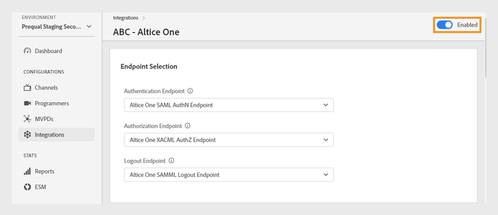

# Integraties

>[!NOTE]
>
>De inhoud op deze pagina wordt alleen ter informatie verstrekt. Voor het gebruik van deze API is een huidige licentie van Adobe vereist. Ongeautoriseerd gebruik is niet toegestaan.

De **Integraties** kunt u de instellingen voor de integratie tussen uw kanalen en MVPD&#39;s weergeven en beheren. U kunt [een nieuwe integratie tot stand brengen](#create-new-integration) volgens uw vereiste.

De **Integraties** in het linkerdeelvenster wordt een lijst met bestaande integratie weergegeven met de volgende details:

* Status die aangeeft of de integratie momenteel actief of inactief is
* Integratie die specifieke kanalen met respectieve MVPDs verbindt
* Kanaalnaam met kanaal-id
* MVPD-weergavenaam en MVPD-id

*Lijst van bestaande integratie*

Typ de naam van het kanaal of MVPD in het dialoogvenster **Zoeken** voor meer informatie over de integratie.

## Integratieconfiguraties beheren {#manage-integration-conf}

Voer de volgende stappen uit om een specifieke integratie te beheren.

1. Selecteer de **Integraties** in het linkerdeelvenster.
1. Selecteer een integratie in de lijst met opties om verschillende instellingen in de volgende secties weer te geven en te bewerken:

   * [Eindpuntselectie](#endpoint-selection)
   * [Platforminstellingen](#platform-settings)
   * [Metagegevens gebruiker](#user-metadata)

>[!IMPORTANT]
>
> Weergave [Wijzigingen controleren en duwen](/help/authentication/tve-dashboard-review-push-changes.md) voor meer informatie over het activeren van de configuratieveranderingen.

### Eindpuntselectie {#endpoint-selection}

Deze sectie laat u toe om de eindpunten van MVPD te kiezen die voor authentificatie, vergunning, en logout stromen van de respectieve dropdown menu&#39;s worden gebruikt.

*Eindpunten voor authentificatie, vergunning, en logout stromen*

>[!NOTE]
>
>MVPDs kan één of veelvoudige eindpunten voor elke stroom verstrekken. Wanneer het integreren van een nieuw kanaal, moet MVPD hun aangewezen eindpunt voor elke stroom specificeren.

>[!IMPORTANT]
>
>Elke wijziging in de eindpunten heeft gevolgen voor het algemene gedrag van een integratie. Deze wijzigingen moeten pas worden doorgevoerd nadat de MVPD een bevestiging heeft ontvangen.

### Platforminstellingen {#platform-settings}

In deze sectie kunt u de integratie-instellingen voor alle componenten weergeven en bewerken [platforms](/help/authentication/tve-dashboard-reports.md#platforms). U kunt deze instellingen wijzigen op basis van afzonderlijke platforms. U kunt bijvoorbeeld de duur van de machtigings-TTL aanpassen op Android terwijl een standaardwaarde voor een ander platform wordt behouden.

Elke eigenschap in platforminstellingen neemt een standaardwaarde over die door de MVPD is ingesteld, maar kan indien nodig worden aangepast.

>[!IMPORTANT]
>
>Een overeenkomst met MVPD wordt vereist om waarden te bepalen die voor elk bezit in platformmontages worden geplaatst.

>[!IMPORTANT]
>
> De montageenovererving volgt een ketting die van montages MVPD (die het meest algemeen zijn) begint, dan eindpunt MVPD, integratie, platformcategorie, en platform (die de meest specifieke waarde) houdt.

**Platforminstellingen** wordt gebruikt om instellingen voor elk niveau in de overervingsketen te overschrijven. De beschikbare niveaus in de keten zijn als volgt gegroepeerd:

* **Standaard voor alles**: Stel waarden in voor eigenschappen die universeel van toepassing zijn op alle platforms als er geen specifieke platformwaarden zijn gedefinieerd, ongeacht de implementaties van de programmeur.

* **Desktopapparaten**: Stel waarden in voor eigenschappen die van toepassing zijn op alle computers met desktops en laptops, ongeacht de programmeermethode (JS SDK of REST API).

* **Mobiele apparaten**: Stel waarden in voor eigenschappen die van toepassing zijn op alle mobiele apparaten, inclusief **iOS**, **Android** en andere, ongeacht de programmeerbenadering (SDK of REST API).

* **Op tv aangesloten apparaten**: Stel waarden in voor eigenschappen die van toepassing zijn op alle aangesloten apparaten, inclusief **tvOS**, **Roku**, **FireTV** en andere, ongeacht de programmeermethode (SDK of REST API).

* **Niet-geïdentificeerde apparaten**: Stel waarden in voor eigenschappen die van toepassing zijn op alle apparaten waarbij het huidige mechanisme het platform niet nauwkeurig kan identificeren. In dergelijke gevallen past u de meest beperkende regels toe die in het MVPD zijn vastgesteld.

  

  *Categorie perrons en de voorzieningen daarvan*

Selecteren  pictogram rechts van elke eigenschap om de eigenschappen te bekijken die worden gebruikt voor elk hierboven beschreven overervingsniveau.

#### Meest gebruikte bedrijfsstromen {#most-used-flows}

De **Platforminstellingen** sectie biedt een waaier van eigenschappen aan die in verschillende bedrijfsstromen worden gebruikt. De eigenlijke eigenschappen kunnen variëren, afhankelijk van de MVPD&#39;s die in de specifieke integratie zijn geselecteerd. Hieronder ziet u de meest gebruikte stromen:

**AuthN TTL en AuthZ TTL over alle platforms**

>[!IMPORTANT]
>
>De waarden van TTL van de authentificatie (AuthN) TTL en van de Vergunning (AuthZ) moeten verenigbaar met montages MVPD richten.

Voer de volgende stappen uit om verificatie en autorisatie-TTL op alle platforms voor een specifieke integratie te wijzigen.

1. Selecteer de **Integraties** in het linkerdeelvenster.
1. Selecteer de integratie waarvoor u waarden van TTL wilt veranderen AuthN en AuthZ TTL.
1. Ga naar de **Platforminstellingen** sectie.

1. Selecteren **Standaard voor alles** tab onder **Platforminstellingen**.

   >[!NOTE]
   >
   >Als u de duur van **AuthN TTL** en **AuthZ TTL** voor een platformcategorie of een specifiek platform selecteert u het platform dienovereenkomstig.

   

   *De AuthN TTL AuthZ TTL-duur van de verandering op alle platforms*

   **A.** AuthN TTL, eigenschap **B.** AuthZ TTL, eigenschap

1. Selecteer de pijlen omhoog en omlaag om de duur voor het aantal dagen, uren, minuten en seconden in het deelvenster **AuthN TTL** en **AuthZ TTL** eigenschappen.

De duur van **AuthN TTL** en **AuthZ TTL** op alle platforms worden alleen bijgewerkt na [revisie- en pushwijzigingen](/help/authentication/tve-dashboard-review-push-changes.md).

**Platform SSO inschakelen**

>[!IMPORTANT]
>
>**Single Sign On inschakelen** eigenschap wordt uitsluitend ondersteund op *iOS, tvOS, Roku en FireTV* platforms. Het is slechts van toepassing op integratie met MVPDs die enig teken voor deze platforms steunen.

Voer de volgende stappen uit om SSO voor een specifieke integratie en een specifiek platform in of uit te schakelen.

1. Selecteer de **Integraties** in het linkerdeelvenster.
1. Selecteer de integratie waarvoor u Single Sign On wilt in- of uitschakelen.

1. Ga naar de **Platforminstellingen** sectie.

1. Selecteer een specifiek platform of een categorie platforms waarvoor u Single Sign On wilt inschakelen **Platforminstellingen**.

   

   *Single Sign On inschakelen voor een specifiek platform*

   **A.** Single Sign On, eigenschap **B.** Permissies platform afdwingen, eigenschap

1. Selecteren **Ja** om **Nee** om van **Single Sign On inschakelen** vervolgkeuzelijst.

1. Selecteren **Ja** om **Nee** om van **Permis platform afdwingen** vervolgkeuzelijst.

   **Permis platform afdwingen** eigenschap bepaalt of de gebruiker besluit om **Toestaan** of **Weigeren** platformtoegang tot hun abonnement op een tv-provider wordt gerespecteerd.

   Als beide **Single Sign On inschakelen** en **Permis platform afdwingen** zijn ingeschakeld en de gebruiker ervoor kiest platformtoegang tot zijn abonnement op de tv-provider te weigeren, dan kan de desbetreffende toepassing (het kanaal) het Adobe Pass-verificatietoken dat door een andere toepassing (kanaal) wordt verkregen, niet gebruiken.

De **Single Sign On** eigenschap voor een geselecteerd platform wordt alleen ingeschakeld of uitgeschakeld na [revisie- en pushwijzigingen](/help/authentication/tve-dashboard-review-push-changes.md).

**Op huis-gebaseerde authentificatie toelaten**

Volg deze stappen om op huis-gebaseerde authentificatie voor op OAuth2 gebaseerde MVPDs toe te laten of onbruikbaar te maken.

1. Selecteer de **Integraties** in het linkerdeelvenster.
1. Selecteer de integratie waarvoor u op huis-gebaseerde authentificatie wilt toelaten of onbruikbaar maken.
1. Ga naar de **Platforminstellingen** sectie.
1. Selecteer een specifiek platform of een categorie van platforms waarvoor u op huis-gebaseerde authentificatie wilt toelaten onder **Platforminstellingen**.

   

   *Op huis-gebaseerde authentificatie voor een specifiek platform toestaan*

   **A.** Attempt HBA, eigenschap **B.** HBA AuthN TTL, eigenschap

1. Selecteren **Ja** om **Nee** om van **Attempt HBA** vervolgkeuzelijst.

>[!IMPORTANT]
>
>De duur wijzigen van **HBA AuthN TTL** eigenschap moet worden vermeden. Dit kan leiden tot onverwachte fouten in het autorisatieproces.

De **Attempt HBA** eigenschap voor een specifieke MVPD wordt alleen na [revisie- en pushwijzigingen](/help/authentication/tve-dashboard-review-push-changes.md).

#### Meer eigenschappen toevoegen {#add-more-properties}

De **Meer eigenschappen toevoegen** biedt de flexibiliteit om aanvullende specifieke eigenschappen voor integratie op te nemen, met name voor minder gangbare stromen.

U kunt de volgende eigenschappen toevoegen:

* Voor alle platforms selecteert u **Standaard voor alles** links.
* Voor een platformcategorie selecteert u **Desktopapparaten**, **Mobiele apparaten**, of **Op tv aangesloten apparaten** links.
* Voor een specifiek apparaat selecteert u **iOS**, **Android**, **tvOS**, **Roku**, of **FireTV** links.

Hier volgen enkele voorbeelden van verschillende stromen die kunnen worden ingeschakeld door de volgende eigenschappen toe te voegen:

**Het aantal voor vooraf geautoriseerde bronnen wijzigen**

De meeste MVPDs steunen een preflight authZ vraag gebruikend tot 5 middel IDs door gebrek.
In gevallen waarin MVPD&#39;s ermee instemmen deze limiet te verhogen, kunt u echter naar de **Meer eigenschappen toevoegen** en selecteert u **Max. bronnen van Preflight** in het menu Opties.

**Max. bronnen van Preflight** voegt een nieuw kenmerk toe waar de overeengekomen limiet met de MVPD kan worden opgegeven.

*De eigenschap Max. bronnen van Preflight toevoegen*

De **Max. bronnen van Preflight** eigenschap wordt alleen toegevoegd na [revisie- en pushwijzigingen](/help/authentication/tve-dashboard-review-push-changes.md).

**Weergavenaam of URL van logo MVPD wijzigen**

Voor programmeertoepassingen die niet hun plukker willen bouwen MVPD en in plaats daarvan op verstrekte configuraties baseren, kunt u aan **Meer eigenschappen toevoegen** en selecteert u **Weergavenaam** of **URL van logo** om de vereiste weergavenaam of logo-URL&#39;s voor elke MVPD toe te voegen vanuit het optiemenu.

Afhankelijk van het apparaatplatform en de gewenste gebruikerservaring kunnen verschillende waarden voor deze eigenschappen worden gebruikt voor dezelfde MVPD.

*Weergavenaam of Logo-URL-eigenschap toevoegen*

De **Weergavenaam** of **URL van logo** eigenschap wordt alleen toegevoegd na [revisie- en pushwijzigingen](/help/authentication/tve-dashboard-review-push-changes.md).

**Nieuwe verificatiestroom aanvragen bij schakelen tussen apps (kanalen)**

Als u een nieuwe verificatie wilt forceren wanneer gebruikers schakelen tussen apps. In dat geval kunt u naar het dialoogvenster **Meer eigenschappen toevoegen**, selecteert u de **Auth per aggregator** eigenschap.

Toevoegen **Auth per aggregator** breekt effectief één teken voor het respectieve kanaal aan.

*Auth per aggregator-eigenschap toevoegen*

De **Auth per aggregator** eigenschap wordt alleen toegevoegd na [revisie- en pushwijzigingen](/help/authentication/tve-dashboard-review-push-changes.md).

Als het is toegevoegd, selecteert u **Ja** om **Auth per aggregator** eigenschap voor een geselecteerde integratie.

#### Eigenschappen verwijderen {#delete-properties}

Selecteren  pictogram rechts van elke eigenschap om de eigenschappen te verwijderen die niet meer vereist zijn.

>[!NOTE]
>
>Bepaalde eigenschappen kunnen niet worden verwijderd, omdat het verplichte vereisten voor de geselecteerde MVPD zijn.

De eigenschap wordt verwijderd uit het menu **Platforminstellingen** alleen secties na [revisie- en pushwijzigingen](/help/authentication/tve-dashboard-review-push-changes.md).

### Metagegevens gebruiker {#user-metadata}

Deze sectie staat u toe om montages voor elke parameters bij te werken van gebruikersmeta-gegevens die door MVPD worden gedeeld.

>[!NOTE]
>
>Elke MVPD kan verschillende parameters delen. Neem contact op met uw Adobe voor meer informatie over de parameters die een specifieke MVPD kan delen.

In de sectie met gebruikersmetagegevens worden de volgende kolommen weergegeven:

**Sleutel**: Vertegenwoordigt de daadwerkelijke parameters van gebruikersmeta-gegevens die in API moeten worden gebruikt om waarden te halen.

**Beschrijving**: Bevat een korte beschrijving van elke parameter voor gebruikersmetagegevens.

**Gecodeerd**: Met deze kolom kunt u parameters in de API in- of uitschakelen door **Ja** of **Nee** in het vervolgkeuzemenu. Opteren voor **Ja** Hiermee wordt aangegeven dat de parameterwaarde wordt gecodeerd in de API. De versleuteling wordt uitgevoerd met een certificaat dat is gedefinieerd door een **Metagegevens gebruiker** bereik.

>[!TIP]
>
>
> Zorg er altijd voor dat de **ZIP** parameter is gecodeerd.

Meer informatie over beschikbare certificaten vindt u in [Programmeurs](/help/authentication/tve-dashboard-programmers.md#available-certificates) en [Kanalen](/help/authentication/tve-dashboard-channels.md#available-certificates) secties.

**Ingeschakeld**: In deze kolom kunt u de parameters in de API in- of uitschakelen door **Ja** of **Nee** in het vervolgkeuzemenu.

*Parameters beschikbaar voor gebruikersmetagegevens*

## Nieuwe integratie maken {#create-new-integration}

Voer de volgende stappen uit om een nieuwe integratie te maken met een nieuwe MVPD op uw huidige installatie:

1. Selecteer de **Integraties** in het linkerdeelvenster.
1. Selecteren **Nieuwe integratie maken** rechtsboven in het **Integraties** sectie.

   

   *Een nieuwe integratie maken*

   De volgende secties worden weergegeven:

   **Kanaal en MVPD selecteren**

   Selecteer een **Kanaal** van de **Kanaal selecteren** vervolgkeuzelijst om een nieuwe integratie toe te voegen. Nadat u het kanaal hebt geselecteerd, selecteert u de gewenste optie **MVPD** van de **MVPD selecteren** vervolgkeuzemenu dat moet worden geïntegreerd met het geselecteerde kanaal.

   

   *Kanaal en MVPD selecteren*

   **Eindpunten selecteren**

   Na het selecteren van de vereiste MVPD, **Eindpunt selecteren**  de sectie zal met de standaardeindpunten worden bevolkt die voor die bepaalde MVPD worden gevormd.

   >[!IMPORTANT]
   >
   >Verander niet de standaardeindpunten in om het even welke stroom tenzij specifiek verklaard door MVPD.

   

   *Eindpunten selecteren*

   **Aanvullende informatie**

   Deze sectie omvat diverse eigenschappen die voor geselecteerde MVPD in moeten worden gevormd **Kanaal en MVPD selecteren** sectie.

   >[!NOTE]
   >
   > De eigenlijke eigenschappen kunnen verschillen, afhankelijk van de geselecteerde MVPD&#39;s in het dialoogvenster **Kanaal en MVPD selecteren** sectie.

   U kunt bijvoorbeeld de opdracht **AuthN TTL** of **Partner-id** (Kanaal-id) voor cobranding op de MVPD-aanmeldingspagina in de volgende afbeelding.

   

   *Aanvullende informatie bewerken*

   Selecteren **Integratie opslaan** rechtsboven in het **Nieuwe integratie maken** sectie.

Een nieuwe integratie zal pas na [revisie- en pushwijzigingen](/help/authentication/tve-dashboard-review-push-changes.md).

## Integratie uitschakelen {#disable-integratgion}

Voer de volgende stappen uit om een integratie uit te schakelen:

1. Selecteer de **Integraties** in het linkerdeelvenster.
1. Selecteer de integratie die u wilt uitschakelen.
1. Schakel de schakeloptie rechtsboven in de geselecteerde integratie uit.

   

   *Integratie uitschakelen*

De integratie wordt pas uitgeschakeld na [revisie- en pushwijzigingen](/help/authentication/tve-dashboard-review-push-changes.md).

Nadat de integratie wordt onbruikbaar gemaakt, zullen de eindgebruikers de capaciteit verliezen om voor authentiek te verklaren of toe te laten gebruikend specifieke MVPD.

