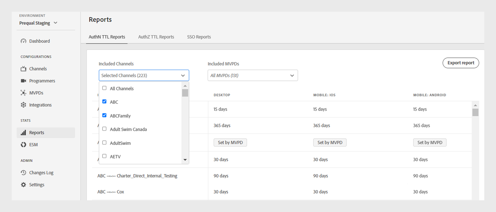

# Rapporten {#Reports}

>[!NOTE]
>
>De inhoud op deze pagina wordt alleen ter informatie verstrekt. Voor het gebruik van deze API is een huidige licentie van Adobe vereist. Ongeautoriseerd gebruik is niet toegestaan.

De **Rapporten** sectie van het Dashboard van TVE verleent toegang tot samengevoegde gegevens voor de rapporten van AuthN TTL, AuthZ TTL, en SSO. Deze rapporten omvatten uw kanaalintegratie met verschillende MVPDs over al [platforms](#platforms).

Met rapporten kunt u gegevens filteren en inzichten verzamelen over [specifieke kanalen of MVPDs](#selecting-specific-channels-mvpds). U kunt rapporten ook exporteren in een CSV-bestand voor verdere analyse.

## Rapporten weergeven {#view-reports}

Voer de volgende stappen uit om een specifiek rapport weer te geven.

1. Selecteer de **Rapporten** in het linkerdeelvenster.
1. Selecteer een van de volgende tabbladen om de geaggregeerde gegevens van de opgenomen kanalen en MVPD&#39;s weer te geven en te exporteren:
   * [AuthN TTL-rapporten](#authn-ttl-reports)
   * [TTL-rapporten van AuthZ](#authz-ttl-reports)
   * [SSO-rapporten](#sso-reports)

   

   *Type rapporten*

### AuthN TTL-rapporten {#authn-ttl-reports}

De rapporten van TTL van AuthN, die ook als Tijd-aan-Levend van de Authentificatie (TTL) worden bedoeld, tonen de duur waarvoor de authentificatietokens voor uw Integraties van Kanalen met diverse MVPDs over alle worden gevormd [platforms](#platforms). Deze rapporten staan u toe om de hoeveelheid tijd te inspecteren een gebruiker voor een specifieke MVPD en een platform voor authentiek verklaard blijft. De duurwaarden worden weergegeven in gebruikersvriendelijke notaties, zoals: **dagen**, **uren**, **minuten**, en **seconden**. De tabel AuthN TTL-rapporten biedt horizontaal en verticaal schuiven voor verschillende schermgrootten.

U kunt ook gegevens weergeven en downloaden voor [specifieke kanalen of MVPD&#39;s](#selecting-specific-channels-mvpds).

*AuthN TTL-rapporten exporteren*

>[!IMPORTANT]
>
> De **Instellen op MVPD** placeholder wordt gebruikt wanneer MVPD de waarde AuthN TTL eerder dan de configuratie van de Authentificatie van Adobe Pass afdwingt.

Selecteren **Rapporten exporteren** om de gegevens op te slaan als een CSV-bestand op uw lokale computer.

### AuthZ TTL-rapporten {#authz-ttl-reports}

De rapporten van AuthZ TTL, die ook als Tijd-aan-Levende van de Vergunning (TTL) worden bedoeld, tonen de duur van het toestemmingstoken dat voor uw Integraties van Kanalen met diverse MVPDs over al wordt gevormd [platforms](#platforms). Deze rapporten staan u toe om de hoeveelheid tijd te inspecteren een gebruiker geautoriseerd blijft om inhoud voor een specifiek MVPD en platform te letten. De duurwaarden worden weergegeven in gebruikersvriendelijke notaties, zoals: **dagen**, **uren**, **minuten**, en **seconden**. De tabel AuthZ TTL-rapporten biedt horizontaal en verticaal schuiven voor verschillende schermgrootten.

U kunt de gegevens ook weergeven en downloaden voor [specifieke kanalen of MVPD&#39;s](#selecting-specific-channels-mvpds).

*AuthZ TTL-rapporten exporteren*

>[!IMPORTANT]
>
> De **Instellen op MVPD** placeholder wordt gebruikt wanneer MVPD de waarde AuthZ TTL eerder dan de configuratie van de Authentificatie van Adobe Pass afdwingt.

Selecteren **Rapporten exporteren** om de gegevens op te slaan als een CSV-bestand op uw lokale computer.

### SSO-rapporten {#sso-reports}

De rapporten SSO, die ook als enig teken-op worden bedoeld, tonen de enige sign-on status die voor uw Integraties van Kanalen met diverse MVPDs over alle wordt gevormd [platforms](#platforms). Deze rapporten staan u toe om de verwachte ervaring van SSO van de gebruikersauthentificatie voor een specifieke MVPD en een platform te inspecteren. De waarden worden gepresenteerd in gebruiksvriendelijke notaties, zoals: **SSO uitgeschakeld**, **SSO ingeschakeld**, en **SSO onzeker**. De tabel SSO-rapporten bevat horizontaal en verticaal schuiven om verschillende schermgrootten mogelijk te maken.

U kunt ook gegevens weergeven en downloaden voor [specifieke kanalen of MVPD&#39;s](#selecting-specific-channels-mvpds).

*SSO-rapporten exporteren*

>[!IMPORTANT]
>
> De **SSO onzeker** tijdelijke aanduiding geeft aan dat Single Sign-On (SSO) is ingeschakeld en mogelijk operationeel is. De onderstaande instellingen kunnen echter een belemmering vormen voor SSO-verificatie, zoals in de volgende voorbeelden wordt uitgelegd:
>
> * Instellingen voor gebruikersplatformen: de optie om cookies van derden te blokkeren.
> * Besluiten van gebruikers: de gebruikers weigeren platformtoegang tot hun abonnement op een tv-provider.
> * MVPD-instellingen: MVPD vraagt verificatie voor elk kanaal.

Selecteren **Rapporten exporteren** om de gegevens op te slaan als een CSV-bestand op uw lokale computer.

## Platforms {#platforms}

De [AuthN TTL-rapporten](#authn-ttl-reports), [TTL-rapporten van AuthZ](#authz-ttl-reports), en [SSO-rapporten](#sso-reports) gegevens presenteren op verschillende platforms, zoals:

* **Desktop**: Hiermee geeft u waarden weer die zijn toegepast op de programmeerimplementaties via de Adobe Pass Authentication JavaScript SDK.

* **Mobiel**

  **iOS**: Hiermee geeft u waarden weer die zijn toegepast met de Adobe Pass Authentication iOS SDK.

  **Android**: geeft de waarden weer die zijn toegepast via de Adobe Pass Authentication Android SDK.

  **Overige**: Hiermee geeft u waarden weer die zijn toegepast met de Adobe Pass Authentication REST API die is ontwikkeld voor mobiele apparaten.

* **TVCD**

  **Roku**: Hiermee geeft u waarden weer die zijn toegepast via de Adobe Pass Authentication REST API, waarbij Roku wordt geïdentificeerd als een apparaattype.

  **FireTV**: Hiermee geeft u waarden weer die zijn toegepast via de Adobe Pass Authentication FireTV SDK.

  **AppleTV**: Geeft waarden weer die zijn toegepast via de Adobe Pass Authentication tvOS SDK.

  **Overige**: Hiermee geeft u waarden weer die zijn toegepast met de Adobe Pass Authentication REST API voor apparaten die zijn aangesloten op tv.

* **Platform niet geïdentificeerd**: Hiermee geeft u waarden weer die worden toegepast op programmeerimplementaties wanneer de Adobe Pass-verificatieservices een onbekend apparaattype detecteren.

Meer informatie over het delen van het gewenste apparaattype, zoals **Roku** met Adobe Pass Authentication REST API&#39;s of SDK&#39;s bekijkt u het mechanisme van [clientgegevens doorgeven](/help/authentication/passing-client-information-device-connection-and-application.md).

>[!IMPORTANT]
>
> De samengevoegde gegevens zijn gebaseerd op de specifieke configuratie van elke Adobe Pass-verificatieomgeving. Wanneer u overschakelt tussen verschillende TVE-dashboardomgevingen, verwacht u variaties in de gegevens in de verschillende rapporten. Zie de [Adobe Pass-verificatieomgevingen](/help/authentication/tve-dashboard-environments.md) om meer te weten.

## Specifieke kanalen en MVPD&#39;s selecteren {#selecting-specific-channels-mvpds}

De [AuthN TTL-rapporten](#authn-ttl-reports), [TTL-rapporten van AuthZ](#authz-ttl-reports), en [SSO-rapporten](#sso-reports) gegevens presenteren voor **Alle kanalen** integratie met **Alle MVPD&#39;s** standaard.

>[!NOTE]
>
> Als u **Alle kanalen** of **Alle MVPD&#39;s** in de respectieve vervolgkeuzemenu&#39;s wordt een bericht weergegeven om een selectie te maken voor het weergeven van zinvolle rapporten.

Een rapport genereren voor specifieke kanalen:

1. Selecteer de **Opgenomen kanalen** vervolgkeuzelijst boven aan het geselecteerde rapport.

   

   *Opgenomen vervolgkeuzemenu Kanalen*

1. Deselecteren **Alle kanalen**.
1. Selecteer de vereiste kanalen in het menu **Opgenomen kanalen** vervolgkeuzemenu waarvoor u gegevens wilt genereren.

>[!NOTE]
>
> Om opties beschikbaar te hebben in **Opgenomen MVPD&#39;s** vervolgkeuzelijst, moet u ten minste één kanaal selecteren in het dialoogvenster **Opgenomen kanalen** vervolgkeuzelijst.

Om een rapport voor specifieke MVPDs te produceren:

1. Selecteer de **Opgenomen MVPD&#39;s** vervolgkeuzelijst boven aan het geselecteerde rapport.

   

   *Opgenomen vervolgkeuzemenu voor MVPD&#39;s*

1. Deselecteren **Alle MVPD&#39;s**.
1. Selecteer de vereiste MVPDs van **Opgenomen MVPD&#39;s** vervolgkeuzemenu waarvoor u gegevens wilt genereren.
