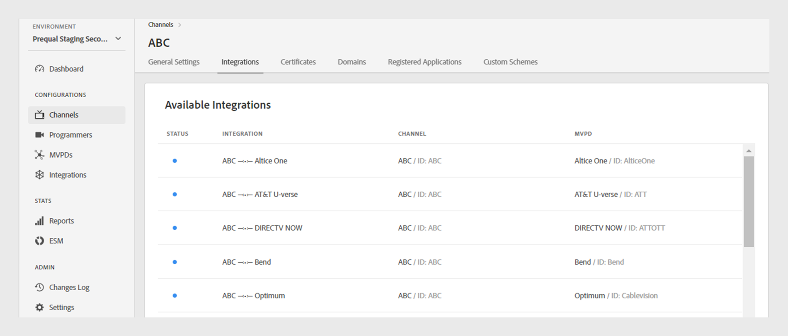

# Kanalen {#channels}

>[!NOTE]
>
>De inhoud op deze pagina wordt alleen ter informatie verstrekt. Voor het gebruik van deze API is een huidige licentie van Adobe vereist. Ongeautoriseerd gebruik is niet toegestaan.

De **sectie van Kanalen** van het Dashboard van TVE staat u toe om montages voor de kanalen te bekijken en te beheren verbonden aan een specifieke programmeur. U kunt ook [&#x200B; een nieuw kanaal &#x200B;](#add-new-channel) volgens uw vereiste toevoegen.

Het **lusje van Kanalen** in het linkerpaneel toont een lijst van verbonden kanalen met de volgende details:

* **naam van de Vertoning**: De merknaam van het kanaal dat voor commerciële doeleinden wordt gebruikt.
* **identiteitskaart van het Kanaal**: Een uniek herkenningsteken, die ook als identiteitskaart van de Aanvrager wordt bedoeld.
* **Integraties**: Het aantal verbindingen die met [&#x200B; worden gevestigd MVPDs &#x200B;](/help/authentication/integration-guide-programmers/rest-apis/rest-api-v2/rest-api-v2-glossary.md#mvpd).

*Lijst van bestaande kanalen*

Typ de naam van het kanaal in de **bar van het Onderzoek** boven de lijst om meer over het kanaal te weten.

## Kanaalconfiguraties beheren {#manage-channel-conf}

Voer de stappen uit om verschillende instellingen van een specifiek kanaal te beheren.

1. Selecteer het **lusje van Kanalen** in het linkerpaneel.

1. Selecteer het kanaal in de beschikbare lijst.

1. Selecteer een van de volgende tabbladen om de bijbehorende instellingen van het geselecteerde kanaal weer te geven en te bewerken:

   * [Algemene instellingen](#general-settings)
   * [Integraties](#integrations)
   * [Certificaten](#certificates)
   * [Domeinen](#domains)
   * [Geregistreerde toepassingen](#registered-applications)
   * [Aangepaste schema&#39;s](#custom-schemes)

   

   *montages van het Kanaal*

>[!IMPORTANT]
>
> De Controle van de mening [&#x200B; en duw verandert &#x200B;](/help/authentication/user-guide-tve-dashboard/tve-dashboard-review-push-changes.md) voor meer informatie bij het activeren van de configuratieveranderingen.

### Algemene instellingen {#general-settings}

Dit lusje stelt **en** Configuratie van Analytics **voor de Informatie van het Kanaal van 0&rbrace;.**

#### Kanaalgegevens {#channel-information}

In deze sectie kunt u de volgende details bewerken:

* **naam van de Vertoning**: De merknaam van het kanaal dat voor commerciële doeleinden wordt gebruikt.

* **Standaard opnieuw richt URL**: De steun richt URL voor authentificatie en logout opnieuw.

* **Fout die** meldt: Bij het selecteren **ja**, verzendt Adobe Pass SDKs foutenrapporten naar Adobe Pass achterste voor analyses.

*geef de informatie van het Kanaal uit*

#### Analyseconfiguratie {#analytics-configuration}

Deze sectie staat u toe om het door:sturen van de gebeurtenissen van de Authentificatie van Adobe Pass aan Adobe Analytics te vormen.

Om **Configuratie van Analytics** toe te laten, contacteer uw Technische Manager van de Rekening (TAM) voor meer details bij vestiging identiteitskaart van de Reeks van het Rapport (RSID).

 toe

*laat de Configuraties van Analytics* toe

Selecteer **toevoegen nieuwe analytische configuratie** om veelvoudige configuraties toe te voegen.

Er is een nieuwe configuratiewijziging gemaakt en deze is gereed voor serverupdate. Om de nieuwe analytische configuratie van de **sectie van de Configuratie van de Analytics** te gebruiken, ga met de [&#x200B; overzicht te werk en druk veranderingen &#x200B;](/help/authentication/user-guide-tve-dashboard/tve-dashboard-review-push-changes.md) stroom.

### Integraties {#integrations}

Dit lusje toont een lijst van beschikbare integratie tussen het momenteel geselecteerde kanaal en MVPDs. De lijst geeft elke integratie samen met de status weer, en geeft aan of deze is ingeschakeld of niet. Selecteer een specifieke integratie van deze lijst om tot gedetailleerde informatie in de [&#x200B; sectie van de Integraties &#x200B;](tve-dashboard-integrations.md) toegang te hebben.

*Lijst van Beschikbare Integraties*

### Certificaten {#certificates}

Dit lusje toont een lijst van [&#x200B; beschikbare certificaten &#x200B;](#available-certificates) en [&#x200B; geërfte beschikbare certificaten &#x200B;](#inherited-avail-certificates) die in de de encryptiestromen van gebruikersmeta-gegevens worden gebruikt. Er worden details weergegeven over elk certificaat dat het volgende bevat:

* De status (of toegelaten voor **encryptie van gebruikersmeta-gegevens** gebruik of niet)
* Serienummer
* Naam van de emittentenorganisatie
* Naam van de organisatie die het onderwerp vormt
* Datum van afgifte
* Vervaldatum
* Een dropdown menu om gebruikersmeta-gegevens (als u **ja** selecteert, codeert het certificaat gevoelige gebruikersinformatie, zoals zip codewaarden).

#### Beschikbare certificaten {#available-certificates}

Deze certificaten fungeren als openbare of persoonlijke sleutels en worden gebruikt voor versleuteling van gebruikersmetagegevens.
U kunt de volgende wijzigingen aanbrengen in de sectie met beschikbare certificaten:

* [Nieuw certificaat toevoegen](#add-new-certificate)
* [Certificaat verwijderen](#delete-certificate)

##### Nieuw certificaat toevoegen {#add-new-certificate}

Ga als volgt te werk om een nieuw certificaat toe te voegen:

1. Selecteer **nieuw certificaat** bij de bovenkant van de **Beschikbare sectie van Certificaten** toevoegen.

   

   *voeg een nieuw certificaat toe*

1. Plak de openbare sleutel van uw certificaat in het **Nieuwe certificaat** dialoogvakje.

1. Selecteer **toevoegen certificaat**.

1. Bepaal de plaats van het nieuwe certificaat in de lijst van **Beschikbare Certificaten**.

   >[!IMPORTANT]
   >
   > Zorg ervoor dat uw systemen up-to-date zijn en klaar zijn om het nieuwe certificaat te gebruiken.

1. Selecteer **ja** van **Gebruikt aan gecodeerde gebruikersmeta-gegevens** dropdown menu om een nieuw certificaat te activeren.

Er is een nieuwe configuratiewijziging gemaakt en deze is gereed voor serverupdate. Om het nieuwe certificaat te gebruiken dat in de **Beschikbare sectie van Certificaten** wordt vermeld, ga met de [&#x200B; overzicht en duw veranderingen &#x200B;](/help/authentication/user-guide-tve-dashboard/tve-dashboard-review-push-changes.md) stroom te werk.

##### Certificaat verwijderen {#delete-certificate}

Ga als volgt te werk om een certificaat te verwijderen.

1. Beweeg op het certificaat dat u van de lijst van **Beschikbare certificaten** wilt schrappen.

1. Selecteer **verwijderen**.

   

   *verwijder het geselecteerde certificaat*

1. Selecteer **Schrapping** van **de actieve doos van de certificaatdialoog van de Schrapping**.

Er is een nieuwe configuratiewijziging gemaakt en deze is gereed voor serverupdate. Het certificaat zal van de **Beschikbare certificaten** sectie slechts na [&#x200B; overzicht en duw veranderingen &#x200B;](/help/authentication/user-guide-tve-dashboard/tve-dashboard-review-push-changes.md) worden geschrapt.

#### Overgenomen beschikbare certificaten {#inherited-avail-certificates}

Mediabedrijven definiëren deze certificaten op hun eigen niveau. Alle kanalen die aan hetzelfde mediabedrijf zijn gekoppeld, kunnen deze certificaten gebruiken.

*Overgenomen beschikbare certificaten*

### Domeinen {#domains}

Op dit tabblad wordt een lijst weergegeven met beschikbare domeinen via welke het desbetreffende kanaal communiceert met Adobe Pass-verificatie.

U kunt de volgende wijzigingen aanbrengen in domeinen:

* [Een nieuw domein toevoegen](#add-domains)
* [Domein verwijderen](#delete-domain)

>[!TIP]
>
> Voeg geen nieuw subdomein toe als de lijst een meer algemeen domein bevat.

#### Nieuw domein toevoegen {#add-domains}

Ga als volgt te werk om een domein toe te voegen.

1. Selecteer **nieuw domein** bij de hoger-juiste hoek van de **Beschikbare Domeinen** sectie toevoegen.

    toe

   *voeg een nieuw domein* toe

1. Typ de naam van uw domein in het **Nieuwe domein** dialoogvakje.

1. Selecteer **domein** toevoegen om een nieuw domein voor het geselecteerde kanaal toe te voegen.

Er is een nieuwe configuratiewijziging gemaakt en deze is gereed voor serverupdate. Om het nieuwe domein te gebruiken dat in de **Beschikbare sectie van Domeinen** wordt vermeld, ga met de [&#x200B; overzicht en duw veranderingen &#x200B;](/help/authentication/user-guide-tve-dashboard/tve-dashboard-review-push-changes.md) stroom te werk.

#### Domein verwijderen {#delete-domain}

Ga als volgt te werk om een domein te verwijderen.

1. Beweeg over het domein dat u van de lijst van **Beschikbare Domeinen** wilt schrappen.

1. Selecteer **verwijderen**.

   

   *verwijder het geselecteerde domein*

1. Selecteer **Schrapping** op het **domein** dialoogvakje van de Schrapping.

Er is een nieuwe configuratiewijziging gemaakt en deze is gereed voor serverupdate. Het domein zal van de **Beschikbare sectie van Domeinen** slechts na [&#x200B; overzicht en duw veranderingen &#x200B;](/help/authentication/user-guide-tve-dashboard/tve-dashboard-review-push-changes.md) worden geschrapt.

Het geselecteerde domein is niet meer beschikbaar voor gebruik. Als gevolg hiervan verliest de toepassing die aan dit domein is gekoppeld toegang tot de Adobe Pass-verificatieservices.

### Geregistreerde toepassingen {#registered-applications}

Op dit tabblad wordt een lijst met geregistreerde toepassingen weergegeven. Voor meer details met betrekking tot geregistreerd toepassingsgebruik, verwijs naar het [&#x200B; dynamische overzicht van de cliëntregistratie &#x200B;](../integration-guide-programmers/rest-apis/rest-api-dcr/dynamic-client-registration-overview.md) documentatie.

U kunt de volgende handelingen uitvoeren met geregistreerde toepassingen:

* [Een nieuwe geregistreerde toepassing toevoegen](#add-registered-applications)
* [Software-instructies downloaden](#download-software-statement)

#### Nieuwe geregistreerde toepassing toevoegen {#add-registered-applications}

Ga als volgt te werk om een nieuwe geregistreerde toepassing toe te voegen.

1. Selecteer **nieuwe toepassing** bij de hoger-juiste hoek van de **Geregistreerde sectie van Toepassingen** toevoegen.

    toe

   *voeg een nieuwe toepassing* toe

1. Selecteer **Platforms** van het dropdown menu in het **Nieuwe de dialoogvakje van de Toepassing**.

   >[!IMPORTANT]
   >
   > Het wordt aanbevolen geregistreerde toepassingen te maken met specifiekere en beperkte machtigingen om de beveiliging te verbeteren en ongeoorloofde toegang te voorkomen. Wanneer u geregistreerde toepassingen maakt, kunt u daarom overwegen om smallere opties te gebruiken voor de toegewezen `platforms` .

1. Selecteer **Domeinen** van het dropdown menu.

   >[!IMPORTANT]
   >
   > In het clientregistratieproces kan de clienttoepassing vragen om een omleidings-URL te mogen gebruiken voor de voltooiing van de verificatiestroom. Wanneer een clienttoepassing een specifieke omleidings-URL gebruikt, wordt deze gevalideerd op basis van de geselecteerde `domains` .

1. Typ de **Naam** van de toepassing.

1. Typ de **Versie** van de toepassing.

   >[!IMPORTANT]
   >
   > Het wordt aanbevolen een nieuwe geregistreerde toepassing te maken voor elke belangrijke update van uw clienttoepassing om de levenscyclus en het gebruik ervan te beheren. Indien noodzakelijk, creeer een kaartje door onze [&#x200B; Zendesk &#x200B;](https://adobeprimetime.zendesk.com) en vraag uw Technische Manager van de Rekening (TAM) om een geregistreerde toepassing te herroepen om de functionaliteit van een specifieke versie van de cliënttoepassing te blokkeren.

1. Selecteer **waarde &quot;DIRECT van het Type 0&rbrace; &lbrace;van het drop-down menu.**

1. Selecteer **toepassing** toevoegen.

Er is een nieuwe configuratiewijziging gemaakt en deze is gereed voor serverupdate. Om de nieuwe geregistreerde toepassing te gebruiken die in de **Geregistreerde sectie van Toepassingen** wordt vermeld, ga met de [&#x200B; overzicht en duw veranderingen &#x200B;](/help/authentication/user-guide-tve-dashboard/tve-dashboard-review-push-changes.md) stroom te werk.

#### Software-instructie downloaden {#download-software-statement}

Voer de volgende stappen uit om een softwareinstructie te downloaden.

1. Beweeg op de geregistreerde toepassing die u de softwareverklaring van de lijst van **Geregistreerde Toepassingen** wilt downloaden.

1. Selecteer **Download**.

   

   *Download een softwareverklaring*

### Aangepaste schema&#39;s {#custom-schemes}

Op dit tabblad wordt een lijst met aangepaste schema&#39;s weergegeven. Voor meer details met betrekking tot het gebruik van douaneregelingen, verwijs naar de [&#x200B; iOS/tvOS toepassingsregistratie &#x200B;](/help/authentication/integration-guide-programmers/legacy/sdks/ios-tvos-sdk/iostvos-application-registration.md).

U kunt de volgende wijzigingen aanbrengen in aangepaste schema&#39;s:

* [Een nieuw aangepast schema genereren](#generate-custom-schemes)

#### Nieuw aangepast schema genereren {#generate-custom-schemes}

Voer de volgende stappen uit om een nieuw aangepast schema te genereren.

1. Selecteer **produceer nieuwe douaneregeling**.

   

   *produceer een nieuw douaneregeling*

Er is een nieuwe configuratiewijziging gemaakt en deze is gereed voor serverupdate. Om de nieuwe douaneregeling te gebruiken die in de **sectie van de Douane van de Schema&#39;s** wordt vermeld, ga met de [&#x200B; overzicht te werk en druk veranderingen &#x200B;](/help/authentication/user-guide-tve-dashboard/tve-dashboard-review-push-changes.md) stroom.

#### Overgenomen aangepaste schema&#39;s {#inherited-custom-schemes}

Mediabedrijven definiëren deze aangepaste regelingen op hun eigen niveau. Alle kanalen verbonden aan het zelfde media bedrijf kunnen deze douaneregelingen gebruiken.

*Overerfde douaneregelingen*

## Nieuw kanaal toevoegen {#add-new-channel}

Ga als volgt te werk om een nieuw kanaal toe te voegen.

1. Selecteer het **lusje van Kanalen** in het linkerpaneel.

1. Selecteer **nieuw kanaal** bij de hoger-juiste hoek van de **Kanalen** sectie toevoegen.

    toe

   *voeg een nieuw kanaal* toe

1. Selecteer **identiteitskaart van de Programmer** van het dropdown menu in het **Nieuwe kanaal** dialoogvakje.

1. Typ een uniek herkenningsteken in **identiteitskaart van het Kanaal**.

1. Typ de merknaam van het kanaal dat voor commerciële doeleinden in de **naam van de Vertoning** wordt gebruikt.

1. Selecteer **kanaal** toevoegen.

Er is een nieuwe configuratiewijziging gemaakt en deze is gereed voor serverupdate. Om het nieuwe die kanaal te gebruiken in de **wordt vermeld Kanalen** sectie, met de [&#x200B; overzicht en duw veranderingen &#x200B;](/help/authentication/user-guide-tve-dashboard/tve-dashboard-review-push-changes.md) stroom te werk gaat.
