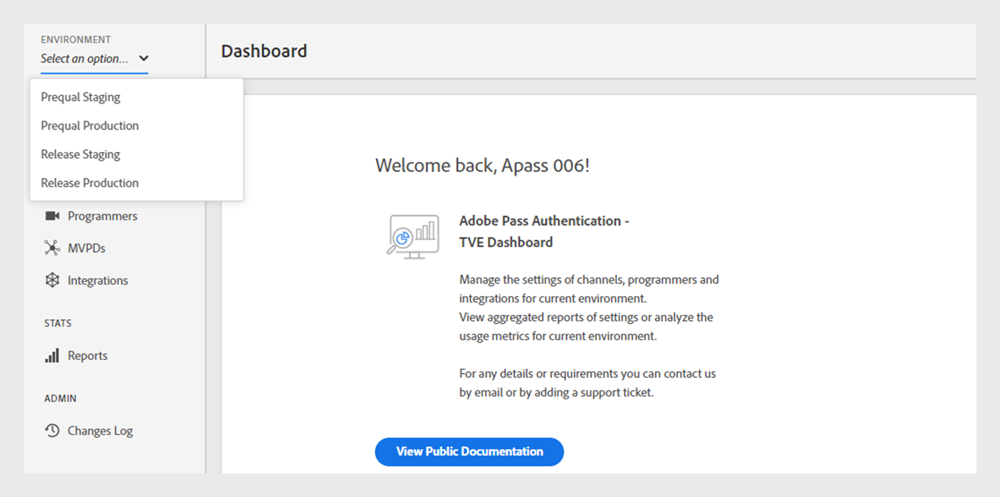

# Omgevingen {#environments}

>[!NOTE]
>
>De inhoud op deze pagina wordt alleen ter informatie verstrekt. Voor het gebruik van deze API is een huidige licentie van Adobe vereist. Ongeautoriseerd gebruik is niet toegestaan.

Het TVE-dashboard biedt verschillende omgevingen die zijn aangepast voor specifieke doeleinden binnen de Adobe Pass-verificatie. Er zijn twee primaire omgevingen:

* **Prequal**: Het pre-kwalificatiemilieu dient als testende grond voor het voorbereiden van en het testen van nieuwe bouwstijlen vóór plaatsing aan productie.

* **Versie**: De gastheren van het versiemilieu voltooide en geteste bouwt voor productie.

Binnen elke omgeving zijn er twee verschillende profielen:

* **het Opvoeren**: Het het opvoeren profiel verbindt met de het opvoeren server van MVPD voor het testen en bevestiging van integraties alvorens levend te gaan.

* **Productie**: Het productieprofiel verbindt met het MVPD productieprofiel voor daadwerkelijke productieactiviteiten.

## Gebruik hoofdletters

De omgevingen in het TVE-dashboard hebben gedurende de hele levenscyclus van de toepassing verschillende gebruiksgevallen. Met deze omgevingen kunt u:

### Periodieke stapeling

* Valideer nieuwe niet-vrijgegeven eigenschappen van de server van de Authentificatie van Adobe Pass gebruikend de het opvoeren eindpunten van MVPD.
* Primair gebruikt door het productteam van de Authentificatie van Adobe Pass om nieuwe integratie toe te voegen en te bevestigen MVPD.

### Prequente productie

* Valideer nieuwe niet-vrijgegeven eigenschappen of configuraties van de server van de Authentificatie van Adobe Pass gebruikend de productie eindpunten van MVPD.
* Valideer nieuwe toepassingsversies voor elk kanaal gebruikend de productie eindpunten van MVPD.
* Bevestig elke configuratieverandering alvorens het aan productie te duwen.

### Staging vrijgeven

* Valideer nieuwe toepassingsversies voor elk kanaal gebruikend het opvoeren eindpunten van MVPD.
* Voer prestatie- of capaciteitstests uit in deze omgeving.

### Geen productie

* Vertegenwoordigt de live omgeving met de nieuwste Adobe Pass-releasebuild die algemeen beschikbaar is voor alle eindgebruikers.
* Behoudt stabiliteit in code en configuratie en weerspiegelt onmiddellijk configuratieveranderingen in de toepassing van de eindgebruiker.

## Switch-omgevingen {#switch-environments}

Voer de stappen uit om te schakelen tussen Adobe Pass Authentication TVE Dashboard-omgevingen.

1. Meld u aan met uw programmeergegevens.

1. Selecteer het vereiste het opvoeren of productiemilieu van het **milieu** dropdown menu bij de bovenkant van het linkerpaneel.

   

   *het milieu dropdown menu van het Dashboard van de Authentificatie van Adobe Pass TVE*

>[!NOTE]
>
> De configuraties kunnen in elke omgeving variëren op basis van uw instellingen.
