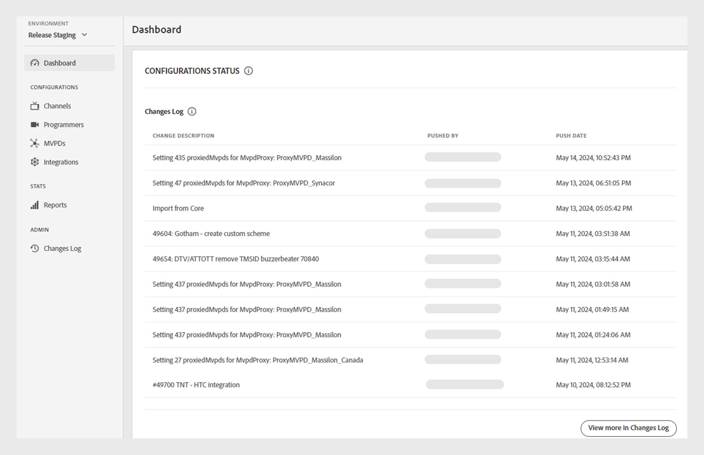

# Dashboard {#dashboard}

>[!NOTE]
>
>De inhoud op deze pagina wordt alleen ter informatie verstrekt. Voor het gebruik van deze API is een huidige licentie van Adobe vereist. Ongeautoriseerd gebruik is niet toegestaan.

De **sectie van het Dashboard** in het linkerpaneel dient als homepage van het Dashboard van TVE van de Authentificatie van Adobe Pass.

Er zijn twee secties beschikbaar op de homepage:

* [Welkomstscherm](#welcome-screen)
* [Configuratiestatus](#configuration-status)

## Welkomstscherm {#welcome}

In deze sectie, kunt u tot de openbare documentatie van het welkome bericht direct toegang hebben, en een momentopname van uw huidige configuraties bekijken.

* **Actieve integratie**: Het aantal actieve integratie in het huidige milieu. Selecteer **Mening meer in integratiesectie** om tot gedetailleerde informatie in de [ sectie van de Integraties ](tve-dashboard-integrations.md) toegang te hebben.
* **Actieve kanalen**: Het aantal actieve kanalen in het huidige milieu. Selecteer **Mening meer in de sectie van Kanalen** om tot gedetailleerde informatie in de [ Kanalen ](tve-dashboard-channels.md) sectie toegang te hebben.
* **updates van het Gegevensbestand**: Het aantal configuratieveranderingen die aan huidig milieu worden aangebracht. Selecteer **Mening meer in de sectie van het Logboek van Veranderingen** om tot gedetailleerde informatie in de [ sectie van het Logboek van Veranderingen ](tve-dashboard-changes-log.md) toegang te hebben.
* **ESM dashboard**: Houd een oog uit voor het aanstaande Dashboard ESM, die diepgaande metriek op bezitsgebruik in het huidige milieu aanbieden. Deze functionaliteit is in toekomstige updates beschikbaar.

*Welkome scherm*

## Configuratiestatus {#conf-status}

Deze sectie presenteert 10 meest recente configuratieveranderingen die omvatten:

* **beschrijving van Veranderingen**: Een korte beschrijving van de verandering die door de gebruiker wordt geselecteerd.
* **die door** wordt gedrukt: De rekening verantwoordelijk voor de verandering.
* **de datum van de Duw**: De datum toen de verandering werd aangebracht.

*Status van de Configuratie van een Logboek van Veranderingen*

Om de volledige lijst van veranderingen te bekijken, selecteer **Mening meer in het Logboek van Veranderingen** bij het laag-recht om de [ sectie van het Logboek van Veranderingen ](tve-dashboard-changes-log.md) te bekijken.
