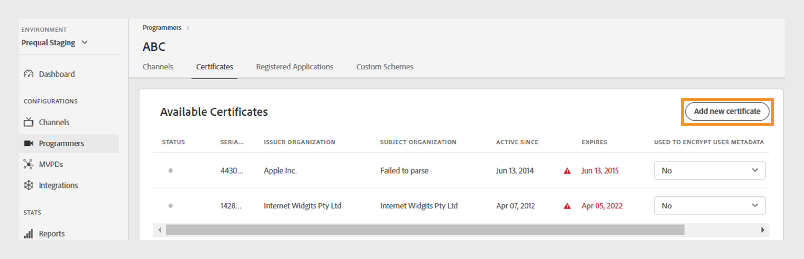

# Programmeurs {#programmers}

>[!NOTE]
>
>De inhoud op deze pagina wordt alleen ter informatie verstrekt. Voor het gebruik van deze API is een huidige licentie van Adobe vereist. Ongeautoriseerd gebruik is niet toegestaan.

De **sectie van Programmeurs** van het Dashboard van TVE staat u toe om montages voor de [&#x200B; programmeurs &#x200B;](/help/authentication/integration-guide-programmers/rest-apis/rest-api-v2/rest-api-v2-glossary.md#programmer) verbonden aan uw rekeningsrechten te bekijken en te beheren. U kunt ook [&#x200B; een nieuwe programmeur &#x200B;](#add-new-programmer) volgens uw vereiste toevoegen.

Het **lusje van Programmeurs** in het linkerpaneel toont een lijst van bestaande programmeurs met de volgende details:

* **identiteitskaart van de Programmer**: Een herkenningsteken van het media bedrijf binnen het systeem.
* **Kanalen**: Het aantal bijbehorende kanalen verbonden aan een programmeur.

*Lijst van bestaande programmeurs*

Typ de naam van de programmeur in de **bar van het Onderzoek** boven de lijst om meer over een programmeur te weten te komen.

## Programmeerconfiguraties beheren {#manage-programmer-conf}

Voer de volgende stappen uit om verschillende instellingen van een specifieke programmeur te beheren.

1. Selecteer het **lusje van Programmeurs** in het linkerpaneel.
1. Selecteer een programmeur in de lijst.
1. Selecteer een van de volgende tabbladen om de bijbehorende instellingen van de geselecteerde programmeur weer te geven en te bewerken:

   * [Kanalen](#channels)
   * [Certificaten](#certificates)
   * [Geregistreerde toepassingen](#registered-applications)
   * [Aangepaste schema&#39;s](#custom-schemes)

   

   *montages van de Programmer*

>[!IMPORTANT]
>
> De Controle van de mening [&#x200B; en duw verandert &#x200B;](/help/authentication/user-guide-tve-dashboard/tve-dashboard-review-push-changes.md) voor meer informatie bij het activeren van de configuratieveranderingen.

### Kanalen {#channels}

Op dit tabblad wordt een lijst weergegeven met kanalen die zijn gekoppeld aan een huidige programmeur. Selecteer een specifiek kanaal van deze lijst om tot gedetailleerde informatie in de [&#x200B; sectie van Kanalen &#x200B;](/help/authentication/user-guide-tve-dashboard/tve-dashboard-channels.md) toegang te hebben.

Om een nieuw kanaal voor de geselecteerde programmeur toe te voegen, **voeg nieuw kanaal** van de hoger-juiste hoek van **Beschikbare Kanalen** sectie toe. Leer [&#x200B; hoe te om een nieuw kanaal &#x200B;](/help/authentication/user-guide-tve-dashboard/tve-dashboard-channels.md#add-new-channel) toe te voegen.

 toe

*voeg een nieuw kanaal* toe

### Certificaten {#certificates}

Dit lusje toont een lijst van [&#x200B; beschikbare certificaten &#x200B;](#available-certificates) die in de de encryptiesstromen van gebruikersmeta-gegevens worden gebruikt. Er worden details weergegeven over elk certificaat dat het volgende bevat:

* De status (of toegelaten voor **encryptie van gebruikersmeta-gegevens** gebruik of niet)
* Serienummer
* Naam van de emittentenorganisatie
* Naam van de organisatie die het onderwerp vormt
* Datum van afgifte
* Vervaldatum
* Een dropdown menu om gebruikersmeta-gegevens te coderen (als u **ja** selecteert, zal het certificaat gevoelige gebruikersinformatie, zoals zip codewaarden coderen).

#### Beschikbare certificaten {#available-certificates}

Deze certificaten fungeren als openbare of persoonlijke sleutels en worden gebruikt voor versleuteling van gebruikersmetagegevens. Alle kanalen die aan hetzelfde mediabedrijf zijn gekoppeld, kunnen deze certificaten gebruiken.

U kunt de volgende wijzigingen aanbrengen in beschikbare certificaten:

* [Nieuw certificaat toevoegen](#add-new-certificate)
* [Certificaat verwijderen](#delete-certificate)

##### Nieuw certificaat toevoegen {#add-new-certificate}

Ga als volgt te werk om een nieuw certificaat toe te voegen.

1. Selecteer **nieuw certificaat** bij de hoger-juiste hoek van de **Beschikbare sectie van Certificaten** toevoegen.

   

   *voeg een nieuw certificaat toe*

1. Plak de openbare sleutel van uw certificaat in het **Nieuwe certificaat** dialoogvakje.

1. Selecteer **toevoegen certificaat**.

1. Bepaal de plaats van het nieuwe certificaat in de lijst van **Beschikbare Certificaten**.

   >[!IMPORTANT]
   >
   > Zorg ervoor dat uw systemen up-to-date zijn en klaar zijn om het nieuwe certificaat te gebruiken.

1. Selecteer **ja** van **Gebruikt aan gecodeerde gebruikersmeta-gegevens** dropdown menu om een nieuw certificaat te activeren.

Er is een nieuwe configuratiewijziging gemaakt en deze is gereed voor serverupdate. Om het nieuwe certificaat te gebruiken dat in de **Beschikbare sectie van Certificaten** wordt vermeld, ga met de [&#x200B; overzicht en duw veranderingen &#x200B;](/help/authentication/user-guide-tve-dashboard/tve-dashboard-review-push-changes.md) stroom te werk.

##### Certificaat verwijderen {#delete-certificate}

Ga als volgt te werk om een certificaat te verwijderen.

1. Beweeg op het certificaat u van de lijst van **Beschikbare certificaten** wilt schrappen.

1. Selecteer **verwijderen**.

   

   *verwijder het geselecteerde certificaat*

1. Selecteer **Schrapping** op het **certificaat van de Schrapping** dialoogvakje.

Er is een nieuwe configuratiewijziging gemaakt en deze is gereed voor serverupdate. Het certificaat zal van de **Beschikbare certificaten** sectie slechts na [&#x200B; overzicht en duw veranderingen &#x200B;](/help/authentication/user-guide-tve-dashboard/tve-dashboard-review-push-changes.md) worden geschrapt.

### Geregistreerde toepassingen {#registered-applications}

Op dit tabblad wordt een lijst met geregistreerde toepassingen weergegeven. Voor meer details met betrekking tot geregistreerd toepassingsgebruik, verwijs naar het [&#x200B; dynamische overzicht van de cliëntregistratie &#x200B;](../integration-guide-programmers/rest-apis/rest-api-dcr/dynamic-client-registration-overview.md) documentatie.

U kunt de volgende handelingen uitvoeren met geregistreerde toepassingen:

* [Een nieuwe geregistreerde toepassing toevoegen](#add-registered-applications)
* [Software-instructies downloaden](#download-software-statement)

#### Nieuwe geregistreerde toepassing toevoegen {#add-registered-applications}

Ga als volgt te werk om een nieuwe geregistreerde toepassing toe te voegen.

1. Selecteer **nieuwe toepassing** bij de hoger-juiste hoek van de **Geregistreerde sectie van Toepassingen** toevoegen.

    toe

   *voeg een nieuwe toepassing* toe

1. Selecteer **Toegewezen aan Kanaal** van het dropdown menu in het **Nieuwe de dialoogvakje van de Toepassing**.

   >[!IMPORTANT]
   >
   > Het wordt aanbevolen geregistreerde toepassingen te maken met specifiekere en beperkte machtigingen om de beveiliging te verbeteren en ongeoorloofde toegang te voorkomen. Wanneer u geregistreerde toepassingen maakt, kunt u daarom overwegen om smallere opties te gebruiken voor de toegewezen `channel` .

1. Selecteer **Platforms** van het dropdown menu.

   >[!IMPORTANT]
   >
   > Het wordt aanbevolen geregistreerde toepassingen te maken met specifiekere en beperkte machtigingen om de beveiliging te verbeteren en ongeoorloofde toegang te voorkomen. Wanneer u geregistreerde toepassingen maakt, kunt u daarom overwegen om smallere opties te gebruiken voor de toegewezen `platforms` .

1. Selecteer **Domeinen** van het dropdown menu.

   >[!IMPORTANT]
   >
   > In het clientregistratieproces kan de clienttoepassing vragen om een omleidings-URL te mogen gebruiken voor de voltooiing van de verificatiestroom. Wanneer een clienttoepassing een specifieke omleidings-URL gebruikt, wordt deze gevalideerd op basis van de geselecteerde `domains` .

1. Typ de **Naam** van de toepassing.

1. Typ de **Versie** van de toepassing.

   >[!IMPORTANT]
   >
   > Het wordt aanbevolen een nieuwe geregistreerde toepassing te maken voor elke belangrijke update van uw clienttoepassing om de levenscyclus en het gebruik ervan te beheren. Indien noodzakelijk, creeer een kaartje door onze [&#x200B; Zendesk &#x200B;](https://adobeprimetime.zendesk.com) en vraag uw Technische Manager van de Rekening (TAM) om een geregistreerde toepassing te herroepen om de functionaliteit van een specifieke versie van de cliënttoepassing te blokkeren.

1. Selecteer **waarde &quot;DIRECT van het Type 0&rbrace; &lbrace;van het drop-down menu.**

1. Selecteer **toepassing** toevoegen.

Er is een nieuwe configuratiewijziging gemaakt en deze is gereed voor serverupdate. Om de nieuwe geregistreerde toepassing te gebruiken die in de **Geregistreerde sectie van Toepassingen** wordt vermeld, ga met de [&#x200B; overzicht en duw veranderingen &#x200B;](/help/authentication/user-guide-tve-dashboard/tve-dashboard-review-push-changes.md) stroom te werk.

#### Software-instructie downloaden {#download-software-statement}

Voer de volgende stappen uit om een softwareinstructie te downloaden.

1. Beweeg op de geregistreerde toepassing u de softwareverklaring van de lijst van **Geregistreerde Toepassingen** wilt downloaden.

1. Selecteer **Download**.

   

   *Download een softwareverklaring*

### Aangepaste schema&#39;s {#custom-schemes}

Op dit tabblad wordt een lijst met aangepaste schema&#39;s weergegeven. Voor meer details met betrekking tot het gebruik van douaneregelingen, verwijs naar de [&#x200B; iOS/tvOS toepassingsregistratie &#x200B;](/help/authentication/integration-guide-programmers/legacy/sdks/ios-tvos-sdk/iostvos-application-registration.md).

U kunt de volgende wijzigingen aanbrengen in aangepaste schema&#39;s:

* [Een nieuw aangepast schema genereren](#generate-custom-schemes)

#### Nieuw aangepast schema genereren {#generate-custom-schemes}

Voer de volgende stappen uit om een nieuw aangepast schema te genereren.

1. Selecteer **produceer nieuwe douaneregeling**.

   

   *produceer een nieuw douaneregeling*

Er is een nieuwe configuratiewijziging gemaakt en deze is gereed voor serverupdate. Om de nieuwe douaneregeling te gebruiken die in de **sectie van de Douane van de Schema&#39;s** wordt vermeld, ga met de [&#x200B; overzicht te werk en druk veranderingen &#x200B;](/help/authentication/user-guide-tve-dashboard/tve-dashboard-review-push-changes.md) stroom.

## Nieuwe programmeur toevoegen {#add-new-programmer}

Ga als volgt te werk om een nieuwe programmeerentiteit toe te voegen.

1. Selecteer het **lusje van Programmeurs** in het linkerpaneel.

1. Selecteer **nieuwe programmeur** bij de hoger-juiste hoek van de **sectie van Programmers** toevoegen.

    toe

   *voeg een nieuwe programmeur* toe

1. Het bedrijfherkenningsteken van het type media in **identiteitskaart van de Programmer** in het **Nieuwe programmeur** dialoogvakje.

1. Typ een commerciële merknaam u in de console onder **naam van de Vertoning** wilt worden getoond.

1. Selecteer **programmer** toevoegen.

Er is een nieuwe configuratiewijziging gemaakt en deze is gereed voor serverupdate. Om de nieuwe programmeur te gebruiken die in de **sectie wordt vermeld van 0&rbrace; Programmers &lbrace;, ga met de** overzicht te werk en druk veranderingen [&#x200B; stroom.](/help/authentication/user-guide-tve-dashboard/tve-dashboard-review-push-changes.md)
