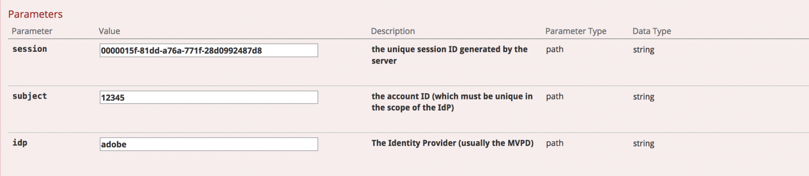
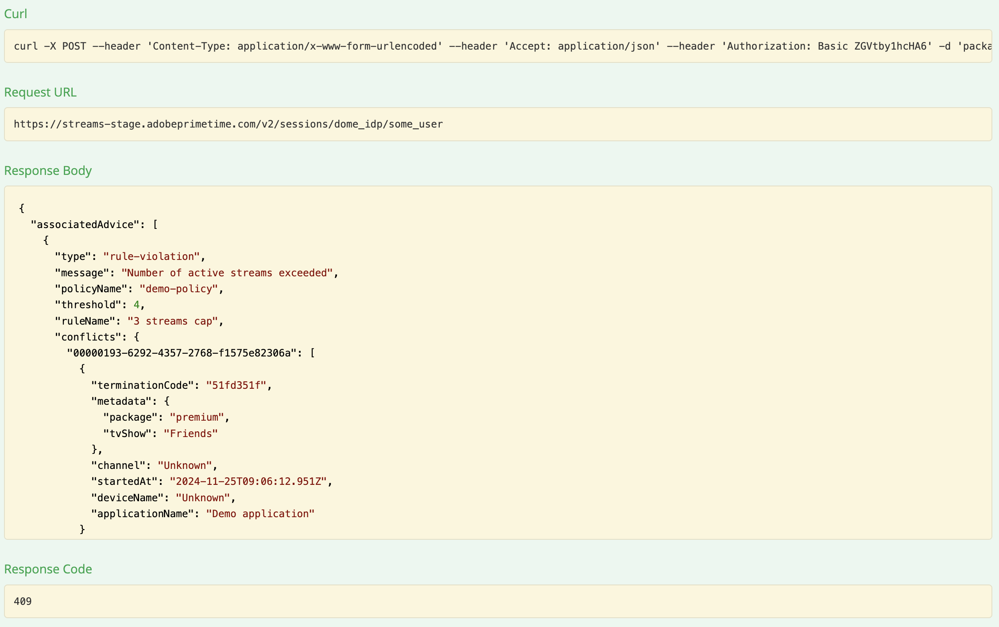
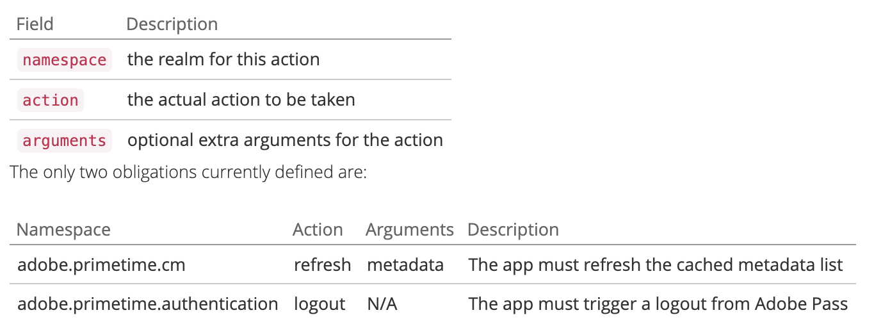

# API-overzicht {#api-overview}

Bekijk de [ online API documentatie ](http://docs.adobeptime.io/cm-api-v2/) voor meer details.

## Doel en voorwaarden {#purpose-prerequisites}

Dit document helpt toepassingsontwikkelaars om onze Swagger API-specificatie te gebruiken bij het implementeren van een integratie met Gelijktijdige bewaking. Het wordt ten zeerste aanbevolen dat de lezer een eerder inzicht heeft in de concepten die door de service zijn gedefinieerd voordat deze richtlijn wordt gevolgd. Om dit begrip te hebben, is het noodzakelijk om een overzicht van de [ productdocumentatie ](/help/concurrency-monitoring/cm-home.md) en de [ Tagger API specificatie ](http://docs.adobeptime.io/cm-api-v2/) te hebben.


## Inleiding {#api-overview-intro}

Tijdens het ontwikkelingsproces vormt de openbare documentatie van Swagger de referentierichtlijn voor het begrijpen en testen van de API-stromen. Dit is een grote plaats om te beginnen om een hands-on benadering te hebben en vertrouwd te worden met de manier de echte toepassingen zich in verschillende scenario&#39;s van gebruikersinteractie zouden gedragen.

Verzend een kaartje in [ Zendesk ](mailto:tve-support@adobe.com) om uw bedrijf en toepassingen in de Controle van de Valuta te registreren. Adobe wijst een toepassings-id toe aan elke entiteit. In deze gids zullen wij twee verwijzingstoepassingen met ids **demo-app** en **demo-app-2** gebruiken die onder de huurder Adobe zullen zijn.


## Gebruik hoofdletters {#api-use-case}

De eerste stap bij het testen van een flow met Swagger is het invoeren van de toepassings-id in de rechterbovenhoek van de pagina, als volgt:


Na dit persen wij **ontdekken** om identiteitskaart te plaatsen die in de kopbal van de Vergunning voor alle vraag zal worden gebruikt die aan REST API wordt gemaakt.  Elke API-aanroep verwacht dat de toepassings-id wordt doorgegeven via HTTP-basisverificatie. De gebruikersnaam is de toepassings-id en het wachtwoord is leeg.


### Eerste toepassing {#first-app-use-cases}

De toepassing met identiteitskaart **demo-app** is toegewezen door het team van Adobe een beleid met één regel die het aantal gezamenlijke stromen tot 3 beperkt. Een beleid wordt toegewezen aan een specifieke toepassing op basis van het in Zendesk ingediende verzoek.


#### Metagegevens ophalen {#retrieve-metadata-use-case}

De eerste aanroep die we uitvoeren, is bestemd voor de bron Metagegevens om de lijst met metagegevenskenmerken te verkrijgen die als formuliergegevens moeten worden doorgegeven tijdens de sessieinitialisatie. Deze metagegevens worden gebruikt om het beleid te evalueren dat is toegewezen aan deze toepassing.


Na het drukken &quot;uitproberen het&quot;, voor de toepassing met identiteitskaart **demo-app** zullen wij het volgende resultaat krijgen:


Zoals u kunt zien in het veld voor de responsstructuur, is de lijst met metagegevenskenmerken leeg. Dit betekent dat de kenmerken die door het ontwerp worden vereist, voldoende zijn om het beleid voor drie streams te evalueren dat aan deze toepassing is toegewezen. Zie ook, de [ Standaarddocumentatie van de Gebieden van Meta-gegevens ](/help/concurrency-monitoring/standard-metadata-attributes.md). Na deze vraag, kunnen wij verdergaan en een nieuwe zitting op het middel van de REST van Sessies tot stand brengen.


#### Sessieinitialisatie {#session-initial}

De vraag van de zittingsinitialisatie wordt gedaan door een toepassing na het verwerven van alle noodzakelijke informatie nodig om het uit te voeren.


Er is geen behoefte om enige beëindigingscode op de eerste vraag te verstrekken omdat wij geen andere actieve stromen hebben. En geen metagegevenskenmerk omdat geen van de aanroepen van metagegevens is geretourneerd.

Het **onderwerp** en **idp** parameters zijn verplicht, zullen zij als de wegvariabelen van URI worden gespecificeerd. U kunt het **onderwerp** en **idp** parameters verkrijgen door een vraag naar **mvpd** en **upstreamUserID** meta-gegevensgebieden van de Authentificatie van Adobe Pass te maken. Zie ook, het [ overzicht van Meta-gegevens APIs ](https://experienceleague.adobe.com/docs/primetime/authentication/auth-features/user-metadat/user-metadata-feature.html?lang=en#). In dit voorbeeld geven we de waarde &quot;12345&quot; als het onderwerp en &quot;adobe&quot; als het idp.


Stel de initialisatieaanroep voor de sessie in. U krijgt het volgende antwoord:


Alle gegevens die we nodig hebben, staan in de antwoordheaders. De **kopbal van de Plaats** vertegenwoordigt identiteitskaart van de nieuwe gecreeerde zitting en de **Datum** en **verloopt** kopballen vertegenwoordigen de waarden die worden gebruikt om uw toepassing te plannen om volgende hartslag te maken om de zitting levend te houden.

Bij elke oproep kunt u metagegevens verzenden die u nodig hebt, niet alleen de verplichte metagegevens voor uw toepassing. U kunt metagegevens op twee manieren verzenden:
* het gebruiken van **vraag** **parameters**:

  ```sh
  curl -i -XPOST -u "user:pass" "https://streams-stage.adobeprimetime.com/v2/sessions/some_idp/some_user?metadata1=value1&metadata2=value2"
  ```

* het gebruiken van **verzoek** **lichaam**:

  ```sh
  curl -i -XPOST -u "user:pass" https://streams-stage.adobeprimetime.com/v2/sessions/some_idp/some_user -d "metadata1=value1" -d "metadata2=value2" -H "Content-Type=application/x-www-form-urlencoded"
  ```

#### Hartslag {#heartbeat}

Maak een hartslagvraag. Verstrek **zitting identiteitskaart** die in de vraag van de zittingsinitialisering, samen met het **wordt verkregen onderwerp** en **gebruikte dip** parameters.


Voor hartslagvraag kunt u meta-gegevens op de zelfde manier verzenden u voor zittingsingang doet. Één kan op elk ogenblik nieuwe meta-gegevens toevoegen en kan eerder verzonden waarden met sommige **uitzonderingen** bijwerken. De volgende waarden, eens plaats, kunnen niet worden veranderd: **pakket**, **kanaal**, **platform**, **assetId**, **idp**, **mvpd**, **hba_status**, **hba**,
**mobileDevice**

Als de sessie nog geldig is (deze is niet verlopen of handmatig verwijderd), krijgt u een geslaagd resultaat:


Zoals in het eerste geval, zullen wij **Datum** gebruiken en **vervalt** kopballen om een andere hartslag voor deze bepaalde zitting te plannen. Als de zitting niet meer geldig is, zal deze vraag met een 410 GONE code van de Status van HTTP ontbreken.

U kunt de optie &quot;De stream in leven houden&quot; gebruiken in de gebruikersinterface van Swagger om automatische hartslagen op een bepaalde sessie uit te voeren. Dit kan u helpen een regel te testen zonder u zorgen te hoeven maken over de boilerplate die nodig is om geschikte sessiehartslagen te doen. Deze knop wordt naast de knop &quot;Uitproberen&quot; op het tabblad Swagger-hartslag geplaatst. Als u een automatische hartslag wilt instellen voor alle gemaakte sessies, moet u deze elk in een aparte Swagger-interface hebben gepland die wordt geopend op een tabblad van een webbrowser.


#### Sessiebeëindiging {#session-termination}

De bedrijfscase van uw bedrijf zou Gelijktijdige Controle kunnen vereisen om een specifieke zitting te beëindigen wanneer, bijvoorbeeld, een gebruiker ophoudt bekijkend een video. Dit kan worden gedaan door een DELETE te maken vraag op het middel van Sessies.



Gebruik de zelfde parameters voor de vraag zoals voor de zittingshartslag. De HTTP-statuscodes voor reacties zijn:

* 202 AANVAARD voor een succesvol antwoord
* 410 GONE als de sessie al was gestopt.

#### Alle actieve streams ophalen {#get-all-running-streams}

Dit eindpunt biedt alle momenteel lopende zittingen voor een specifieke huurder op al zijn toepassingen aan. Het voorwerp van het gebruik **en** idp **parameters voor de vraag:**


Wanneer u de vraag maakt zult u de volgende reactie krijgen:


Voor elke zittingen zal men **terminateCode** en volledige meta-gegevens krijgen.

Gelieve te merken op **vervalt** kopbal. Dat is het tijdstip waarop de eerste sessie moet verlopen, tenzij er een hartslag wordt verzonden.
In het metagegevensveld worden alle metagegevens ingevuld die bij het starten van de sessie worden verzonden. We filteren het niet, je ontvangt alles wat je hebt verzonden.
De reactie omvat alle stromen die op apps van andere huurders lopen zolang apps het zelfde beleid delen.
Als er geen lopende zittingen voor een specifieke gebruiker zijn wanneer u de vraag doet zult u deze reactie krijgen:


Merk ook op dat in dit geval **&#x200B;**&#x200B;kopbal niet aanwezig is.

In het geval dat een zitting werd gecreeerd dodend een andere, gebruikend **x-beëindigt** kopbal, onder meta-gegevens u gebied **vervangen** zult vinden. De waarde is een indicator van de gedode sessie om ruimte te maken voor de huidige sessie.


#### Het beleid doorbreken {#breaking-policy-app-first}


Om het gedrag van onze toepassing te simuleren wanneer het 3 die stroombeleid aan het wordt toegewezen wordt gebroken moeten wij 3 vraag tot zittingsinitialisering maken. Om het beleid van kracht te worden, moeten de vraag worden gedaan alvorens één van de zitting wegens gebrek aan hartslagen verloopt. We zullen zien dat deze oproepen allemaal succes hebben, maar als we een vierde aanroepen, dan zal dat mislukken met de volgende fout:



Wij krijgen een reactie 409 CONFLICT samen met een voorwerp van het evaluatieresultaat in de lading. Dit geeft aan dat het beleid aan de serverzijde het niet toestaat dat deze sessie wordt gemaakt of voortgezet. De responsinstantie bevat een EvaluationResult-object met een niet-lege AssociatedAdvice. Dit is de lijst met Advice-objecten die uitleg bevatten voor elke regelschending.

De toepassing moet de gebruiker op de hoogte stellen van de foutberichten die door elke Advice-instantie worden gedragen. Ook, wijst elk advies op de regeldetails zoals attributen, drempel, regel en beleidsnamen. Bovendien worden de conflicterende waarden ook opgenomen in de lijst met actieve sessies voor elke waarde.

Deze informatie is bedoeld voor geavanceerde opmaak van foutberichten en voor het uitvoeren van actie met betrekking tot de conflicterende sessies.

Elke conflicterende zitting zal a **terminateCode** dragen die voor **kan worden gebruikt het doden** die stroom. Op deze manier kan de toepassing de gebruiker toestaan om te kiezen welke sessie(s) worden beëindigd om toegang te krijgen tot de huidige sessie.

De toepassing kan de informatie van het evaluatieresultaat gebruiken om een bepaald bericht aan de gebruiker te tonen wanneer het tegenhouden van de video en verdere acties te nemen indien nodig. U kunt andere bestaande streams stoppen om een nieuwe te starten. Dit wordt gedaan door de **waarde te gebruiken 0&rbrace; terminateCode die op het** **gebied voor een specifiek conflicterend attribuut aanwezig is.** De waarde zal als X-beëindig HTTP- kopbal in de vraag naar een nieuwe zittingsinitialisering worden verstrekt.


Wanneer het verstrekken van één of meerdere beëindigingscodes bij zitingsinitialisatie zal de vraag slagen en een nieuwe zitting zal worden geproduceerd. Dan als wij proberen om een hartslag met één van de zittingen te maken die ver zijn tegengehouden zullen wij een reactie van 410 GONE met een nuttige last van het evaluatieresultaat terugkrijgen die het feit beschrijft dat de zitting ver, zoals in het voorbeeld is geëindigd:


410 kan met of zonder een lichaam worden teruggekeerd, gebaseerd op wat de huidige zitting om veroorzaakte te beëindigen.

Wanneer de reactie geen lichaam heeft, betekent 410 dat een hartslagvraag (of beëindiging) voor een zitting wordt geprobeerd die niet meer actief (wegens onderbreking of een vorig conflict of wat dan ook) is. De enige manier om van deze status te herstellen is door de toepassing een nieuwe sessie te starten. Aangezien er geen hoofdtekst is, wordt ervan uitgegaan dat de toepassing deze fout afhandelt zonder dat de gebruiker hiervan op de hoogte is.

Anderzijds, wanneer een reactielichaam wordt verstrekt, moet de toepassing binnen het **associatedAdvice** attribuut kijken om a **ver-beëindiging** advies te vinden dat op de verre zitting wijst die met een expliciete intentie van **het doden** van de huidige werd in werking gesteld. Dit moet resulteren in een foutbericht zoals &quot;Uw sessie is afgesloten per apparaat/toepassing&quot;.

### Reactieorgaan {#response-body}

Voor alle API-aanroepen van de sessielevenscyclus is de responsinstantie (indien aanwezig) een JSON-object met de volgende velden:


**Advies**
**EvaluationResult** zal een serie van de voorwerpen van het Advies onder **associatedAdvice** omvatten. De adviezen zijn bedoeld voor de toepassing om een uitgebreid foutbericht voor de gebruiker weer te geven en (mogelijk) de gebruiker in staat te stellen actie te ondernemen.

Momenteel, zijn er twee soorten diensten (die door hun **worden gespecificeerd type** attributenwaarde): **regel-schending** en **ver-beëindiging**. De eerste bevat details met betrekking tot een regel die is afgebroken en de sessies die conflicteren met de huidige (inclusief het kenmerk terminate die kan worden gebruikt om die sessie extern te beëindigen). De tweede is enkel verklaren dat de huidige zitting opzettelijk door verre werd geëindigd, zodat zullen de gebruikers weten wie hen uit schopte toen de grenzen werden bereikt. In het geval dat **vervangen** in de meta-gegevens toen inbegrepen is werd de zitting in kwestie gecreeerd gebruikend **x-beëindigt** kopbal.


**Verplichting**
De evaluatie kan ook een of meer vooraf gedefinieerde acties bevatten die door de aanvraag moeten worden geactiveerd als gevolg van deze evaluatie.



### Tweede toepassing {#second-application}

De andere voorbeeldtoepassing die wij zullen gebruiken is met identiteitskaart **demo-app-2**. Aan deze regel is een beleid toegewezen met één regel die het aantal stromen dat beschikbaar is voor een kanaal beperkt tot maximaal 2.   U moet de kanaalvariabele verstrekken om dit beleid te evalueren.

#### Metagegevens ophalen {#retrieving-metadata}

Stel de nieuwe toepassings-id in de rechterbovenhoek van de pagina in en roep de bron Metagegevens aan. U krijgt het volgende antwoord:


Deze keer is de hoofdtekst van de reactie niet langer een lege lijst, zoals in het voorbeeld van de eerste toepassing. Nu verklaart de Gelijktijdige ControleDienst in het antwoordlichaam dat de **kanaal** meta-gegevens bij zittingsinitialisering worden vereist om het beleid te evalueren.

Als u een vraag maakt zonder een waarde voor de **kanaal** parameter te verstrekken, zult u krijgen:

* Antwoordcode - 400 SLECHTS VERZOEK
* Het Licht van de reactie - een nuttige last van het evaluatieresultaat die op het **verplichtingen** gebied beschrijft wat in het verzoek om zittingsinitialisering wordt verwacht opdat de verrichting succesvol is.


#### Sessieinitialisatie {#session-init}

Wijs een waarde toe voor de vereiste meta-gegevenssleutel en plaats het als vormparameter in het verzoek van de zittingsinitialisering, zoals hieronder getoond:


Nu zal de vraag slagen en een nieuwe zitting zal worden geproduceerd.


#### Het beleid doorbreken {#breaking-policy-second-app}

Om de regel te breken die wij in het beleid hebben dat aan deze toepassing wordt toegewezen, moeten wij 2 vraag met de zelfde kanaalwaarde maken. Zoals in het eerste voorbeeld, moet de tweede vraag worden gedaan terwijl de eerste geproduceerde zitting nog geldig is.


Als wij verschillende waarden voor de kanaalmeta-gegevens gebruiken telkens als wij een nieuwe zitting creëren zullen alle vraag slagen omdat de drempel van 2 aan elke waarde individueel wordt behandeld.

Zoals in het eerste voorbeeld, kunnen wij de beëindigingscode gebruiken om het tegenstrijdige stromen ver tegen te houden of kunnen wij op één van de stromen wachten te verlopen, veronderstellend dat geen hartslag op hen zal worden in werking gesteld.
