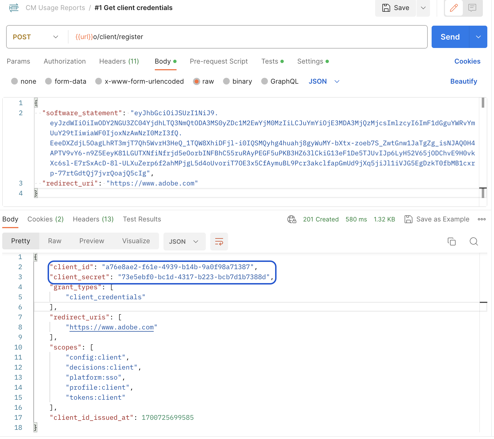

# Toegang tot API voor gelijktijdige bewaking {#cmu-api-usage-access}

>[!NOTE]
>
>De inhoud op deze pagina wordt alleen ter informatie verstrekt. Voor het gebruik van deze API is een huidige licentie van Adobe vereist. Ongeautoriseerd gebruik is niet toegestaan. Neem contact op met uw Adobe-vertegenwoordiger voor vragen over beschikbaarheid.

## Overzicht van de toegangsprocedure {#api-access-procedure-overview}

Wij hebben CMU- rapporten toegang bijgewerkt om met het Dynamische Protocol van de Registratie van de Cliënt van OAuth 2.0 compatibel te zijn. Een douane OAuth 2.0 vergunningsserver wordt opgesteld om de behoeften van de toepassing van de Controle van de Valuta te richten. \
Opdat de toepassingen van de Cliënt de vergunning OAuth 2.0 gebruiken, moet de server dynamisch registreren om specifieke informatie (cliëntgeloofsbrieven) te verkrijgen om met het te kunnen communiceren. Als deel van het registratieproces, moet de cliënt een reeks ingebouwde meta-gegevens aan het eindpunt van de cliëntregistratie voorleggen.
Deze metagegevens worden doorgegeven als een softwareinstructie, die een &quot;software_id&quot; bevat waarmee onze verificatieserver verschillende exemplaren van een toepassing kan correleren met dezelfde softwareinstructie.
Een softwareverklaring is een Token van het Web JSON (JWT) die meta-gegevenswaarden over de cliëntsoftware als bundel bevestigt. Wanneer voorgesteld aan de vergunningsserver als deel van een verzoek van de cliëntregistratie, moet de softwareverklaring digitaal worden ondertekend of MACed gebruikend de Handtekening van het Web JSON (JWS). \
U kunt een gedetailleerdere verklaring vinden over welke softwareverklaringen zijn en hoe zij in de officiële documentatie <a href="https://datatracker.ietf.org/doc/html/rfc7591" target="_blank">[ RFC7591 ]</a> werken.
Voer de stappen in de onderstaande secties uit om toegang te krijgen.

## Toegangsprocedures {#access-procedure-steps}

1. Een geregistreerde toepassing hebben op de Adobe Pass DCR-server. Voor deze stap gelieve ons [&#x200B; Team van de Steun &#x200B;](mailto:tve-support@adobe.com) te contacteren.

2. De software-instructie ophalen
   1. Ga naar [&#x200B; Adobe Pass TVE Dashboard &#x200B;](https://experience.adobe.com/#/pass/authentication)
   2. Programmeur selecteren
   3. Ga naar *Geregistreerde Toepassingen* lusje
   4. Toepassing selecteren
   5. Klik op Downloaden op de geregistreerde toepassingsrij waarvoor u een softwareverklaring wilt krijgen en sparen het als dossier op uw lokale machine
      <figure>
          
      </figure>

      <figure>
          
      </figure>

3. Toegangstoken verkrijgen
   1. Krijg cliëntgeloofsbrieven door de hierboven verkregen softwareverklaring te gebruiken en de hieronder vraag uit te voeren. Op deze manier zal een client_id - client_geheime paar worden verkregen, die kan worden gebruikt om het toegangstoken te krijgen.
      *deze stap zou niet elke keer moeten worden uitgevoerd. Het zou opnieuw moeten worden gedaan slechts wanneer de geloofsbrieven verlopen.*
      <figure>
          
       </figure>

   2. Krijg toegangstoken door de lagere vraag te gebruiken. Gebruik dit toegangstoken om een CMU API aan te roepen tot het teken zal verlopen.
      *deze stap zou moeten worden uitgevoerd slechts als het laatste geproduceerde teken verliep.*
      <figure>
          
       </figure>

4. Vraag CMU API - zie verwante informatie hieronder.
   <figure>
          
       </figure>

## Gerelateerde informatie {#related-information}

* [CMU-overzicht](/help/concurrency-monitoring/reports/cm-usage-reports.md)
* [CMU-API](/help/concurrency-monitoring/reports/cmu-api.md)
